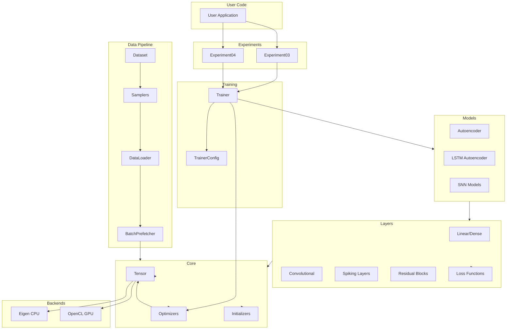
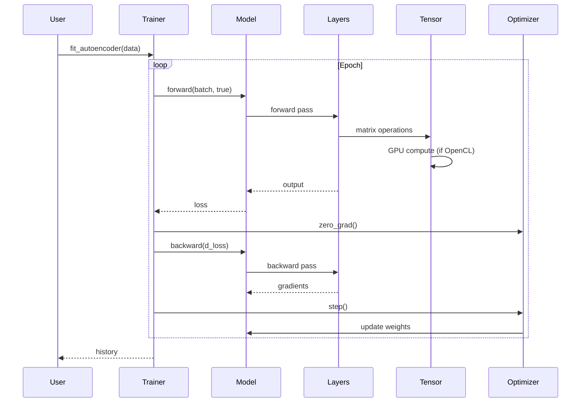
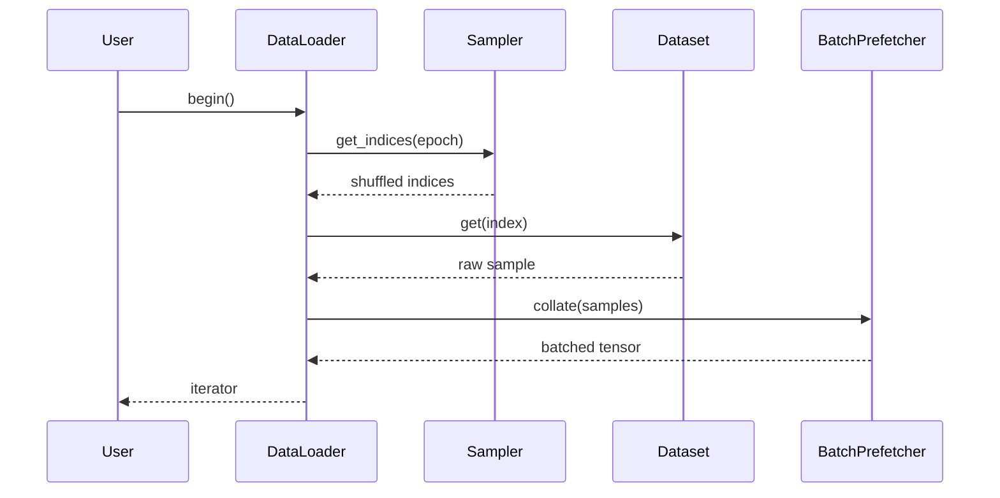

# System Architecture

This document provides a high-level overview of the nn library architecture, showing how the different components interact.

## Overview

The nn library follows a modular architecture with clear separation between:

1. **Tensor Operations** - Core data structure and operations
2. **Neural Network Layers** - Building blocks for models
3. **Models** - Composed layers (autoencoders, LSTMs)
4. **Training** - Optimization loops and configuration
5. **Data Pipeline** - Loading, preprocessing, batching

## High-Level Architecture Diagram

## Module Map

### Core Library (`src/core/`)

| Module | Purpose | Key Files |
|--------|---------|------------|
| `tensor/` | Tensor data structure and operations | `Tensor.hpp`, `OpenCLTensorBackend.cpp` |
| `layers/` | Neural network layer implementations | `Linear.hpp`, `Conv2d.hpp`, `LeakyBPTT.hpp` |
| `optimizers/` | Optimization algorithms | `Adam.hpp`, `SGD.hpp` |
| `training/` | Training loop implementation | `Trainer.hpp`, `TrainerConfig.hpp` |
| `initializers/` | Weight initialization | `xavier.hpp`, `kaiming_snn.hpp` |
| `linearAlgebra/` | Linear algebra utilities | `linear_algebra.hpp` |
| `statistics/` | Metrics and statistics | `kfold.hpp`, `multi_class_metrics.hpp` |

### Data Loaders (`include/nn/dataLoaders/`)

| Module | Purpose |
|--------|---------|
| `datasets/` | Dataset implementations (MAT files, windowed data) |
| `samplers/` | Sampling strategies (random, sequential, k-fold) |
| `runtime/` | DataLoader and iteration |
| `10.1117/` | Specific dataset (EEG/audio) handling |

### Public Headers (`include/nn/`)

| Path | Contents |
|------|----------|
| `tensor/` | Tensor, OpenCL backend |
| `layers/` | All layer types |
| `device/` | Device abstraction (CPU/OpenCL) |
| `optimizers/` | Optimizer interfaces |

## Data Flow Examples

### Training Flow

### Data Loading Flow

## Key Design Decisions

1. **Template-based Backend Selection**: Layers use template parameters (`<Backend>`) to select between Eigen and OpenCL at compile time.

2. **RAII Device Management**: `DeviceRuntime` ensures OpenCL context is initialized once and lives for process duration.

3. **Lazy Synchronization**: GPU tensors only sync to host when `const at()` is called, reducing data transfer overhead.

4. **PyTorch-like API**: Model interface mirrors PyTorch (`forward()`, `backward()`, `params()`, `state_dict()`).

5. **Separation of Concerns**: Data loading, model definition, and training loop are independent components.
