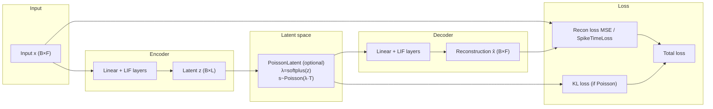

# Autoencoders

Autoencoders are neural networks trained to reconstruct their inputs, learning compressed representations (latent codes) in the process.

## Theoretical Background

### Basic Autoencoder

An autoencoder consists of:
- **Encoder**: $z = f(W_e x + b_e)$ — compresses input to latent space
- **Decoder**: $\hat{x} = f(W_d z + b_d)$ — reconstructs from latent

Training minimises reconstruction loss:
$$L(x, \hat{x}) = \| x - \hat{x} \|^2$$

### Denoising Autoencoder (DAE)

DAEs corrupt input with noise and learn to reconstruct the clean version [8]:
$$\hat{x} = \text{Decoder}(\text{Encoder}(\tilde{x})), \quad \tilde{x} = x + \text{noise}$$

This forces the encoder to learn robust features.

### Variational Autoencoder (VAE)

VAEs learn a probability distribution over latents [9]:
$$q(z|x) = \mathcal{N}(\mu(x), \sigma(x)^2)$$
$$L = L_\text{recon} + \text{KL}(q(z|x) \| p(z))$$

The KL divergence term regularises the latent space toward the prior $p(z) = \mathcal{N}(0, I)$.

### Spiking VAE — Poisson Latent Space

For spiking autoencoders, Gaussian reparameterisation is replaced by a **Poisson spike process** [29, 30].  This is appropriate because SNNs communicate through discrete spike counts, which are naturally modelled by Poisson distributions.

**Reparameterisation**:
1. Encoder outputs logits $z \in \mathbb{R}^{B \times F}$
2. Firing rate: $\lambda = \text{softplus}(z) = \log(1 + e^z)$, ensuring $\lambda > 0$
3. Spike count: $s \sim \text{Poisson}(\lambda \cdot T)$
4. Output (continuous relaxation): $s / T$

**KL divergence** from Poisson prior $\text{Poisson}(\lambda_0)$:
$$\text{KL}(\text{Poisson}(\lambda) \| \text{Poisson}(\lambda_0)) = \lambda - \lambda_0 - \lambda \log(\lambda / \lambda_0)$$

The total β-SVAE loss is:
$$L_\text{total} = L_\text{recon} + \beta \cdot \frac{1}{BF} \sum_{b,f} \text{KL}(\lambda_{b,f}, \lambda_0)$$

**Straight-through gradient** for the discrete sampling step:
$$\frac{\partial L}{\partial z} \approx \frac{\partial L}{\partial \text{output}} \cdot \frac{1}{T} \cdot \sigma(z)$$

where $\sigma(z) = \partial \lambda / \partial z$ is the sigmoid (derivative of softplus).

### Latent Space Properties

| Type | Size | Effect |
|---|---|---|
| Overcomplete | $\|z\| > \|x\|$ | May learn identity; needs regularisation |
| Undercomplete | $\|z\| < \|x\|$ | Forced to learn structure (desired) |
| Sparse | many $z_i \approx 0$ | Disentangled representations |
| Poisson | spike counts | Natural for SNN; energy-efficient |

---

## How It Is Implemented Here

### Base Autoencoder

```cpp
// File: src/core/models/autoencoder/BaseAutoencoder.hpp
template <typename Backend>
class BaseAutoencoder : public Module<Backend>
{
protected:
    Module<Backend>& encoder_;
    Module<Backend>& decoder_;
public:
    auto encode(const Tensor& input) -> Tensor { return encoder_.forward(input, false); }
    auto decode(const Tensor& latent) -> Tensor { return decoder_.forward(latent, false); }
    auto forward(const Tensor& input, bool requires_grad) -> Tensor override
    {
        return decode(encode(input));
    }
};
```

### Poisson Latent Layer (SNN-VAE)

```cpp
// File: include/layers/spiking/PoissonLatentLayer.hpp
template <typename Backend>
class PoissonLatentLayerImpl : public Module<Backend>
{
public:
    int time_steps = 1;       // T
    float prior_rate = 0.1F;  // λ₀ for KL divergence
    float beta_kl = 1.0F;    // β weighting (0 = plain AE, no KL)

    explicit PoissonLatentLayerImpl(int T = 1, float prior_rate_ = 0.1F, float beta_kl_ = 1.0F);

    // KL term accumulated during last forward(). Add to total loss.
    float kl_loss() const;

    // Mean rates λ from last forward (for sparsity logging).
    const Tensor& last_rates() const;

    // forward(train): rate=softplus(z); sample s~Poisson(λ*T); return s/T
    // forward(infer): return λ (no stochastic sampling)
    auto forward(const Tensor& input, bool requires_grad = true) -> Tensor override;

    // Straight-through + KL gradient
    auto backward(const Tensor& grad_output) -> Tensor override;
};
```

β-SVAE training loop:
```cpp
PoissonLatentLayerImpl<Backend> latent(/*T=*/10, /*prior_rate=*/0.1f, /*beta_kl=*/1.0f);

// Training step
auto z_enc  = encoder.forward(input, true);
auto s      = latent.forward(z_enc, true);    // reparameterized spike sample
auto recon  = decoder.forward(s, true);
float recon_loss = mse_loss(recon, target);
float total_loss = recon_loss + beta * latent.kl_loss();
```

### SpikeTimeLoss — Latency-Coded Autoencoders

When using latency spike encoding (early spike = high magnitude), use `SpikeTimeLossImpl` instead of MSE or `SpikeCountLoss`.

```cpp
// File: include/layers/losses/SpikeTimeLoss.hpp
template <typename Backend>
class SpikeTimeLossImpl : public Module<Backend>
{
public:
    explicit SpikeTimeLossImpl(int time_steps = 1);
    void set_target(const Tensor& t);
    void set_time_steps(int T);

    // forward: extract first-spike time per (b,f); compute MSE on times
    //   missing spike → penalty = T (not ∞, for numeric safety)
    auto forward(const Tensor& input, bool requires_grad = true) -> Tensor override;

    // backward: straight-through at first-spike position
    //   dL/d_input[t,b,f] = 2*(pred_t - tgt_t)/(B*F) if t == first_spike_time, else 0
    auto backward(const Tensor& grad_output) -> Tensor override;
};
```

Input/output shape: `(T*B, F)` spike tensor (time-major layout, values 0 or 1).

```cpp
SpikeTimeLossImpl<Backend> stloss(/*time_steps=*/10);
stloss.set_target(target_spikes);
auto loss = stloss.forward(pred_spikes, true);
auto grad = stloss.backward(ones);
```

### MSE Reconstruction Loss

For rate-coded or ANN autoencoders, standard MSE is used:
```cpp
// File: include/layers/losses/MSELoss.hpp
auto loss = mse_loss.forward(reconstruction, target, true);
```

---

## Encoding–Loss Alignment

| Encoding type | Correct loss | Wrong loss (gradient broken) |
|---|---|---|
| Rate coding (spike count) | `SpikeCountLoss` | `SpikeTimeLoss` |
| Latency coding (first-spike time) | `SpikeTimeLoss` | `SpikeCountLoss` |
| Continuous (ANN) | MSE | `SpikeCountLoss` |

Mixing encoding and loss types reverses or zeros gradient directions for some neurons.

---

## Data Flow



---

## Common Pitfalls

1. **Latent Dimension**: Too small loses information; too large may overfit
2. **VAE β Parameter**: Large β enforces regularity but degrades reconstruction quality; tune β
3. **Inference vs training**: `PoissonLatentLayer.forward(requires_grad=false)` returns the mean rate λ with no sampling — use this for inference
4. **KL divergence in loss**: `kl_loss()` must be added to the total loss *after* `forward()` is called; it is reset each call
5. **Loss–encoding mismatch**: See encoding–loss alignment table above

---

## See Also

- [SNN and Surrogate Gradients](./SNN-and-Surrogate-Gradients.md) — LIF neuron and BPTT
- [Spike Rate Regularization](./Spike-Rate-Regularization.md) — Preventing dead/bursting neurons
- [Spike Encoding](./Spike-Encoding.md) — Rate vs latency coding
- [Experiment03](../Experiments/Experiment03.md) — Autoencoder experiments
- [Experiment04](../Experiments/Experiment04.md) — LSTM autoencoder
- [Weight Initialisation](./Weight-Initialisation.md) — Important for training

---

## References

[8] P. Vincent, H. Larochelle, Y. Bengio, and P.-A. Manzagol, "Extracting and composing robust features with denoising autoencoders," in *Proc. 25th Int. Conf. Machine Learning (ICML)*, 2008.

[9] D. P. Kingma and M. Welling, "Auto-encoding variational Bayes," in *Proc. 2nd Int. Conf. Learning Representations (ICLR)*, 2014. [Online]. Available: https://arxiv.org/abs/1312.6114

[29] K. Kamata et al., "Fully spiking variational autoencoder," in *Proc. AAAI Conf. Artificial Intelligence*, 2022.

[30] C. Chen et al., "ESVAE: An efficient spiking variational autoencoder with reparameterizable Poisson spiking sampling," arXiv:2310.14839, 2024. [Online]. Available: https://arxiv.org/html/2310.14839v2

[32] S. Comsa et al., "Spiking autoencoders with temporal coding," *Frontiers in Neuroscience*, vol. 15, p. 712667, 2021. [Online]. Available: https://www.frontiersin.org/articles/10.3389/fnins.2021.712667/full
