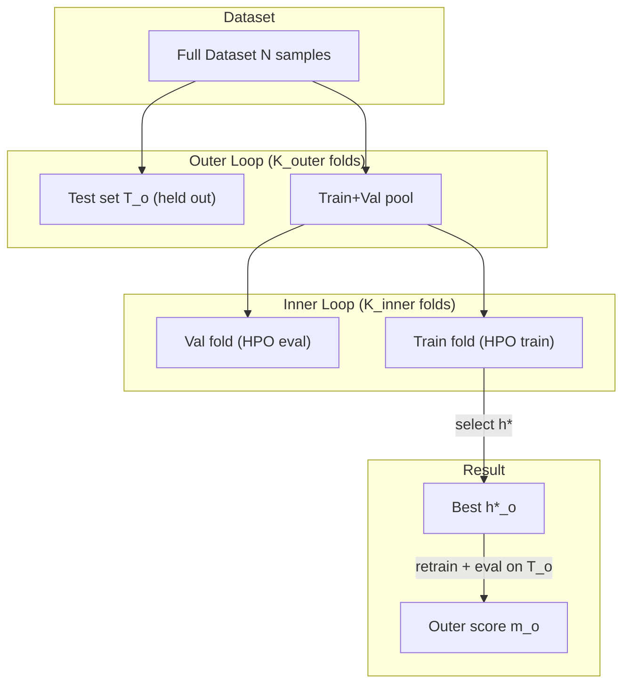

# K-Fold Cross-Validation

K-fold cross-validation is a robust technique for estimating model performance and hyperparameter tuning.

## Theoretical Background

### Standard K-Fold

The dataset is split into $k$ equal-sized folds:

1. Train on $k-1$ folds, validate on 1 fold
2. Repeat $k$ times, each fold used exactly once for validation
3. Average the $k$ validation scores

Final metric: $\bar{m} = \frac{1}{k} \sum_{i=1}^{k} m_i$

### Bias-Variance Tradeoff [6]

- **Low k** (e.g., 2): Low bias, high variance (few training examples per fold)
- **High k** (e.g., 10): High bias, low variance (more training examples)
- **k = n** (leave-one-out): Maximum variance, minimum bias

Research suggests **k=10** provides good balance for most problems.

### Stratified K-Fold

Maintains class distribution across folds:
- In classification: each fold has same proportion of each class
- Essential for imbalanced datasets

### With Test Split

Extended version with dedicated test set:
```
Train+Val: 80% → split into k folds for CV
Test: 20% → held out completely, evaluated once
```

### Nested K-Fold (Two-Loop CV)

Standard single-level k-fold leads to **optimistic performance estimates** when hyperparameters are tuned on the same splits used for evaluation.  The 2024 biomedical ML guide [41] strongly recommends **nested k-fold** to eliminate this selection bias:

```
Outer loop (K_outer folds) → held-out test estimate (unbiased)
  └── Inner loop (K_inner folds) → hyperparameter selection
```

For each outer fold $o$:
1. Hold out test set $T_o$ (completely hidden from inner loop)
2. Run inner k-fold on the remaining data to select best hyperparameters $h^*_o$
3. Retrain with $h^*_o$ on all non-test data; evaluate on $T_o$

The outer-loop scores $\{m_1, \ldots, m_{K_\text{outer}}\}$ give an unbiased estimate of generalisation performance.

---

## How It Is Implemented Here

### K-Fold and Stratified K-Fold

```cpp
// File: include/statistics/kfold.hpp

struct FoldSplit {
    std::vector<std::size_t> train_indices;
    std::vector<std::size_t> test_indices;
};

// Plain K-fold
class KFold {
public:
    explicit KFold(std::size_t n_splits, bool shuffle = false,
                   std::uint32_t random_seed = 0U);
    auto split(std::size_t n_samples) const -> std::vector<FoldSplit>;
};

// Stratified K-fold (for classification)
class StratifiedKFold {
public:
    explicit StratifiedKFold(std::size_t n_splits, bool shuffle = false,
                             std::uint32_t random_seed = 0U);
    auto split(const std::vector<int>& labels) const -> std::vector<FoldSplit>;
};
```

### Nested K-Fold

```cpp
// File: include/statistics/kfold.hpp  (namespace statistics)

struct NestedFoldSplit {
    std::vector<std::size_t> test_indices;  // outer held-out test set
    std::vector<FoldSplit>   inner_splits;  // inner HPO splits (train+val)
};

class NestedKFold {
public:
    explicit NestedKFold(std::size_t n_outer_splits,
                         std::size_t n_inner_splits,
                         bool shuffle = false,
                         std::uint32_t random_seed = 0U);

    auto split(std::size_t n_samples) const -> std::vector<NestedFoldSplit>;
};
```

Inner seeds are deterministic but distinct per outer fold (Knuth multiplicative hash on the outer test indices), guaranteeing reproducibility while ensuring inner splits differ.

### TrainerConfig Integration

```cpp
// File: src/core/training/TrainerConfig.hpp
struct TrainerConfig {
    // ...
    int nested_cv_outer_folds = 0;  // 0 = disabled (plain k-fold)
    int nested_cv_inner_folds = 5;  // inner HPO folds per outer fold
};
```

---

## Data Flow



---

## Usage Example

### Standard K-Fold

```cpp
#include "statistics/kfold.hpp"

statistics::KFold kf(5, /*shuffle=*/true, /*seed=*/42U);
auto splits = kf.split(dataset.size());

std::vector<float> fold_scores;
for (auto& [train_idx, val_idx] : splits)
{
    auto model = create_model();
    // train on train_idx, evaluate on val_idx ...
    fold_scores.push_back(val_loss);
}
float mean = std::accumulate(fold_scores.begin(), fold_scores.end(), 0.0f) / fold_scores.size();
```

### Nested K-Fold

```cpp
#include "statistics/kfold.hpp"

statistics::NestedKFold nkf(5, 5, /*shuffle=*/true, /*seed=*/42U);
auto outer_folds = nkf.split(dataset.size());

for (auto& outer : outer_folds)
{
    // outer.test_indices — never touched during inner HPO
    // inner HPO: pick best learning rate
    float best_val = std::numeric_limits<float>::infinity();
    float best_lr = 1e-3f;
    for (float lr : {1e-4f, 1e-3f, 1e-2f})
    {
        float inner_val = 0.0f;
        for (auto& [tr, va] : outer.inner_splits)
        {
            auto model = create_model(lr);
            // train on tr, evaluate on va ...
            inner_val += val_loss;
        }
        inner_val /= outer.inner_splits.size();
        if (inner_val < best_val) { best_val = inner_val; best_lr = lr; }
    }
    // Retrain with best_lr on all outer.train data, evaluate on outer.test_indices
}
```

---

## Common Pitfalls

1. **Data Leakage**: Never use validation or test data for training; preprocess separately per fold

2. **Non-IID Data**: Time-series or grouped data require special handling (group-aware splits)

3. **Hyperparameter Leak**: If you tune hyperparameters using single-level CV scores, use nested k-fold instead

4. **Stratification**: Use `StratifiedKFold` for classification with imbalanced classes

---

## See Also

- [DataLoaders](../Core/DataLoaders.md) — Loading and sampling data
- [Statistics](../Core/Statistics.md) — KFold/NestedKFold implementation reference
- [Autoencoders](./Autoencoders.md) — Models being validated
- [Training](../Core/Training.md) — `nested_cv_*` fields in `TrainerConfig`
- [Experiment03](../Experiments/AutoencoderRunner.md) — Experiments using k-fold

---

## References

[6] R. Kohavi, "A study of cross-validation and bootstrap for accuracy estimation and model selection," in *Proc. 14th Int. Joint Conf. Artificial Intelligence (IJCAI)*, 1995, pp. 1137–1143.

[40] S. Arlot and A. Celisse, "A survey of cross-validation procedures for model selection," *Statistics Surveys*, vol. 4, pp. 40–79, 2010. [Online]. Available: https://doi.org/10.1214/09-SS054

[41] A. Leal et al., "A guide to cross-validation for artificial intelligence in medical imaging," *Radiology: Artificial Intelligence*, 2023. [Online]. Available: https://pmc.ncbi.nlm.nih.gov/articles/PMC10388213/
