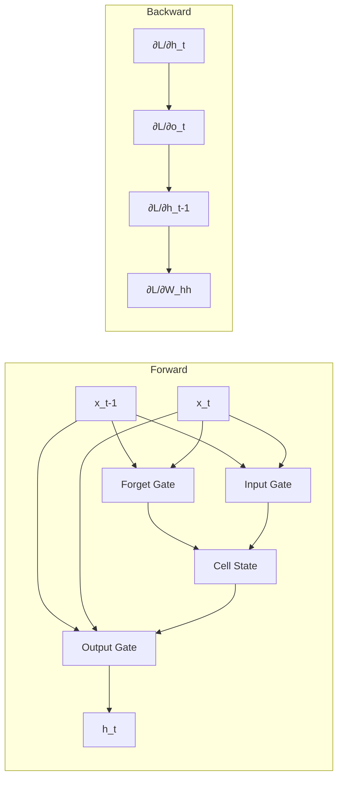

# LSTM and Backpropagation Through Time (BPTT)

Long Short-Term Memory (LSTM) networks are a type of recurrent neural network capable of learning long-term dependencies through specialized gating mechanisms.

## Theoretical Background

### The Vanishing Gradient Problem

Standard RNNs suffer from vanishing/exploding gradients when learning long sequences [1]:

$$\frac{\partial h_t}{\partial h_{t-\tau}} = \prod_{i=t-\tau}^{t} \frac{\partial h_i}{\partial h_{i-1}}$$

When $| \frac{\partial h_i}{\partial h_{i-1}} | < 1$, gradients exponentially decay; when $> 1$, they explode.

### LSTM Architecture

LSTM introduces gating mechanisms to control information flow [1]:

1. **Forget Gate**: Decides what to discard from memory
   $$f_t = \sigma(W_f \cdot [h_{t-1}, x_t] + b_f)$$

2. **Input Gate**: Decides what to store
   $$i_t = \sigma(W_i \cdot [h_{t-1}, x_t] + b_i)$$
   $$\tilde{C}_t = \tanh(W_C \cdot [h_{t-1}, x_t] + b_C)$$

3. **Cell State Update**:
   $$C_t = f_t * C_{t-1} + i_t * \tilde{C}_t$$

4. **Output Gate**: Decides what to output
   $$o_t = \sigma(W_o \cdot [h_{t-1}, x_t] + b_o)$$
   $$h_t = o_t * \tanh(C_t)$$

Where $\sigma$ is the sigmoid function.

### Backpropagation Through Time (BPTT)

BPTT unrolls the RNN over time steps and computes gradients through each step [1]:

1. Unroll network: $x_0 \to x_1 \to \dots \to x_T$
2. Forward pass: compute all hidden states
3. Backward pass: propagate gradients from $x_T$ back to $x_0$

## How It Is Implemented Here

```cpp
// File: include/nn/layers/spiking/LeakyBPTT.hpp
class LeakyBPTT : public Module<EigenTensorBackend>
{
    // LSTM-like cell with BPTT
    Tensor weights_ih_;  // input to hidden
    Tensor weights_hh_;  // hidden to hidden
    Tensor bias_;

    auto forward_sequence(const Tensor& input, bool requires_grad) -> Tensor override
    {
        // Unroll over time steps
        // ... implement LSTM cell
    }
};
```

The library implements LSTM-based autoencoders in Experiment04 for sequence reconstruction.

## Data Flow



## Usage Example

```cpp
// File: src/experiments/04/lib/src/LSTMAutoencoder.cpp
// Simplified LSTM autoencoder usage
#include "nn/layers/spiking/LeakyBPTT.hpp"

auto encoder = std::make_unique<LeakyBPTT>(input_dim, hidden_dim);
auto decoder = std::make_unique<LeakyBPTT>(hidden_dim, output_dim);

// Encode sequence to latent
Tensor latent = encoder->forward_sequence(input_sequence, true);

// Decode latent to reconstruction
Tensor reconstruction = decoder->forward_sequence(latent, true);

// Compute loss
Tensor loss = MSELoss(reconstruction, input_sequence);

// Backward (BPTT)
decoder->backward(loss.grad());
encoder->backward(decoder->get_hidden_grad());
```

## Common Pitfalls

1. **Sequence Length**: Very long sequences cause memory issues; use truncation

2. **Hidden State Initialization**: Initialize to zeros or learned initial states

3. **Bidirectional vs Unidirectional**: Bidirectional requires full sequence at inference time

4. **Gradient Clipping**: Essential for BPTT to prevent exploding gradients

## See Also

- [Autoencoders](./Autoencoders.md) - LSTM autoencoder usage
- [SNN and Surrogate Gradients](./SNN-and-Surrogate-Gradients.md) - Related spiking implementation
- [Tensor](../Core/Tensor.md) - Data structure

## References

[1] S. Hochreiter and J. Schmidhuber, "Long short-term memory," *Neural Computation*, vol. 9, no. 8, pp. 1735–1780, Nov. 1997. [Online]. Available: https://doi.org/10.1162/neco.1997.9.8.1735

[2] P. J. Werbos, "Backpropagation through time: What it does and how to do it," *Proc. IEEE*, vol. 78, no. 10, pp. 1550–1560, Oct. 1990. [Online]. Available: https://doi.org/10.1109/5.58337
