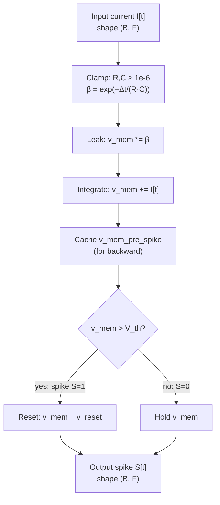

# Membrane Dynamics

The Leaky Integrate-and-Fire (LIF) neuron models the membrane potential of a biological neuron as a resistor-capacitor (RC) circuit. In discrete time, the membrane update rule is $v[t] = \beta \cdot v[t-1] + R \cdot I[t]$ where $\beta = \exp(-\Delta t / (R \cdot C))$ is the decay factor. When the potential exceeds a threshold $V_\text{th}$ the neuron emits a spike and the membrane is reset. This framework makes $R$, $C$, and $V_\text{th}$ trainable scalar parameters so the time constant adapts during learning.

---

## Theoretical Background

The continuous-time RC circuit equation is [Gerstner & Kistler, 2002]:

$$C \frac{dv}{dt} = -\frac{v}{R} + I(t)$$

where $v$ is the membrane potential, $R$ is the membrane resistance (M$\Omega$), $C$ is the membrane capacitance (pF), and $I(t)$ is the synaptic input current. The solution for constant $I$ decays exponentially with time constant $\tau_m = R \cdot C$.

Discretising with step $\Delta t$ via the Euler method yields:

$$v[t] = \underbrace{e^{-\Delta t / \tau_m}}_{\beta} \cdot v[t-1] + R \cdot I[t]$$

The spike condition and hard reset are:

$$S[t] = \mathbf{1}[v[t] > V_\text{th}], \qquad v[t] \leftarrow v_\text{reset} \text{ if } S[t] = 1$$

A soft-reset variant subtracts the threshold instead: $v[t] \leftarrow v[t] - V_\text{th} \cdot S[t]$, preserving excess potential [Gerstner & Kistler, 2002].

Making $R$, $C$, $V_\text{th}$ learnable parameters was popularised by Fang et al. (2021), who showed that gradient-adapted membrane time constants ($\tau_m = R \cdot C$) significantly improve SNN accuracy on vision benchmarks [Fang et al., 2021]. The biological motivation traces to Mahowald & Douglas (1991), who demonstrated that analogue VLSI RC circuits accurately reproduce cortical neuron dynamics.

**Numerical stability guard:** during training, optimisers can drive raw $R$ or $C$ to non-positive values (e.g., Adam with a large learning rate). To prevent $\tau_m \leq 0$ and $\exp(-\Delta t / \tau_m) = \text{NaN}$, both parameters are clamped to $R, C \geq 10^{-6}$ before any forward or gradient computation.

---

## How It Is Implemented Here

**Key file:** `include/layers/spiking/Lif.hpp`

The core forward-pass sequence (Leak → Integrate → Fire → Reset):

```cpp
// include/layers/spiking/Lif.hpp  (lines 230–384, condensed)
constexpr float kMinPositiveParam = 1e-6F;
float const R    = std::max(kMinPositiveParam, resistance.at(0, 0));
float const C    = std::max(kMinPositiveParam, capacitance.at(0, 0));
float const tau  = R * C;
float const beta = std::exp(-time_step / tau);   // decay factor

// 1. Leak
v_mem = v_mem.multiply_scalar(beta);

// 2. Integrate
v_mem = v_mem.add(input);

// 3. Cache pre-spike potential for backward
if (requires_grad) { v_mem_pre_spike = v_mem; }

// 4. Fire
for (size_t i = 0; i < v_mem.rows(); ++i)
    for (size_t j = 0; j < v_mem.cols(); ++j)
        output.at(i, j) = (v_mem.at(i, j) > voltage_threshold.at(0,0)) ? 1.0f : 0.0f;

// 5. Hard reset
for (size_t i = 0; i < v_mem.rows(); ++i)
    for (size_t j = 0; j < v_mem.cols(); ++j)
        if (output.at(i, j) == 1.0f)
            v_mem.at(i, j) = reset_potential;
```

`LifBPTTImpl` (`include/layers/spiking/LifBPTT.hpp`) applies the same logic inside a time loop over the $(T \cdot B, F)$ input block, caching `v_mem_history` and `v_post_history` for the BPTT backward pass.

---

## Data Flow



---

## Usage Example

```cpp
// Minimal LIF layer usage
#include "layers/spiking/Lif.hpp"
#include "tensor/Tensor.hpp"

// Construct: Δt=1ms, R=1, C=1, V_th=1, hard reset
LifImpl<XTensorBackend> lif(
    /*time_step=*/1.0F,
    /*resistance=*/1.0F,
    /*capacitance=*/1.0F,
    /*voltage_threshold=*/1.0F,
    /*reset_zero=*/true);

// Run 10 time steps manually (single-step Lif)
nn::Tensor input(8, 32);   // batch=8, features=32
for (int t = 0; t < 10; ++t) {
    input.setRandom();
    nn::Tensor spikes = lif.forward(input, /*requires_grad=*/true);
    // spikes contains 0.0f or 1.0f per element
}

// Between independent sequences, clear persistent membrane state
lif.reset_state();
```

---

## Common Pitfalls

1. **Not calling `reset_state()` between sequences**: `v_mem` persists across `forward()` calls by design (it is the neuron's state). For independent audio clips or EEG epochs, omitting `reset_state()` carries stale membrane charge from one clip to the next, inflating early spike rates in clip 2.

2. **Optimizer driving R or C negative**: Adam updates are unconstrained. Without the `1e-6` clamp, $\tau_m = R \cdot C$ can become zero or negative, causing `exp(-Δt/0)` = `inf` or `NaN` that poisons subsequent gradients. The guard in `Lif.hpp` handles this, but if you write a custom layer without it, training will silently diverge.

3. **Mixing hard-reset and soft-reset layers in one network**: `reset_zero=true` (hard reset) and `reset_zero=false` (soft reset) produce different gradient paths. The soft-reset backward accumulates a $-V_\text{th} \cdot \text{surr}$ term in `dvpost_dvpre` (see `LifBPTT.hpp`, backward). Changing `reset_zero` mid-training without resetting the optimiser state will produce incorrect gradient estimates for `voltage_threshold`.

4. **Spike-frequency adaptation left at `adapt_coupling > 0`**: if `adapt_coupling` is non-zero (enabled), the effective threshold rises after each spike. This suppresses bursting but also reduces total spike count per epoch, which can starve gradient flow in sparse encodings. Disable with `adapt_coupling=0.0` unless explicitly needed.

---

## See Also

- [Concepts/SNN-and-Surrogate-Gradients.md](./SNN-and-Surrogate-Gradients.md) — how the non-differentiable spike step is approximated for backprop
- [Concepts/Time-Major-Layout.md](./Time-Major-Layout.md) — tensor shape convention used when calling `LifBPTT`
- [Core/Layers.md](../Core/Layers.md) — full list of layer types and their shape contracts

---

## References

[1] W. Gerstner and W. M. Kistler, *Spiking Neuron Models: Single Neurons, Populations, Plasticity*. Cambridge, UK: Cambridge University Press, 2002.

[2] M. Mahowald and R. Douglas, "A silicon neuron," *Nature*, vol. 354, pp. 515–518, Dec. 1991.

[3] W. Fang, Z. Yu, Y. Chen, T. Masquelier, T. Huang, and Y. Tian, "Incorporating Learnable Membrane Time Constants to Enhance Learning of Spiking Neural Networks," in *Proc. IEEE/CVF ICCV*, 2021, pp. 2661–2671.
