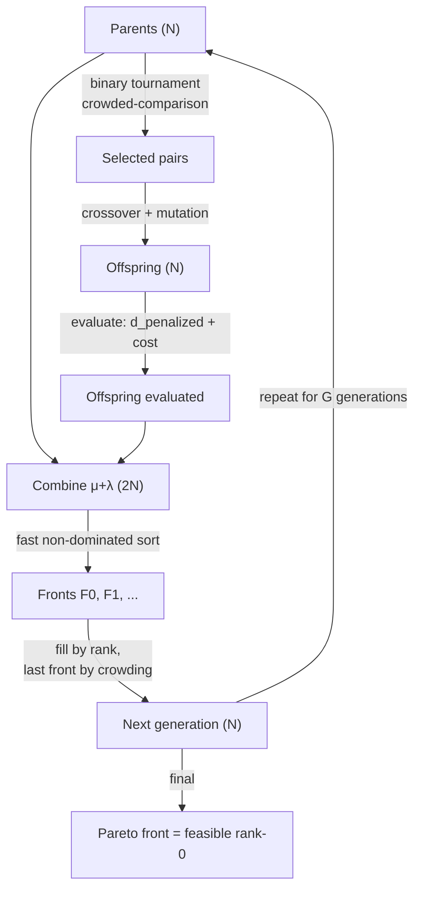

# Multi-Objective Optimisation (NSGA-II)

When a search has **two goals that trade off** — here, maximise feature quality *and*
minimise inference cost — there is usually no single winner: a cheaper model is often
worse, a better model is often slower. Multi-objective optimisation replaces "the best
individual" with **the Pareto front**: the set of solutions where you cannot improve one
objective without hurting another. NSGA-II (Non-dominated Sorting Genetic Algorithm II)
[1] is the standard evolutionary algorithm for finding that front, and it is the only
new algorithm in the [paraconsistentGA](../Experiments/ParaconsistentGA.md) experiment.

## Theoretical Background

**Dominance.** For minimised objectives $f_1,\dots,f_m$, solution $a$ *dominates* $b$
($a \prec b$) if $a$ is no worse on every objective and strictly better on at least one:

$$a \prec b \iff \big(\forall i:\ f_i(a) \le f_i(b)\big)\ \wedge\ \big(\exists j:\ f_j(a) < f_j(b)\big)$$

The **Pareto front** is the set of non-dominated solutions. NSGA-II [1] approximates it
with a genetic algorithm using three ideas:

1. **Fast non-dominated sorting.** Partition the population into fronts $F_0, F_1, \dots$
   where $F_0$ is the non-dominated set, $F_1$ is non-dominated once $F_0$ is removed, and
   so on. This gives every individual a *rank* (front index; lower is better).

2. **Crowding distance.** Within a front, diversity is preserved by preferring individuals
   in *sparse* regions. The crowding distance of a point is the sum, over objectives, of the
   normalised gap between its two neighbours when the front is sorted by that objective.
   Boundary points get $+\infty$ so the extremes of the front are never discarded [1].

3. **Crowded-comparison operator.** In selection, individual $a$ beats $b$ if it has a lower
   rank, or — on a tie — a larger crowding distance. This drives the population toward the
   front while spreading it out along the front.

Elitism is achieved by combining parents and offspring ($\mu+\lambda$) before sorting, so a
good solution can never be lost. NSGA-II descends from the original NSGA [3] but replaces its
$O(mN^3)$ sort and fitness-sharing with an $O(mN^2)$ sort and parameter-free crowding.

**Constraint handling.** Real searches have hard constraints (a latency ceiling, a
minimum latent activity). Deb's *constrained-domination* [2] extends the dominance rule
without weights or penalties:

- a **feasible** solution always dominates an **infeasible** one;
- between two infeasible solutions, the one with **smaller total constraint violation** wins;
- between two feasible solutions, ordinary Pareto dominance applies.

This guarantees no infeasible individual can reach the reported Pareto front as long as one
feasible individual exists.

## How It Is Implemented Here

`src/experiments/paraconsistentGA/lib/src/GaNsga2.cpp` implements all three ideas plus
constrained domination. The dominance predicate is the literal translation of [1] + [2]:

```cpp
// src/experiments/paraconsistentGA/lib/src/GaNsga2.cpp
bool constrained_dominates(const Individual& a, const Individual& b)
{
    if (a.feasible != b.feasible) return a.feasible;              // feasible ≻ infeasible [2]
    if (!a.feasible && !b.feasible)                               // both infeasible:
        return a.constraint_violation < b.constraint_violation;   //   less violation wins [2]

    bool strictly_better = false;                                 // both feasible: Pareto [1]
    for (size_t i = 0; i < a.objectives.size(); ++i)
    {
        if (a.objectives[i] > b.objectives[i]) return false;
        if (a.objectives[i] < b.objectives[i]) strictly_better = true;
    }
    return strictly_better;
}
```

The two minimised objectives are `{d_penalized_mean, inference_cost}` — feature quality
from the [Paraconsistent Logic](../Core/Paraconsistent.md) metric and a structural cost proxy.
`fast_non_dominated_sort` fills each individual's `rank`; `assign_crowding_distance` fills
`crowding`; `run_nsga2` runs the $\mu+\lambda$ generational loop with binary-tournament
selection under the crowded-comparison operator.

## Data Flow



## Usage Example

```cpp
// Minimal NSGA-II core usage (objectives already filled on each Individual).
std::vector<pga::Individual> pop = /* evaluated population */;
auto fronts = pga::fast_non_dominated_sort(pop);   // assigns .rank, returns index fronts
for (const auto& f : fronts)
    pga::assign_crowding_distance(pop, f);          // assigns .crowding within each front
// Selection then prefers lower rank, breaking ties by larger crowding (crowded_less).
```

The full run is driven from a JSON profile — see
[paraconsistentGA](../Experiments/ParaconsistentGA.md).

## Common Pitfalls

1. **Scalarising instead of sorting.** Collapsing objectives into `w1·f1 + w2·f2` reintroduces
   a weight you have to justify and hides the trade-off. NSGA-II deliberately avoids weights —
   do not add them back.
2. **Forgetting elitism.** Selecting the next generation from offspring only (not $\mu+\lambda$)
   lets the best solution be lost. Always combine parents + offspring before sorting.
3. **Constraint penalties with magic weights.** Adding `+penalty·violation` to an objective makes
   feasibility trade against quality. Constrained domination [2] keeps feasibility strictly
   prior — use it instead.
4. **Non-deterministic tie-breaks.** `std::sort` is not stable; equal-objective ties can flip
   between runs. The implementation orders the final front deterministically (by cost, then
   `d_penalized`) so results are reproducible.
5. **Comparing objectives on incomparable scales.** Crowding normalises per objective by its
   range, but the *objectives themselves* must be meaningful to minimise; here `d_penalized` is
   normalised to `[0,1]`-feature space (see [Paraconsistent Logic](../Core/Paraconsistent.md)).

## See Also

- [paraconsistentGA](../Experiments/ParaconsistentGA.md) — the experiment that uses NSGA-II
- [Paraconsistent Logic](../Core/Paraconsistent.md) — objective 1 (`d_penalized`)
- [Autoencoders](Autoencoders.md) — what each genome builds
- [Thesis](../Experiments/Thesis.md) — the phase00 baseline this search extends

## References

[1] K. Deb, A. Pratap, S. Agarwal, and T. Meyarivan, "A fast and elitist multiobjective genetic algorithm: NSGA-II," *IEEE Transactions on Evolutionary Computation*, vol. 6, no. 2, pp. 182–197, Apr. 2002. [Online]. Available: https://doi.org/10.1109/4235.996017

[2] K. Deb, "An efficient constraint handling method for genetic algorithms," *Computer Methods in Applied Mechanics and Engineering*, vol. 186, no. 2–4, pp. 311–338, 2000. [Online]. Available: https://doi.org/10.1016/S0045-7825(99)00389-8

[3] N. Srinivas and K. Deb, "Muiltiobjective optimization using nondominated sorting in genetic algorithms," *Evolutionary Computation*, vol. 2, no. 3, pp. 221–248, 1994. [Online]. Available: https://doi.org/10.1162/evco.1994.2.3.221
