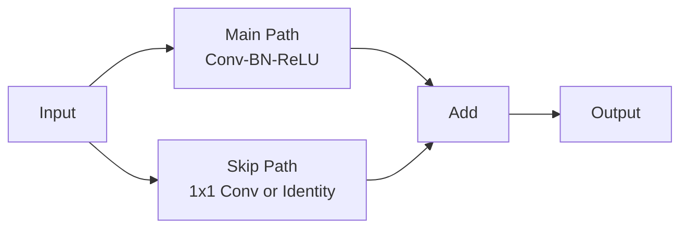

# Residual Blocks

Residual blocks (ResNet) use skip connections to enable training of very deep networks.

## Theoretical Background

The core idea is learning the residual mapping instead of direct mapping [5]:

$$\mathbf{y} = \mathcal{F}(\mathbf{x}, \{W_i\}) + \mathbf{x}$$

Where:
- $\mathbf{x}$ is the input
- $\mathcal{F}$ is the learned residual
- $\mathbf{y}$ is the output

This enables gradient flow directly through the skip connection, allowing very deep networks to train.

### Why It Works

Without skip connection:
$$\frac{\partial \mathbf{y}}{\partial \mathbf{x}} = \frac{\partial \mathcal{F}}{\partial \mathbf{x}}$$

With skip connection:
$$\frac{\partial \mathbf{y}}{\partial \mathbf{x}} = \frac{\partial \mathcal{F}}{\partial \mathbf{x}} + 1$$

The "+1" ensures gradient flow even when $\mathcal{F}$ learns zero.

## Implementation

### Residual Block

```cpp
// File: include/nn/layers/residual/ResidualBlock.hpp
template <typename Backend>
class ResidualBlock : public Module<Backend>
{
    Module<Backend>& main_path_;  // Linear -> Activation -> Linear
    Module<Backend>& skip_;       // Identity or 1x1 conv

    auto forward(const Tensor& input, bool requires_grad) -> Tensor override
    {
        Tensor out = main_path_.forward(input, requires_grad);
        out = out + skip_.forward(input, false);  // Skip connection
        return activation_.forward(out);
    }
};
```

### ResNet Block

```cpp
// File: include/nn/layers/residual/ResNetBlock.hpp
// Pre-activation ResNet block
class ResNetBlock : public Module<EigenTensorBackend>
{
    // BatchNorm -> ReLU -> Conv -> BatchNorm -> ReLU -> Conv
};
```

## Data Flow



## See Also

- [Layers](../Core/Layers.md) - Other layer types
- [Weight-Initialisation](./Weight-Initialisation.md) - Important for deep networks

## References

[1] K. He, X. Zhang, S. Ren, and J. Sun, "Deep residual learning for image recognition," in *Proc. IEEE Conf. Computer Vision and Pattern Recognition (CVPR)*, 2016, pp. 770–778. [Online]. Available: https://arxiv.org/abs/1512.03385

[2] K. He, X. Zhang, S. Ren, and J. Sun, "Identity mappings in deep residual networks," in *Proc. 14th European Conf. Computer Vision (ECCV)*, 2016, pp. 630–645. [Online]. Available: https://arxiv.org/abs/1603.05027
