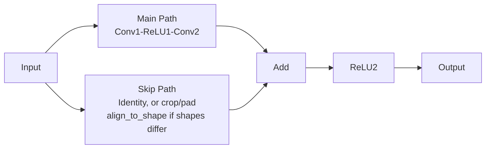

# Residual Blocks

Residual blocks (ResNet) use skip connections to enable training of very deep networks.

## Theoretical Background

The core idea is learning the residual mapping instead of direct mapping [5]:

$$\mathbf{y} = \mathcal{F}(\mathbf{x}, \{W_i\}) + \mathbf{x}$$

Where:
- $\mathbf{x}$ is the input
- $\mathcal{F}$ is the learned residual
- $\mathbf{y}$ is the output

This enables gradient flow directly through the skip connection, allowing very deep networks to train.

### Why It Works

Without skip connection:
$$\frac{\partial \mathbf{y}}{\partial \mathbf{x}} = \frac{\partial \mathcal{F}}{\partial \mathbf{x}}$$

With skip connection:
$$\frac{\partial \mathbf{y}}{\partial \mathbf{x}} = \frac{\partial \mathcal{F}}{\partial \mathbf{x}} + 1$$

The "+1" ensures gradient flow even when $\mathcal{F}$ learns zero.

## Implementation

### Residual Block

```cpp
// File: include/layers/residual/ResidualBlock.hpp
// x -> Linear -> ReLU -> Linear + x  (dense/MLP block; alias `nn::ResidualBlock`)
template <typename Backend>
struct ResidualBlockImpl : public Module<Backend>
{
    std::shared_ptr<LinearImpl<Backend>> fc1;
    std::shared_ptr<ReLUImpl<Backend>> act1;
    std::shared_ptr<LinearImpl<Backend>> fc2;

    explicit ResidualBlockImpl(int features);  // fc1/fc2: features -> features

    auto forward(const Tensor& input, bool requires_grad = true) -> Tensor override
    {
        Tensor out = fc2->forward(act1->forward(fc1->forward(input, requires_grad), requires_grad), requires_grad);
        return out.add(input);  // identity skip only — no projection; caller must
                                 // ensure input/output feature dims already match
    }
};
```

### ResNet Block

```cpp
// File: include/layers/residual/ResNetBlock.hpp
// y = ReLU2( Conv2(ReLU1(Conv1(x))) + skip(x) )  — no BatchNorm.
// Two separate ReLU instances so each caches its own activation mask.
template <typename Backend>
class ResNetBlockImpl : public Module<Backend>
{
    ResNetBlockImpl(int in_channels, int out_channels);  // conv1_, conv2_: 3x3

    auto forward(const Tensor& input, bool requires_grad = true) -> Tensor override
    {
        Tensor output = conv2_.forward(relu1_.forward(conv1_.forward(input, requires_grad), requires_grad), requires_grad);
        // Skip connection: identity if shapes match; otherwise the overlapping
        // region of `input` is copied and the rest zero-padded (align_to_shape).
        output = (output.get_shape() == input.get_shape())
                     ? output.add(input)
                     : output.add(align_to_shape(input, output.get_shape()));
        return relu2_.forward(output, requires_grad);
    }
};
```

## Data Flow



## See Also

- [Layers](../Core/Layers.md) - Other layer types
- [Weight-Initialisation](./Weight-Initialisation.md) - Important for deep networks
- [Ground-Truth and Smoke Testing](../Guides/Ground-Truth-and-Smoke-Testing.md) - `ResidualBlock`/`ResNetBlock` are both pinned against plain `torch.nn` equivalents, including `ResNetBlock`'s shape-aligned (cropped) skip connection

## References

[1] K. He, X. Zhang, S. Ren, and J. Sun, "Deep residual learning for image recognition," in *Proc. IEEE Conf. Computer Vision and Pattern Recognition (CVPR)*, 2016, pp. 770–778. [Online]. Available: https://arxiv.org/abs/1512.03385

[2] K. He, X. Zhang, S. Ren, and J. Sun, "Identity mappings in deep residual networks," in *Proc. 14th European Conf. Computer Vision (ECCV)*, 2016, pp. 630–645. [Online]. Available: https://arxiv.org/abs/1603.05027

> In-text numbers follow the project-wide numbering in [References](../References.md). The entries cited above are reproduced here.

[5] K. He, X. Zhang, S. Ren, and J. Sun, "Deep residual learning for image recognition," in Proc. IEEE Conf. Computer Vision and Pattern Recognition (CVPR), 2016, pp. 770–778. [Online]. Available: https://arxiv.org/abs/1512.03385
