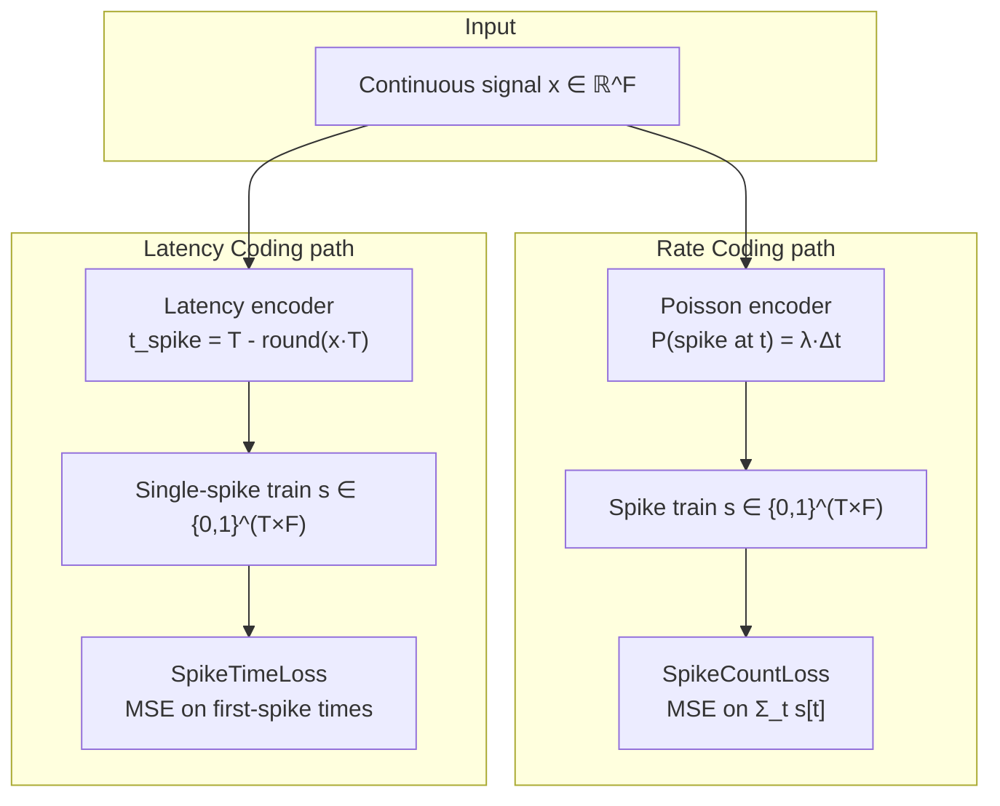

# Spike Encoding

Spike encoding converts continuous-valued input signals into sequences of binary spike events for processing by spiking neural networks.

## Theoretical Background

### Rate Coding

In rate coding, input magnitude is represented by the **frequency** of spikes over a time window $T$:

$$\lambda(x) = f_\text{max} \cdot \sigma(x)$$

where $\sigma$ is a normalising function and $f_\text{max}$ is the maximum firing rate.  A common approach is **Poisson rate coding**: spikes are sampled independently at each time step with probability $p_t = \lambda \cdot \Delta t$.

- High input → many spikes per window
- Low input → few spikes per window
- Information requires $T \gg 1$ time steps to accumulate

### Latency Coding (Time-to-First-Spike)

In latency coding, input magnitude is represented by the **time of the first spike** [32]:

$$t_\text{spike}(x) = T - \lfloor x \cdot T \rfloor$$

- High input → early spike (small $t$)
- Low input → late spike (large $t$) or no spike ($t = T$)
- Information is carried in a single spike per neuron → highly energy-efficient

For reconstruction tasks, the decoder receives the first-spike time and reconstructs the original signal.

### The No-Spike Problem

Latency coding represents a value as *when* a spike happens — but if the input is low enough (or the network hasn't learned to fire yet), the first-spike time is undefined: the neuron never crosses threshold within the window. $t_\text{spike}=T-\lfloor x\cdot T\rfloor$ degenerates to $t=T$ as $x\to 0$, so this is the natural limiting case of the encoding, not a corner case that can be designed away [32].

`SpikeTimeLoss` (`include/layers/losses/SpikeTimeLoss.hpp`) resolves this by definition rather than by special-casing it:

```cpp
// first_spike_times(): for each (batch, feature) pair
float fst = static_cast<float>(T);      // default: no spike -> penalty = T
for (int t = 0; t < T; ++t)
    if (spikes.at(t * B + b, f) > 0.5f) { fst = static_cast<float>(t); break; }
```

A never-firing unit is scored as if it had fired at the last possible step ($t=T$). This keeps the MSE term finite — an undefined time would otherwise force a NaN or an arbitrary infinite penalty — but it also means "never fires" and "fires at the very last step" are indistinguishable to the loss. If that distinction matters for a given task, $T$ needs to be tuned so the two cases are close enough in practice not to matter, or the loss needs to be replaced.

**A sharper consequence shows up in the backward pass**, and it is not just a "smaller penalty" — it is a dead end for gradient flow:

```cpp
// backward(): gradient is placed at the *predicted* spike's time index
int t = static_cast<int>(pt);           // pt = predicted first-spike time
if (t < T)                               // only assign gradient at the actual spike time
    grad.at(t * B + b, f) = g;
```

The straight-through estimator needs an actual spike position to know *where* in the `(T·B, F)` tensor to place the gradient. When the predicted output never fires, `pt == T`, the condition `t < T` is false, and **no gradient is written for that unit at all** — regardless of what the target wanted. This is structurally the same failure mode as the tdBN [No-Spike Problem](Threshold-Dependent-Batch-Normalization.md#the-no-spike-problem) (silence → no gradient → permanently silent), but it arises here from how the loss's straight-through estimator indexes into the spike tensor, not from the surrogate gradient of the LIF neuron itself. In practice this means a latency-coded output unit that goes silent early in training cannot recover through `SpikeTimeLoss` alone — pairing it with [Spike-Rate Regularization](Spike-Rate-Regularization.md) (which supplies a non-zero gradient purely from the mean firing rate, independent of any single spike's position) or with tdBN upstream is what actually breaks the deadlock.

Comşa et al. use exactly this finite-penalty-at-$T$ convention for temporal-coded spiking autoencoders [32]. Manna et al. treat the same underlying issue — training a latency/derivative-coded SNN to reliably produce a spike where one is expected — as a first-class design problem and propose loss functions purpose-built for spike prediction rather than reusing an MSE-on-time proxy [42]; if the plain $t=T$ penalty above proves insufficient for a given experiment, that is the natural next reference to consult.

### Derivative Spike Encoding

For time-series data, spikes can encode the **derivative** of the signal rather than its absolute value [42]:

$$s[t] = \mathbb{1}(x[t] - x[t-1] > \theta)$$

This captures rate-of-change events and is well-suited for EEG and audio signals where transients carry most information.

### Comparison

| Property | Rate coding | Latency coding |
|---|---|---|
| Spikes per neuron | Many (proportional to rate) | At most 1 per window |
| Time steps needed | Many (statistical averaging) | Few (single event) |
| Energy (SOPs) | High | Very low |
| Noise robustness | High | Medium |
| Reconstruction loss | MSE / SpikeCountLoss | SpikeTimeLoss |
| Latency | High | Low |

---

## Critical Invariant: Encoding Must Match Loss

**Using the wrong loss for the encoding type breaks training.** The gradient direction depends on what the loss treats as the informative quantity:

| Encoding | Correct loss | Effect of wrong loss |
|---|---|---|
| Rate (Poisson) | `SpikeCountLoss` (MSE on spike counts) | `SpikeTimeLoss` only sees first spike, ignores count information |
| Latency (first-spike) | `SpikeTimeLoss` (MSE on first-spike times) | `SpikeCountLoss` treats absent spikes as zero count, incorrect gradient for late spikes |
| Direct / continuous | MSE | Either spike loss treats ANN outputs as binary events |

**The no-spike deadlock is a runtime hazard, and it is now fatal rather than silent.**
`SpikeTimeLossImpl::backward` writes a gradient only at the predicted first-spike row
(`if (t < T) grad.at(t*B + b, f) = g;`). A unit that never crosses the 0.5 threshold has
`pt == T`, so **no gradient is written for it at all**. If that holds for every unit in
every batch, training completes, reports a loss, and changes nothing — features from an
untrained model, with no error.

Whether a run lands there is **configuration-dependent, not fixed**: it emerges from the
interaction of learning rate, batch size, `time_steps`, `voltage_threshold` and weight
init. Measured on a 6-sample synthetic set, `lr=0.01` was live across 20 consecutive
seeds and all batch sizes, while `lr=0.001` reached the deadlock at the same threshold
and `firing_rate_reg_lambda = 0.5`. **Encoder firing-rate regularization does not
reliably rescue it** — that regularizer acts on the encoder Lif layers, whereas the dead
gradient originates at the decoder output, so with an all-zero `d_out` there may be
nothing to propagate.

Because no single knob guarantees liveness, `ThesisFeatureExtraction` wraps the spike
losses in a gradient-liveness guard and calls `assert_gradients_were_live()` after
training: if **every** batch produced an all-zero gradient the run throws, naming the
cause and the remedies, instead of returning meaningless features. Some zero-gradient
batches are legitimate near convergence, so only the all-zero case is fatal. Practical
mitigations, in order: raise the learning rate, lower `voltage_threshold`, increase
`time_steps`, enable tdBN upstream. A structural fix — emitting a fallback gradient at
the last timestep when a unit never spikes — would change the loss's documented
straight-through semantics (including its sign convention) and has not been made here.

**Where this is enforced.** The invariant is no longer advisory: `ThesisConfig::validate()`
rejects a mismatched `autoencoder.encoding` / `autoencoder.ae_loss_type` pair outright
(`spiketime` requires `latency`, `spikecount` requires `poisson`), rejects spike losses for
`ann-ae`/`lstm-ae` (which emit continuous values, never spikes), and rejects them for
`direct` (analog — there are no spikes to read). `mse`/`mae` remain selectable under a
spiking encoding as an explicit opt-out baseline.

`SpikeTimeLoss` additionally imposes a **layout** requirement that the trainer must satisfy:
it indexes rows as `t*B + b`, i.e. time-major `(T*B, F)`. The autoencoder path normally
trains on single `(1, D)` frames that stack into `(B, D)` — batch rows, no time axis. The
Trainer cannot produce the needed layout either: `create_batch()` turns multi-row samples
into a 3-D `(B, T, C)` tensor and reshuffles sample indices every epoch. So when
`ae_loss_type = spiketime`, `ThesisFeatureExtraction` **pre-interleaves the batch itself** —
each training sample is a group of `samples_per_batch` inputs laid out as `(T*g, D)` with
`row = t*g + b`, fed one group per step. Batch size is therefore fully supported; it simply
lives in the sample layout instead of in `create_batch()`. A trailing partial group is
harmless because the loss derives `B = rows / T`.

**Why the mismatched rows actually break training** (grounded directly in the loss
implementations under "How It Is Implemented Here" below, not just in general
principle): `SpikeCountLossImpl::forward` computes MSE against $\sum_t s[t]$ — the
*total* spike count — so on a rate-coded train it is well-defined, but on a
latency-coded train (at most one spike per unit) it degenerates to a 0/1 target and
throws away exactly the timing information the encoding carries. Conversely,
`SpikeTimeLossImpl::backward` writes a gradient at *one* time index, the predicted
first-spike position (`t = pt`, see the code excerpt above) — on a rate-coded train
with many spikes this only ever attends to the earliest one and is blind to the
count-carried information in the rest of the window. This is the same underlying
indexing behaviour documented for the no-spike case above [32], generalized to the
mismatched-encoding case.

---

## How It Is Implemented Here

### SpikeCountLoss — Rate-Coded Outputs

```cpp
// File: include/layers/losses/SpikeCountLoss.hpp
template <typename Backend>
class SpikeCountLossImpl : public Module<Backend>
{
public:
    float min_rate       = 0.05f;
    float max_rate       = 0.80f;
    float rate_reg_lambda = 0.0f;

    void set_target(const Tensor& t);

    // forward: MSE(s, target) + rate regularization
    // backward: dMSE/ds + d_reg/ds
};
```

Expected input shape: `(N, F)` — N samples, F features; values are spike counts or 0/1 binary.

### SpikeTimeLoss — Latency-Coded Outputs

```cpp
// File: include/layers/losses/SpikeTimeLoss.hpp
template <typename Backend>
class SpikeTimeLossImpl : public Module<Backend>
{
public:
    explicit SpikeTimeLossImpl(int time_steps = 1);
    void set_target(const Tensor& t);
    void set_time_steps(int T);

    // forward:
    //   1. Extract first-spike time per (b,f): min t s.t. spike[t,b,f]==1, else T
    //   2. MSE on first-spike times: Σ(pred_t - tgt_t)² / (B*F)
    auto forward(const Tensor& input, bool requires_grad = true) -> Tensor override;

    // backward: straight-through at first-spike position
    //   grad[t,b,f] = 2*(pred_t - tgt_t)/(B*F)  if t == first_spike_time
    //               = 0                           otherwise
    auto backward(const Tensor& grad_output) -> Tensor override;
};
```

Expected input shape: `(T*B, F)` spike tensor — time-major layout.

```cpp
SpikeTimeLossImpl<Backend> stloss(/*time_steps=*/10);
stloss.set_target(target_spikes);       // (T*B, F) binary spike tensor
auto loss = stloss.forward(pred_spikes, true);  // MSE on first-spike times
auto grad = stloss.backward(Tensor::ones(1, 1));
```

### Poisson Rate Encoding (PoissonLatentLayer)

For the latent space of an SNN-VAE, firing rate is parameterised via `softplus`:

```cpp
// File: include/layers/spiking/PoissonLatentLayer.hpp
// λ = softplus(z) = log(1 + exp(z))
// s ~ Poisson(λ * T) at training time
// output = s / T   (continuous relaxation back to rate space)
```

---

## Data Flow



---

## Common Pitfalls

1. **No-spike penalty**: see [The No-Spike Problem](#the-no-spike-problem) above — a never-firing predicted unit gets zero gradient from `SpikeTimeLoss`, not just a smaller one.

2. **Rate coding with few time steps**: Statistical averaging requires $T \gg 1$ for reliable rate estimation.  For $T \leq 4$, consider latency coding instead.

3. **Target spike tensor**: Both losses require `set_target()` before `forward()`.  Forgetting this silently computes loss against an empty or stale target.

4. **Gradient through discrete sampling**: Both `SpikeTimeLoss` and `SpikeCountLoss` use straight-through estimators — the backward pass does not back-propagate through the spike generation step but instead treats the spike time or count as a differentiable proxy.

---

## See Also

- [SNN and Surrogate Gradients](./SNN-and-Surrogate-Gradients.md) — LIF neuron dynamics
- [Spike Rate Regularization](./Spike-Rate-Regularization.md) — Dead/bursting neuron prevention
- [Autoencoders](./Autoencoders.md) — Loss–encoding alignment table
- [Layers](../Core/Layers.md) — `SpikeCountLoss` and `SpikeTimeLoss` entries

---

## References

[32] I.-M. Comşa, L. Versari, T. Fischbacher, and J. Alakuijala, "Spiking autoencoders with temporal coding," *Frontiers in Neuroscience*, vol. 15, p. 712667, 2021. [Online]. Available: https://www.frontiersin.org/articles/10.3389/fnins.2021.712667/full

[42] D. L. Manna, A. Vicente-Sola, P. Kirkland, T. J. Bihl, and G. Di Caterina, "Time series forecasting via derivative spike encoding and bespoke loss functions for spiking neural networks," *Computers*, vol. 13, no. 8, p. 202, 2024. [Online]. Available: https://www.mdpi.com/2073-431X/13/8/202
