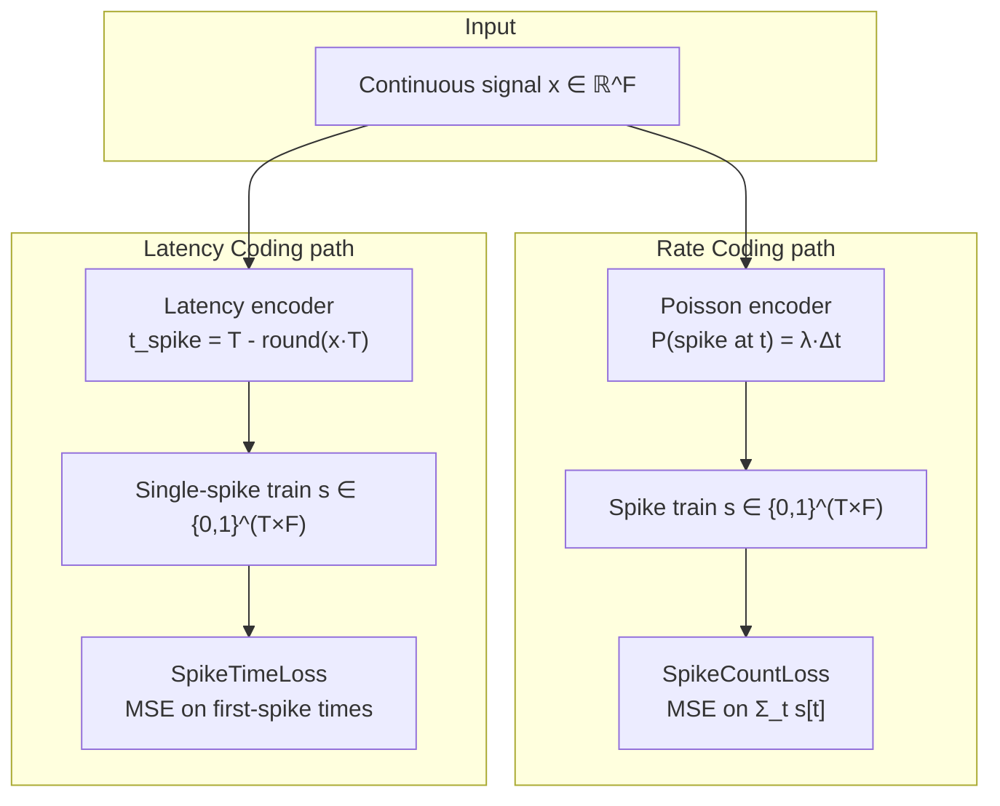

# Spike Encoding

Spike encoding converts continuous-valued input signals into sequences of binary spike events for processing by spiking neural networks.

## Theoretical Background

### Rate Coding

In rate coding, input magnitude is represented by the **frequency** of spikes over a time window $T$:

$$\lambda(x) = f_\text{max} \cdot \sigma(x)$$

where $\sigma$ is a normalising function and $f_\text{max}$ is the maximum firing rate.  A common approach is **Poisson rate coding**: spikes are sampled independently at each time step with probability $p_t = \lambda \cdot \Delta t$.

- High input → many spikes per window
- Low input → few spikes per window
- Information requires $T \gg 1$ time steps to accumulate

### Latency Coding (Time-to-First-Spike)

In latency coding, input magnitude is represented by the **time of the first spike** [32]:

$$t_\text{spike}(x) = T - \lfloor x \cdot T \rfloor$$

- High input → early spike (small $t$)
- Low input → late spike (large $t$) or no spike ($t = T$)
- Information is carried in a single spike per neuron → highly energy-efficient

For reconstruction tasks, the decoder receives the first-spike time and reconstructs the original signal.

### Derivative Spike Encoding

For time-series data, spikes can encode the **derivative** of the signal rather than its absolute value [42]:

$$s[t] = \mathbb{1}(x[t] - x[t-1] > \theta)$$

This captures rate-of-change events and is well-suited for EEG and audio signals where transients carry most information.

### Comparison

| Property | Rate coding | Latency coding |
|---|---|---|
| Spikes per neuron | Many (proportional to rate) | At most 1 per window |
| Time steps needed | Many (statistical averaging) | Few (single event) |
| Energy (SOPs) | High | Very low |
| Noise robustness | High | Medium |
| Reconstruction loss | MSE / SpikeCountLoss | SpikeTimeLoss |
| Latency | High | Low |

---

## Critical Invariant: Encoding Must Match Loss

**Using the wrong loss for the encoding type breaks training.** The gradient direction depends on what the loss treats as the informative quantity:

| Encoding | Correct loss | Effect of wrong loss |
|---|---|---|
| Rate (Poisson) | `SpikeCountLoss` (MSE on spike counts) | `SpikeTimeLoss` only sees first spike, ignores count information |
| Latency (first-spike) | `SpikeTimeLoss` (MSE on first-spike times) | `SpikeCountLoss` treats absent spikes as zero count, incorrect gradient for late spikes |
| Direct / continuous | MSE | Either spike loss treats ANN outputs as binary events |

---

## How It Is Implemented Here

### SpikeCountLoss — Rate-Coded Outputs

```cpp
// File: include/nn/layers/losses/SpikeCountLoss.hpp
template <typename Backend>
class SpikeCountLossImpl : public Module<Backend>
{
public:
    float min_rate       = 0.05f;
    float max_rate       = 0.80f;
    float rate_reg_lambda = 0.0f;

    void set_target(const Tensor& t);

    // forward: MSE(s, target) + rate regularization
    // backward: dMSE/ds + d_reg/ds
};
```

Expected input shape: `(N, F)` — N samples, F features; values are spike counts or 0/1 binary.

### SpikeTimeLoss — Latency-Coded Outputs

```cpp
// File: include/nn/layers/losses/SpikeTimeLoss.hpp
template <typename Backend>
class SpikeTimeLossImpl : public Module<Backend>
{
public:
    explicit SpikeTimeLossImpl(int time_steps = 1);
    void set_target(const Tensor& t);
    void set_time_steps(int T);

    // forward:
    //   1. Extract first-spike time per (b,f): min t s.t. spike[t,b,f]==1, else T
    //   2. MSE on first-spike times: Σ(pred_t - tgt_t)² / (B*F)
    auto forward(const Tensor& input, bool requires_grad = true) -> Tensor override;

    // backward: straight-through at first-spike position
    //   grad[t,b,f] = 2*(pred_t - tgt_t)/(B*F)  if t == first_spike_time
    //               = 0                           otherwise
    auto backward(const Tensor& grad_output) -> Tensor override;
};
```

Expected input shape: `(T*B, F)` spike tensor — time-major layout.

```cpp
SpikeTimeLossImpl<Backend> stloss(/*time_steps=*/10);
stloss.set_target(target_spikes);       // (T*B, F) binary spike tensor
auto loss = stloss.forward(pred_spikes, true);  // MSE on first-spike times
auto grad = stloss.backward(Tensor::ones(1, 1));
```

### Poisson Rate Encoding (PoissonLatentLayer)

For the latent space of an SNN-VAE, firing rate is parameterised via `softplus`:

```cpp
// File: include/nn/layers/spiking/PoissonLatentLayer.hpp
// λ = softplus(z) = log(1 + exp(z))
// s ~ Poisson(λ * T) at training time
// output = s / T   (continuous relaxation back to rate space)
```

---

## Data Flow



---

## Common Pitfalls

1. **No-spike penalty**: When a neuron never spikes, `SpikeTimeLoss` assigns time $T$ (the window length) as a finite penalty.  This avoids NaN but may underestimate the true cost of silence — tune $T$ to control the penalty magnitude.

2. **Rate coding with few time steps**: Statistical averaging requires $T \gg 1$ for reliable rate estimation.  For $T \leq 4$, consider latency coding instead.

3. **Target spike tensor**: Both losses require `set_target()` before `forward()`.  Forgetting this silently computes loss against an empty or stale target.

4. **Gradient through discrete sampling**: Both `SpikeTimeLoss` and `SpikeCountLoss` use straight-through estimators — the backward pass does not back-propagate through the spike generation step but instead treats the spike time or count as a differentiable proxy.

---

## See Also

- [SNN and Surrogate Gradients](./SNN-and-Surrogate-Gradients.md) — LIF neuron dynamics
- [Spike Rate Regularization](./Spike-Rate-Regularization.md) — Dead/bursting neuron prevention
- [Autoencoders](./Autoencoders.md) — Loss–encoding alignment table
- [Layers](../Core/Layers.md) — `SpikeCountLoss` and `SpikeTimeLoss` entries

---

## References

[32] S. Comsa et al., "Spiking autoencoders with temporal coding," *Frontiers in Neuroscience*, vol. 15, p. 712667, 2021. [Online]. Available: https://www.frontiersin.org/articles/10.3389/fnins.2021.712667/full

[42] H. Yang et al., "Time series forecasting via derivative spike encoding and bespoke loss functions for spiking neural networks," *Computers*, vol. 13, no. 8, p. 202, 2024. [Online]. Available: https://www.mdpi.com/2073-431X/13/8/202
