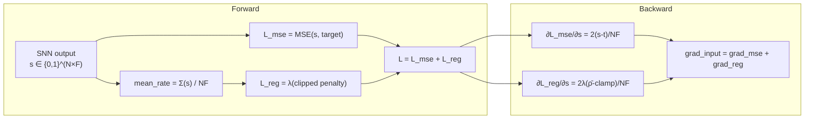

# Spike Rate Regularization

Spike-rate regularization prevents two failure modes specific to SNN autoencoders: dead neurons and bursting neurons.

## Theoretical Background

### The Problem

SNN autoencoders trained with pure reconstruction loss tend to collapse into one of two degenerate regimes [31]:

**Dead neurons** (mean firing rate < ε):
- A neuron's membrane potential never reaches threshold
- Gradient through the surrogate is near zero → neuron never escapes dead state
- Analogous to dying ReLUs in ANNs, but harder to recover from because of the threshold

**Bursting neurons** (mean firing rate ≈ 1):
- A neuron fires at every time step, carrying no selective information
- Its contribution becomes a constant bias rather than an informative signal
- Gradient signal is uninformative; the neuron's weight updates become noisy

### The Regularizer

A soft penalty pushes the network-wide mean firing rate toward a target range $[\rho_\text{min}, \rho_\text{max}]$:

$$L_\text{reg} = \lambda \left[ \max(0,\; \rho_\text{min} - \bar{\rho})^2 + \max(0,\; \bar{\rho} - \rho_\text{max})^2 \right]$$

where $\bar{\rho} = \frac{1}{NF} \sum_{i,f} s_{i,f}$ is the mean firing rate over the batch.

The gradient contribution per element is:

$$\frac{\partial L_\text{reg}}{\partial s_{i,f}} = \frac{2\lambda (\bar{\rho} - \text{clamp}(\bar{\rho}, \rho_\text{min}, \rho_\text{max}))}{NF}$$

This is zero when $\bar{\rho}$ is inside $[\rho_\text{min}, \rho_\text{max}]$, and a linear restoring force otherwise.

**Recommended target range**: 5–30% mean firing rate per layer (literature reports 10–30% achieves best reconstruction with sparsity) [31].

### Synaptic Operations (SOPs) — Energy Efficiency

A key motivation for using SNNs is energy efficiency.  The estimated energy cost of one forward pass is:

$$\text{SOPs} = \sum_l \left( \sum_{i,f} s_{i,f}^{(l)} \right) \times \text{fan\_out}^{(l)}$$

where $l$ indexes layers and fan_out is the number of output connections per neuron.  Compare SOPs against the ANN FLOP count to quantify the claimed energy advantage [26].

---

## How It Is Implemented Here

```cpp
// File: include/layers/losses/SpikeCountLoss.hpp
template <typename Backend>
class SpikeCountLossImpl : public Module<Backend>
{
public:
    // Spike-rate regularization parameters
    float min_rate       = 0.05f;  // dead-neuron guard
    float max_rate       = 0.80f;  // burst guard
    float rate_reg_lambda = 0.0f; // 0 = disabled

    // Last computed mean firing rate (for logging / EpochResult)
    float last_mean_rate() const;

    void set_target(const Tensor& t);

    // forward: MSE(spikes, target) + reg term
    auto forward(const Tensor& input, bool requires_grad = true) -> Tensor override;

    // backward: base MSE gradient + regularization gradient
    auto backward(const Tensor& grad_output) -> Tensor override;
};
```

The MSE base loss treats spike counts as continuous targets:
$$L_\text{MSE} = \frac{1}{NF} \sum_{i,f} (s_{i,f} - t_{i,f})^2$$

Enable regularization by setting `rate_reg_lambda > 0`:
```cpp
SpikeCountLossImpl<Backend> loss;
loss.min_rate        = 0.05f;  // at least 5% firing rate
loss.max_rate        = 0.80f;  // no more than 80%
loss.rate_reg_lambda = 0.01f;  // regularization weight
```

---

## EpochResult — Spike Sparsity Tracking

```cpp
// File: src/core/training/EpochResult.hpp
struct EpochResult {
    int epoch; float train_loss; float val_loss; float epoch_ms;

    // SNN energy-efficiency indicators
    float mean_spike_rate = std::numeric_limits<float>::quiet_NaN(); // NaN = ANN model
    long long sops = 0LL;  // Synaptic OPerations per forward pass
};
```

The Trainer fills these fields from `SpikeCountLoss::last_mean_rate()` when available.
For ANN models, `mean_spike_rate` stays NaN and `sops` stays 0.

---

## Data Flow



---

## Usage Example

```cpp
#include "nn/layers/losses/SpikeCountLoss.hpp"

SpikeCountLossImpl<Backend> loss;
loss.min_rate        = 0.05f;
loss.max_rate        = 0.30f;
loss.rate_reg_lambda = 0.01f;

// Training loop
loss.set_target(target_spikes);
auto loss_val = loss.forward(pred_spikes, true);
auto grad     = loss.backward(Tensor::ones(1, 1));

// Log sparsity
std::cout << "Mean firing rate: " << loss.last_mean_rate() << "\n";
```

---

## Common Pitfalls

1. **Too-tight bounds**: Setting `min_rate == max_rate` creates constant gradient pressure; leave a comfortable range

2. **λ too large**: Dominates reconstruction loss; use λ = 0.001–0.01 initially

3. **λ = 0 default**: Regularization is disabled by default; explicitly set `rate_reg_lambda` for SNN autoencoders

4. **Rate vs adaptation**: Spike-frequency adaptation (`adapt_coupling` in `LifImpl`) naturally suppresses burst mode; combine both mechanisms for best stability

---

## See Also

- [SNN and Surrogate Gradients](./SNN-and-Surrogate-Gradients.md) — Dead neuron prevention via adaptation
- [Spike Encoding](./Spike-Encoding.md) — Rate vs latency coding
- [Autoencoders](./Autoencoders.md) — SNN autoencoder training context
- [Training](../Core/Training.md) — `EpochResult.mean_spike_rate` and `sops`

---

## References

[26] W. Fang et al., "SpikingJelly: An open-source machine learning infrastructure platform for spike-based intelligence," *Science Advances*, vol. 9, no. 40, eadi1480, 2023.

[31] H. Le Gall et al., "Training deep spiking auto-encoders without bursting or dying neurons through regularization," arXiv:2109.11045, 2021. [Online]. Available: https://arxiv.org/abs/2109.11045
