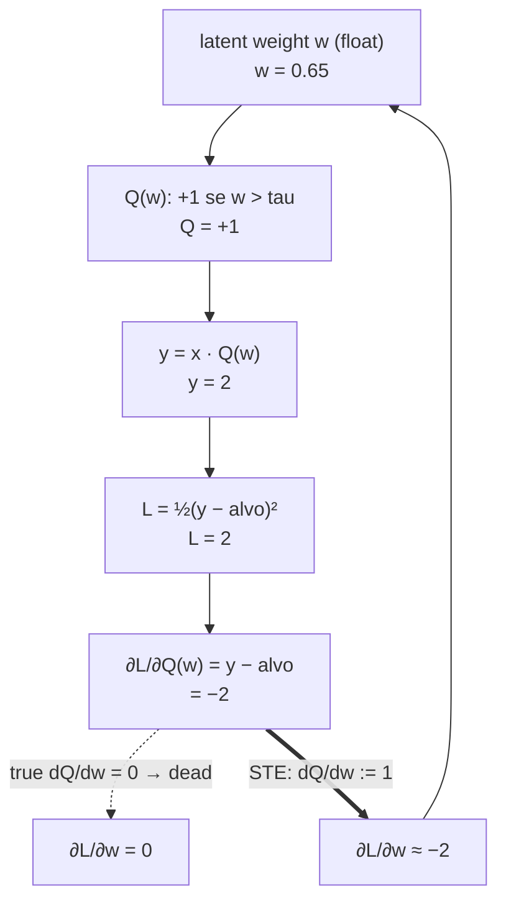

# The Straight-Through Estimator

The Straight-Through Estimator (STE) is the trick that lets gradient descent train a network
containing a step function: run the real, non-differentiable function in the forward pass, and
substitute a differentiable stand-in for its derivative in the backward pass. It is the
quantization world's answer to the same wall the spiking world hits, and the two answers are
close enough to be worth stating side by side — and then qualifying.

This page exists because the wiki documents the SNN half of that pair
([SNN and Surrogate Gradients](./SNN-and-Surrogate-Gradients.md)) but not the quantization
half, and the teaching application
([Efficient Neural Networks Lab](../Demos/efficient-nn-lab.md)) is built around the comparison.

## The problem

Take one real weight, $w = 0{,}65$, and a ternary quantizer with a fixed threshold
$\tau = 0{,}5$:

$$Q(w) = \begin{cases} +1 & w > \tau \\ 0 & |w| \leq \tau \\ -1 & w < -\tau \end{cases}$$

The forward pass is fine: $Q(0{,}65) = +1$, and with an input $x = 2$ the layer outputs
$y = x \cdot Q(w) = 2$. Suppose the target is $4$, so the loss is
$L = \tfrac{1}{2}(y - 4)^2 = 2$ and the gradient arriving at the quantizer is
$\partial L/\partial Q(w) = y - 4 = -2$.

Now try to push that gradient into $w$. The chain rule wants

$$\frac{\partial L}{\partial w} = \frac{\partial L}{\partial Q(w)} \cdot \frac{dQ}{dw}$$

and $dQ/dw = 0$, because $Q$ is flat everywhere except at $\pm\tau$, where it is undefined. So
$\partial L/\partial w = -2 \cdot 0 = 0$. **The weight never moves.** Not slowly — exactly
zero, forever, for every weight in the network. Training does not converge badly; it does not
start.

Drawn, with the numbers above:

```
FORWARD        w = 0.65  ──Q──▶  Q(w) = +1  ──×2──▶  y = 2   ──▶  L = 2
                                                                    │
BACKWARD       ∂L/∂w = 0  ◀──×0──  dQ/dw = 0  ◀──────────  ∂L/∂Q = −2
                    ▲
                    └── the chain is severed here, not attenuated
```

## Theoretical Background

The STE cuts the knot by *lying* about one factor. Keep $Q$ in the forward pass, but in the
backward pass pretend the quantizer was the identity:

$$\frac{dQ}{dw} := 1 \qquad\Longrightarrow\qquad \frac{\partial L}{\partial w} \approx \frac{\partial L}{\partial Q(w)}$$

With the same numbers, $\partial L/\partial w \approx -2$ — a usable gradient, so the real
weight moves and can eventually cross the threshold and flip $Q(w)$. The estimator is biased by
construction; the justification is empirical and the practice predates a full theory
[Bengio, 2013]. Binarized and ternary-weight networks are trained this way in practice
[Courbariaux, 2016], and the same mechanism carries into 1-bit and 1.58-bit LLMs
[Wang, 2023], [Ma, 2024].

The essential bookkeeping detail: because $Q(w)$ is what the forward pass used but $w$ is what
the optimizer updates, the network must keep **both**. The real-valued $w$ ("latent" or
"shadow" weight) accumulates the small updates; the quantized $Q(w)$ is what actually computes.
Discard the latent weight and the updates have nowhere to accumulate — every step would be
rounded away.

### The same shape of answer, in spiking networks

An SNN's spike function $S(v) = \mathbb{1}[v \geq v_{th}]$ has exactly the same defect: zero
derivative almost everywhere, undefined at threshold. The field's fix is the surrogate
gradient — real step forward, smooth curve backward [Neftci, 2019]. Structurally identical.
But the two are **analogous, not identical**, and conflating them is the most common error
this pair of pages exists to prevent:

| | Straight-Through Estimator | Surrogate gradient |
|---|---|---|
| Non-differentiable thing | quantizer $Q(w)$, acting on a **weight** | spike $S(v)$, acting on an **activation** |
| What is substituted | $dQ/dw := 1$ (identity, usually clipped) | $dS/dv := \sigma'$-like bump centred on $v_{th}$ |
| Substitute shape | constant | peaked at threshold, decaying away from it |
| Extra state required | latent real-valued weight, kept forever | none — membrane state already exists |
| What breaks without it | weights never move | no temporal credit assignment at all |

The lab's `Comparação` demo states the analogy and this table's last two rows in the same
breath, on purpose.

## How It Is Implemented Here

The `nn` C++ framework does **not** implement the STE — it has no quantized layers. The
implementation referenced here lives in the teaching application, in NumPy, deliberately small
enough to read on a projector:

```python
# software/efficient_nn_lab/src/efficient_nn_lab/bitnet/ste.py
def ste_forward(w_real: float, threshold: float = 0.5) -> int:
    """The value actually used in the forward pass: the quantized weight."""
    return ternary_quantize(w_real, threshold)


def ste_backward(grad_wrt_quantized: float) -> float:
    """Gradient handed back to the real-valued weight.

    STE's defining move: the (undefined/zero) derivative of Q is replaced
    by 1, so this is just the identity — the gradient that arrived at the
    quantized weight is forwarded unchanged to the real-valued one.
    """
    return grad_wrt_quantized


def sgd_update(w_real: float, grad: float, learning_rate: float) -> float:
    """One plain gradient-descent step on the real-valued (shadow) weight."""
    return w_real - learning_rate * grad
```

Note the signature: `ste_backward` takes only the incoming gradient. There is nothing else to
take — that *is* the whole estimator.

The forward quantizer it is paired with:

```python
# software/efficient_nn_lab/src/efficient_nn_lab/bitnet/quantization.py
DEFAULT_THRESHOLD = 0.5


def ternary_quantize(w: float, threshold: float = DEFAULT_THRESHOLD) -> int:
    """Q(w) in {-1, 0, +1} with a symmetric dead-zone of width 2*threshold."""
    if w > threshold:
        return 1
    if w < -threshold:
        return -1
    return 0
```

A PyTorch reference implementation, used only to check the NumPy version agrees, sits beside it
in `bitnet/ste_torch_reference.py`.

> **Scope warning.** This fixed symmetric threshold is a didactic simplification. BitNet b1.58
> quantizes with an absmean scale $\gamma = \mathrm{mean}(|W|)$ computed per tensor, then clips
> and rounds — that is what the lecture slide teaches. Do not read the code above as an
> implementation of the paper.

## Data Flow



## Usage Example

```bash
# software/efficient_nn_lab/ -- watch the substitution happen on one weight
./run.sh --demo bitnet.ste        # real derivative vs. the constant 1
./run.sh --demo bitnet.guided     # the full cycle, latent weight 0,80 -> 0,84
```

```python
# the whole update, as the guided demo performs it
q = ste_forward(w_real, threshold)     # forward uses the ternary weight
y = x * q
grad_y = y - target                    # ∂L/∂y
grad_w = ste_backward(grad_y)          # ∂L/∂w := ∂L/∂y -- the substitution
w_real = sgd_update(w_real, grad_w, learning_rate)   # the LATENT weight updates
```

## Common Pitfalls

- **Updating the quantized weight instead of the latent one.** `Q(w)` is in `{−1, 0, +1}`;
  subtracting a small gradient from it and re-quantizing rounds the update away every time.
  **Silent failure**: loss plateaus and looks like a bad learning rate.
- **Forgetting to clip the pass-through.** The plain identity lets a latent weight drift far
  outside $[-1, 1]$, where further gradient does nothing but grow it. Practical
  implementations clip the substituted derivative to the region where the quantizer is
  responsive [Courbariaux, 2016]. **Silent failure**: training slows asymptotically as weights
  wander off.
- **Reading the STE as the true gradient.** It is a biased estimator, deliberately wrong. Any
  argument of the form "the gradient tells us…" is on thin ice for a quantized layer.
- **Assuming the SNN surrogate is the same function.** It is the same *strategy*; the
  substituted derivative has a different shape and different support (see the table above).
  Swapping one for the other does not work.

## See Also

- [SNN and Surrogate Gradients](./SNN-and-Surrogate-Gradients.md) — the spiking half of the analogy
- [Efficient Neural Networks Lab](../Demos/efficient-nn-lab.md) — the application that animates
  both, side by side
- [Layers](../Core/Layers.md) — the `nn` layer contract, for contrast: no quantized layer exists there
- [References](../References.md)

## References

[69] Y. Bengio, N. Léonard, and A. Courville, "Estimating or propagating gradients through stochastic neurons for conditional computation," *arXiv:1308.3432*, 2013. [Online]. Available: https://arxiv.org/abs/1308.3432

[67] H. Wang, S. Ma, L. Dong, S. Huang, H. Wang, L. Ma, F. Yang, R. Wang, Y. Wu, and F. Wei, "BitNet: Scaling 1-bit transformers for large language models," *arXiv:2310.11453*, 2023. [Online]. Available: https://arxiv.org/abs/2310.11453

[68] S. Ma, H. Wang, L. Ma, L. Wang, W. Wang, S. Huang, L. Dong, R. Wang, J. Xue, and F. Wei, "The era of 1-bit LLMs: All large language models are in 1.58 bits," *arXiv:2402.17764*, 2024. [Online]. Available: https://arxiv.org/abs/2402.17764

[71] M. Courbariaux, I. Hubara, D. Soudry, R. El-Yaniv, and Y. Bengio, "Binarized neural networks: Training deep neural networks with weights and activations constrained to +1 or −1," *arXiv:1602.02830*, 2016. [Online]. Available: https://arxiv.org/abs/1602.02830

[7] E. O. Neftci, H. Mostafa, and F. Zenke, "Surrogate gradient learning in spiking neural networks," *IEEE Signal Process. Mag.*, vol. 36, no. 6, pp. 51–63, Nov. 2019. [Online]. Available: https://arxiv.org/abs/1901.09948
