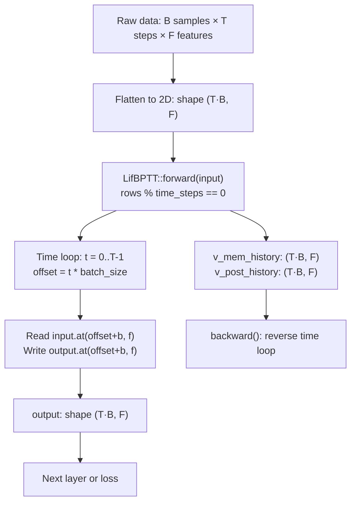

# Time-Major Layout

The time-major layout is the tensor packing convention used by all SNN layers in this framework. A sequence of $T$ time steps over a mini-batch of $B$ samples, each with $F$ features, is stored as a single 2D matrix of shape $(T \cdot B,\; F)$ by concatenating batch slices in time order. This avoids 3D tensor overhead and maps naturally onto the 2D matrix operations provided by the Tensor backend.

---

## Theoretical Background

Recurrent network training requires iterating over an ordered sequence of inputs while keeping state across time steps. Two conventions exist for batched sequence data [Goodfellow et al., 2016]:

1. **Batch-major** $(B, T, F)$: the batch axis is outermost. Common in frameworks like PyTorch when using `batch_first=True`.
2. **Time-major** $(T, B, F)$: the time axis is outermost. Used by TensorFlow's RNN interface, snnTorch's unrolled modules, and — as a flattened 2D variant — by this framework.

Flattening a time-major 3D tensor to 2D yields shape $(T \cdot B,\; F)$ with row order $\{t_0 \text{ rows}, t_1 \text{ rows}, \ldots, t_{T-1} \text{ rows}\}$. This is the shape expected by `LifBPTTImpl::forward()` [Werbos, 1990].

The key invariant is:

$$\text{input.rows()} \;\%\; T = 0 \quad \Longrightarrow \quad B = \frac{\text{input.rows()}}{T}$$

Violation raises `std::invalid_argument` at runtime. This invariant exists because the BPTT unroll loop partitions rows by offset `t * batch_size`; a non-divisible row count would read out-of-bounds memory.

Werbos (1990) introduced BPTT as a way to differentiate through time for recurrent models. The time-major flattened layout is a direct implementation of the unrolling scheme: each forward call processes the full $(T \cdot B, F)$ block, stores intermediate membrane states in a cache of the same shape, then the backward pass iterates in reverse over the $T$ slices [Werbos, 1990; Goodfellow et al., 2016].

---

## How It Is Implemented Here

**Files:**
- `include/layers/spiking/LifBPTT.hpp` — primary consumer of this convention
- `include/layers/spiking/Lif.hpp` — single-step consumer (no explicit unroll)

```cpp
// include/layers/spiking/LifBPTT.hpp  (lines 141–149)
auto forward(const Tensor& input, bool requires_grad = true) -> Tensor override
{
    // Infer Batch Size
    int total_rows = input.rows();
    if (total_rows % time_steps != 0)
    {
        throw std::invalid_argument("LifBPTT: Input rows must be divisible by time_steps");
    }
    int batch_size = total_rows / time_steps;
    int features   = input.cols();
    // ...
    for (int t = 0; t < time_steps; ++t)
    {
        int offset = t * batch_size;   // row start for time step t
        for (int b = 0; b < batch_size; ++b)
        {
            float vin = input.at(offset + b, f);  // sample (t, b, f)
        }
    }
}
```

The history cache has identical shape `(T*B, F)` so indexing is consistent between forward and backward:

```cpp
v_mem_history  = Tensor(total_rows, features);  // (T*B, F)
v_post_history = Tensor(total_rows, features);  // (T*B, F)
```

---

## Data Flow



---

## Usage Example

```cpp
// Prepare a (T*B, F) input for LifBPTT
// T=5 time steps, B=4 samples, F=16 features
#include "layers/spiking/LifBPTT.hpp"
#include "tensor/Tensor.hpp"

constexpr int T = 5, B = 4, F = 16;

// Simulate time-major packing: row t*B+b belongs to (time=t, batch=b)
nn::Tensor input(T * B, F);
input.setZero();
// Fill with your spike data row by row (t0 rows first, then t1, ...)

LifBPTTImpl<XTensorBackend> lif(
    /*time_steps=*/T,
    /*time_step=*/1.0F,
    /*resistance=*/1.0F,
    /*capacitance=*/1.0F,
    /*voltage_threshold=*/1.0F);

// forward expects (T*B, F)
nn::Tensor spikes = lif.forward(input, /*requires_grad=*/true);
// spikes.rows() == T*B, spikes.cols() == F
```

---

## Common Pitfalls

1. **Wrong row count**: passing a `(B, T, F)` batch-major tensor — or a transposed matrix — to `LifBPTTImpl::forward()` will either hit the `% time_steps != 0` guard or silently produce wrong spike patterns because time slices are interleaved rather than consecutive.

2. **Forgetting `reset_state()` between sequences**: `v_mem` persists across `forward()` calls. If two independent audio clips are concatenated into one $(T \cdot B, F)$ block without resetting, the membrane from clip 1 bleeds into clip 2, producing inflated spike rates at the start of clip 2.

3. **`time_steps` mismatch at construction vs. call time**: `LifBPTTImpl` stores `time_steps` at construction. If training uses `T=10` but inference uses `T=5` and the object is reused without reconstruction, the loop count is wrong and `output` may contain unwritten rows.

4. **Loss function shape**: downstream losses (`SpikeCountLoss`, `SpikeTimeLoss`) also expect $(T \cdot B, F)$ input. Reshaping to `(B, T, F)` before the loss breaks the expected row layout and inverts the gradient direction.

---

## See Also

- [Concepts/Membrane-Dynamics.md](./Membrane-Dynamics.md) — how each row is processed inside `LifBPTTImpl`
- [Concepts/SNN-and-Surrogate-Gradients.md](./SNN-and-Surrogate-Gradients.md) — full BPTT derivation and surrogate gradient theory
- [Core/Layers.md](../Core/Layers.md) — list of all layers and their shape contracts
- [Core/Tensor.md](../Core/Tensor.md) — 2D Tensor API used by the SNN layers

---

## References

[1] P. J. Werbos, "Backpropagation through time: what it does and how to do it," *Proceedings of the IEEE*, vol. 78, no. 10, pp. 1550–1560, Oct. 1990.

[2] I. Goodfellow, Y. Bengio, and A. Courville, *Deep Learning*. Cambridge, MA: MIT Press, 2016, ch. 10.

[3] W. Fang et al., "Incorporating Learnable Membrane Time Constants to Enhance Learning of Spiking Neural Networks," in *Proc. IEEE/CVF ICCV*, 2021, pp. 2661–2671.
