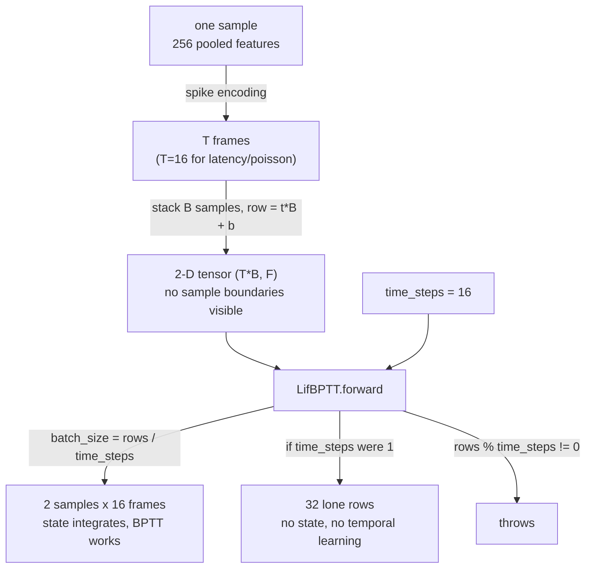

# What `time_steps` Really Means

Two settings in this codebase have almost the same name and mean completely different
things. Confusing them produces a network that trains, prints a loss, and has silently
learned nothing temporal. This page explains both from first principles, then shows the
one line of code where the distinction actually bites.

| Name | Type | Answers | Typical value |
|---|---|---|---|
| `delta_t` | `float` | How **long** one step lasts | `1.0` |
| `time_steps` | `int` | How **many** steps there are | `1` or `16` |

> Historically `delta_t` was called `time_step` — one letter away from `time_steps`. It was
> renamed precisely because that difference was too easy to miss.

---

## Theoretical Background

### Why a spiking neuron needs time at all

An ANN neuron is a pure function: a number goes in, a number comes out.

A **spiking** neuron is not. It carries a membrane potential $V$ that integrates input
current over time, and it emits a spike only when $V$ crosses a threshold $V_{th}$, after
which it resets [1]. Its output at any instant depends on its own past:

$$V_t = \beta V_{t-1} + R\,I_t, \qquad \beta = e^{-\Delta t / (RC)}$$

Because $V_t$ depends on $V_{t-1}$, a single snapshot is not enough input. The neuron
needs a **sequence of moments** in which to charge. So each sample must be presented as a
short movie, not a single photo. See [Membrane Dynamics](Membrane-Dynamics.md) for the
derivation of $\beta$.

This is also what makes backpropagation-through-time (BPTT) necessary: the gradient has to
flow backwards along that chain of $V_t \leftarrow V_{t-1}$ dependencies
[Werbos, 1990; 2].

### Turning one sample into a movie

One EEG or voice sample is pooled to 256 numbers, then expanded into `T` frames by a
[spike encoding](Spike-Encoding.md). With **latency** coding the *value* becomes *when* the
neuron fires:

```
feature = 0.9 (strong) -> fires early:   ▁█▁▁▁▁▁▁▁▁▁▁▁▁▁▁    frame 1
feature = 0.5 (medium) -> fires middle:  ▁▁▁▁▁▁▁█▁▁▁▁▁▁▁▁    frame 7
feature = 0.1 (weak)   -> fires late:    ▁▁▁▁▁▁▁▁▁▁▁▁▁▁█▁    frame 14
                                         └──── 16 frames ────┘
```

That 16 is `time_steps`. One sample now occupies **16 rows**, not one.

### The problem: the tensor is flat

Layers receive a plain 2-D matrix. With 2 samples of 16 frames we hand over **32 rows** —
and nothing in the matrix marks where one sample ends and the next begins:

```
row 0   ┐
row 1   │   32 rows. But is that...
 ...    │     32 samples of 1 frame?
row 30  │      2 samples of 16 frames?
row 31  ┘      4 samples of 8 frames?
```

**The tensor alone cannot answer this.** That is exactly the gap `time_steps` fills.

---

## How It Is Implemented Here

`time_steps` is the divisor that recovers the batch size. From
`include/layers/spiking/LifBPTT.hpp`:

```cpp
// include/layers/spiking/LifBPTT.hpp
int total_rows = input.rows();
if (total_rows % time_steps != 0)
{
    throw std::invalid_argument("LifBPTT: Input rows must be divisible by time_steps");
}
int batch_size = total_rows / time_steps;   // B is INFERRED, never passed in
```

Read that with two different settings and the same 32×F tensor:

| `time_steps` | Interpretation | Consequence |
|---|---|---|
| `16` | 2 samples × 16 frames | Membrane integrates across 16 frames; BPTT has a chain to flow along |
| `1` | 32 independent samples | Every row is a stranger; no state carries; **no temporal learning at all** |

Same bytes, same shape, opposite meaning.

Row order within the tensor is time-major, `row = t*B + b` — all samples at $t_0$, then all
at $t_1$, and so on. See [Time-Major Layout](Time-Major-Layout.md).

### Why `time_steps` has no default

`AutoencoderConfig::time_steps` defaults to **0, meaning unset**, and the SNN builders
raise on it:

```cpp
// src/experiments/autoencoderRunner/lib/include/AutoencoderBuilders.hpp
inline void require_time_steps(int time_steps)
{
    if (time_steps < 1)
        throw std::invalid_argument(
            "AutoencoderBuilders: AutoencoderConfig::time_steps is unset ...");
}
```

Defaulting it to `1` would have been a *silent downgrade*: `LifBPTT` would unroll a single
step and behave exactly like the old single-step `Lif`, yielding a "spiking" network with
no temporal credit assignment that still trains and still reports a plausible loss. Per
the project's no-fallback rule, an unstated sequence length is an error, not a guess.

Note the distinction the guard encodes: **`0` (unset) raises; `1` (explicitly declared) is
allowed.** Some models genuinely have one step — Guayaquil flattens each sample to a single
`{1, window_size}` frame, and `autoencoderRunner` feeds one flat vector per sample. Both
set `time_steps = 1` deliberately, with a comment saying why.

---

## Data Flow



## Usage Example

```cpp
// A latency-coded SNN autoencoder: 16 frames per sample, each frame lasting dt = 1.0.
AutoencoderConfig cfg;
cfg.time_steps = 16;  // HOW MANY frames  -> the BPTT sequence length
cfg.delta_t    = 1.0F; // HOW LONG a frame -> feeds beta = exp(-delta_t/(R*C))

// Input must then be time-major: 16 rows per sample, row = t*B + b.
// 2 samples -> 32 rows. Anything not divisible by 16 raises.
```

## Common Pitfalls

1. **Reading `delta_t` as a count.** It is a duration. Setting it to `16` does not give you
   16 frames — it makes each frame 16× longer, pushing $\beta$ toward 0 so the membrane
   forgets almost instantly.
2. **Leaving `time_steps` unset and assuming 1.** This is the silent-downgrade case the
   guard now blocks. A single-step "SNN" is just an oddly-parameterised ANN.
3. **Feeding frames one at a time.** Calling `forward()` per frame gives `rows = 1`, so
   `1 % 16 != 0` raises. Hand over the whole `(T, F)` sequence in one call.
4. **Batch-major stacking.** Grouping a sample's frames contiguously (`b*T + t`) instead of
   time-major (`t*B + b`) compiles and runs, but every layer then reads the wrong rows.
5. **Changing `time_steps` without re-checking the loss.** Spike losses are tied to the
   encoding, and the encoding is tied to T — see [Spike Encoding](Spike-Encoding.md).

## See Also

- [Time-Major Layout](Time-Major-Layout.md) — the `(T*B, F)` packing and `row = t*B + b`
- [Membrane Dynamics](Membrane-Dynamics.md) — where `delta_t` enters via $\beta$
- [Spike Encoding](Spike-Encoding.md) — what fills the T frames, and the loss pairing
- [SNN and Surrogate Gradients](SNN-and-Surrogate-Gradients.md) — how gradient crosses the spike
- [paraconsistentGA](../Experiments/ParaconsistentGA.md) — sets `time_steps` per genome

## References

[1] W. Gerstner, W. M. Kistler, R. Naud, and L. Paninski, *Neuronal Dynamics: From Single Neurons to Networks and Models of Cognition*. Cambridge University Press, 2014.

[2] P. J. Werbos, "Backpropagation through time: what it does and how to do it," *Proceedings of the IEEE*, vol. 78, no. 10, pp. 1550–1560, Oct. 1990. [Online]. Available: https://doi.org/10.1109/5.58337

[3] E. O. Neftci, H. Mostafa, and F. Zenke, "Surrogate gradient learning in spiking neural networks," *IEEE Signal Processing Magazine*, vol. 36, no. 6, pp. 51–63, Nov. 2019. [Online]. Available: https://doi.org/10.1109/MSP.2019.2931595
