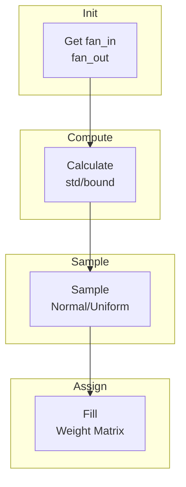

# Weight Initialisation

Proper weight initialization is crucial for training deep neural networks. Poor initialization leads to vanishing/exploding gradients.

## Theoretical Background

### The Problem

Without proper initialization:
- **Sigmoid/Tanh**: Outputs saturate near 0 or 1, gradients vanish
- **ReLU**: Half the neurons are always zero, effective network shrinks

### Xavier/Glorot Initialization [3]

Designed for sigmoid/tanh activations. Weights sampled from:

$$W \sim U\left(-\frac{\sqrt{6}}{\sqrt{n_{in} + n_{out}}}, \frac{\sqrt{6}}{\sqrt{n_{in} + n_{out}}}\right)$$

Or Gaussian:
$$W \sim \mathcal{N}\left(0, \frac{2}{n_{in} + n_{out}}\right)$$

This maintains variance of activations and gradients across layers.

### Kaiming/He Initialization [4]

Designed for ReLU and variants. Weights sampled from:

$$W \sim \mathcal{N}(0, \frac{2}{n_{in}})$$

The factor of 2 accounts for the fact that ReLU zeros half the values.

For SNN Leaky neurons:
$$W \sim \mathcal{N}\left(0, \frac{1}{1 - \alpha^2}\right)$$

Where $\alpha$ is the leak rate.

## How It Is Implemented Here

### Xavier Initialization

```cpp
// File: include/nn/initializers/xavier.hpp
class XavierInitializer
{
public:
    static void initialize(Tensor& weights, unsigned int seed = std::random_device{}())
    {
        auto [fan_in, fan_out] = get_fan(weights);
        float bound = std::sqrt(6.0f / (fan_in + fan_out));

        std::mt19937 gen(seed);
        std::uniform_real_distribution<float> dist(-bound, bound);

        for (size_t i = 0; i < weights.rows(); ++i)
        {
            for (size_t j = 0; j < weights.cols(); ++j)
            {
                weights.at(i, j) = dist(gen);
            }
        }
    }
};
```

### Kaiming Initialization

```cpp
// File: include/nn/initializers/kaiming_snn.hpp
class KaimingSNNInitializer
{
public:
    static void initialize(Tensor& weights, float leak_rate = 0.0f, unsigned int seed = std::random_device{}())
    {
        auto [fan_in, fan_out] = get_fan(weights);

        // For Leaky: std = sqrt(2 / fan_in) / sqrt(1 - leak²)
        float std = std::sqrt(2.0f / fan_in);
        if (leak_rate > 0.0f)
        {
            std /= std::sqrt(1.0f - leak_rate * leak_rate);
        }

        std::mt19937 gen(seed);
        std::normal_distribution<float> dist(0.0f, std);

        for (size_t i = 0; i < weights.rows(); ++i)
        {
            for (size_t j = 0; j < weights.cols(); ++j)
            {
                weights.at(i, j) = dist(gen);
            }
        }
    }
};
```

## Data Flow



## Usage Example

```cpp
// File: include/nn/layers/dense/Linear.hpp
#include "nn/initializers/xavier.hpp"

template <typename Backend>
class Linear : public Module<Backend>
{
    Tensor weights_;

public:
    Linear(size_t in_features, size_t out_features)
    {
        weights_ = Tensor(in_features, out_features);
        XavierInitializer::initialize(weights_);
        bias_ = Tensor(1, out_features);
        bias_.fill(0.0f);
    }
};
```

### SNN-Specific Initialization

```cpp
// Initialize for Leaky spiking neurons
float leak_rate = 0.99f;
KaimingSNNInitializer::initialize(weights, leak_rate);
```

## Common Pitfalls

1. **Wrong Initialization for Activation**: Use Xavier for sigmoid/tanh, Kaiming for ReLU

2. **Bias Initialization**: Set biases to zero initially

3. **Inconsistent Shape**: Ensure `fan_in`/`fan_out` computed correctly for conv layers

4. **Random Seed**: Always set seed for reproducibility in experiments

## See Also

- [Layers](../Core/Layers.md) - Using initialized weights
- [Adam Optimiser](./Adam-Optimiser.md) - Optimizing after initialization
- [Residual Blocks](./Residual-Blocks.md) - Skip connections with initialization

## References

[1] X. Glorot and Y. Bengio, "Understanding the difficulty of training deep feedforward neural networks," in Proc. 13th Int. Conf. Artificial Intelligence and Statistics (AISTATS), 2010, pp. 249–256.

[2] K. He, X. Zhang, S. Ren, and J. Sun, "Delving deep into rectifiers: Surpassing human-level performance on ImageNet classification," in Proc. IEEE Int. Conf. Computer Vision (ICCV), 2015.
