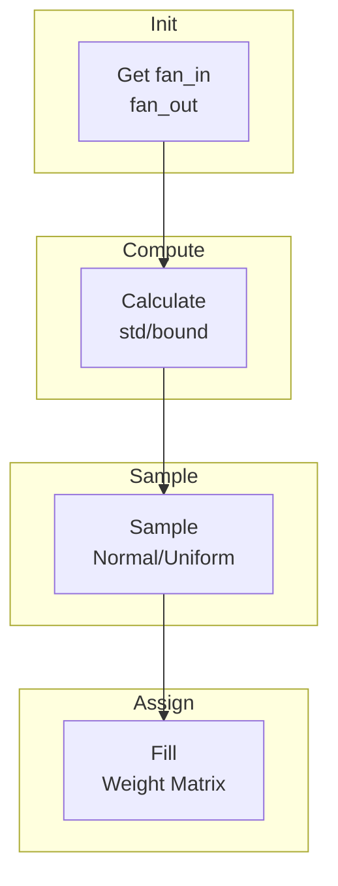

# Weight Initialisation

Proper weight initialization is crucial for training deep neural networks. Poor initialization leads to vanishing/exploding gradients.

## Theoretical Background

### The Problem

Without proper initialization:
- **Sigmoid/Tanh**: Outputs saturate near 0 or 1, gradients vanish
- **ReLU**: Half the neurons are always zero, effective network shrinks

### Xavier/Glorot Initialization [3]

Designed for sigmoid/tanh activations. Weights sampled from:

$$W \sim U\left(-\frac{\sqrt{6}}{\sqrt{n_{in} + n_{out}}}, \frac{\sqrt{6}}{\sqrt{n_{in} + n_{out}}}\right)$$

Or Gaussian:
$$W \sim \mathcal{N}\left(0, \frac{2}{n_{in} + n_{out}}\right)$$

This maintains variance of activations and gradients across layers.

### Kaiming/He Initialization [4]

Designed for ReLU-like and spiking activations. This project uses the **He-uniform**
form: each weight is drawn from a uniform distribution and biases start at zero,

$$\ell = \sqrt{\frac{6}{n_{in}}}, \qquad W_{ij} \sim \mathcal{U}(-\ell, +\ell), \qquad b = 0,$$

where $n_{in}$ is the fan-in (number of inputs per neuron). The uniform on $[-\ell,\ell]$
has variance $\ell^2/3 = 2/n_{in}$ — the He target that keeps activation variance stable
across depth when the nonlinearity discards ~half the signal (ReLU, or the spike
threshold). Larger fan-in → narrower interval, preventing large summed currents.

## How It Is Implemented Here

### Xavier Initialization

```cpp
// File: include/initializers/xavier.hpp
class XavierInitializer
{
public:
    static void initialize(Tensor& weights, unsigned int seed = std::random_device{}())
    {
        auto [fan_in, fan_out] = get_fan(weights);
        float bound = std::sqrt(6.0f / (fan_in + fan_out));

        std::mt19937 gen(seed);
        std::uniform_real_distribution<float> dist(-bound, bound);

        for (size_t i = 0; i < weights.rows(); ++i)
        {
            for (size_t j = 0; j < weights.cols(); ++j)
            {
                weights.at(i, j) = dist(gen);
            }
        }
    }
};
```

### Kaiming Initialization

The actual API is a free function (not a class) that initializes a `Linear` layer in
place with He-uniform weights and zero bias:

```cpp
// File: include/initializers/kaiming_snn.hpp
template <typename Backend>
void kaimingSNNInitializer(const std::shared_ptr<LinearImpl<Backend>>& layer,
                           std::optional<unsigned int> seed = std::nullopt,
                           const std::string& sampler_default_type = "")
{
    const float limit = std::sqrt(6.0f / layer->in_features);  // ℓ = sqrt(6 / fan_in)
    std::mt19937 gen;
    if (seed.has_value())
        gen.seed(*seed ^ mix(sampler_default_type, *seed)); // deterministic
    else
        gen.seed(std::random_device{}());                    // NON-deterministic
    layer->weight = Tensor::rand(out, in, gen) * (2*limit) - limit; // U(-ℓ, +ℓ)
    layer->bias.fill(0.0f);
}
```

**Determinism.** When `seed` is omitted (`std::nullopt`), the generator is seeded from
`std::random_device` — weights differ every run. Pass a seed for reproducible
experiments. The `sampler_default_type` string is mixed into the seed so that layers
sharing one base seed still get distinct-but-deterministic weights.

**Experiment 05 usage.** Both classifiers thread the experiment seed into init:
- **DSNN** (`ThesisDsnnClassifier`): each `Linear` seeded with `seed+1`, `seed+2`, `seed+100+i`.
- **RNN** (`SimpleResNetImpl`): its constructor takes an optional `seed`; Thesis passes
  `cfg.experiment.seed`, so each Linear (input, output, residual `fc1`/`fc2`) is seeded
  with a distinct offset. Without a seed the ResNet falls back to `random_device`
  (the historical, non-reproducible behavior).

## Data Flow



## Usage Example

```cpp
// File: include/layers/dense/Linear.hpp
#include "initializers/xavier.hpp"

template <typename Backend>
class Linear : public Module<Backend>
{
    Tensor weights_;

public:
    Linear(size_t in_features, size_t out_features)
    {
        weights_ = Tensor(in_features, out_features);
        XavierInitializer::initialize(weights_);
        bias_ = Tensor(1, out_features);
        bias_.fill(0.0f);
    }
};
```

### SNN-Specific Initialization

```cpp
// Initialize for Lif spiking neurons
float leak_rate = 0.99f;
KaimingSNNInitializer::initialize(weights, leak_rate);
```

## Common Pitfalls

1. **Wrong Initialization for Activation**: Use Xavier for sigmoid/tanh, Kaiming for ReLU

2. **Bias Initialization**: Set biases to zero initially

3. **Inconsistent Shape**: Ensure `fan_in`/`fan_out` computed correctly for conv layers

4. **Random Seed**: Always set seed for reproducibility in experiments

## See Also

- [Layers](../Core/Layers.md) - Using initialized weights
- [Adam Optimiser](./Adam-Optimiser.md) - Optimizing after initialization
- [Residual Blocks](./Residual-Blocks.md) - Skip connections with initialization

## References

[1] X. Glorot and Y. Bengio, "Understanding the difficulty of training deep feedforward neural networks," in Proc. 13th Int. Conf. Artificial Intelligence and Statistics (AISTATS), 2010, pp. 249–256.

[2] K. He, X. Zhang, S. Ren, and J. Sun, "Delving deep into rectifiers: Surpassing human-level performance on ImageNet classification," in Proc. IEEE Int. Conf. Computer Vision (ICCV), 2015.

> In-text numbers follow the project-wide numbering in [References](../References.md). The entries cited above are reproduced here.

[3] X. Glorot and Y. Bengio, "Understanding the difficulty of training deep feedforward neural networks," in Proc. 13th Int. Conf. Artificial Intelligence and Statistics (AISTATS), 2010, pp. 249–256. [Online]. Available: http://proceedings.mlr.press/v9/glorot10a
[4] K. He, X. Zhang, S. Ren, and J. Sun, "Delving deep into rectifiers: Surpassing human-level performance on ImageNet classification," in Proc. IEEE Int. Conf. Computer Vision (ICCV), 2015, pp. 1026–1034. [Online]. Available: https://arxiv.org/abs/1502.01852
