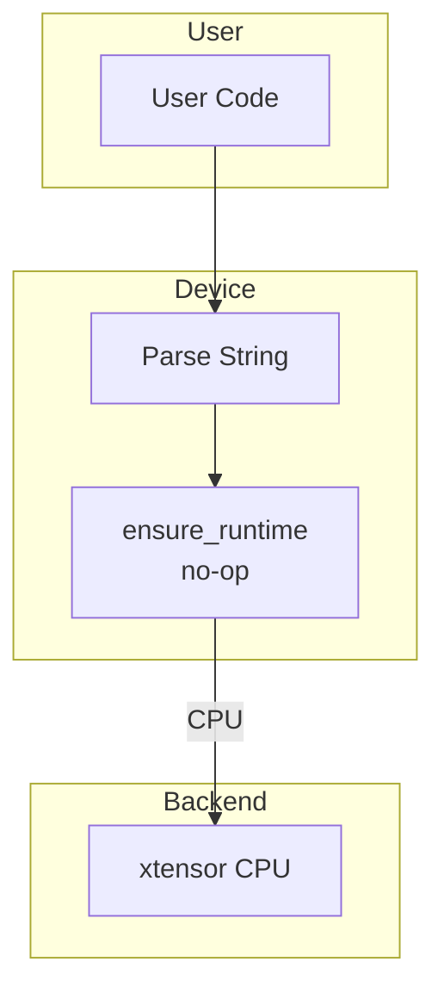

# Device

Device abstraction for CPU computation.

## Theoretical Background

### Device Abstraction

Modern ML systems support multiple compute devices:
- **CPU**: Universal, moderate performance
- **GPU/TPU/NPU**: Specialized accelerators (not implemented by this abstraction — see below)

This project's `Device`/`DeviceType` descriptor is CPU-only. It is a separate,
smaller abstraction from the `NN_BACKEND` tensor backend selection (see
[Tensor](./Tensor.md)) — it is what `Module::to(device)` and
`autoencoderRunner`'s `--device` CLI flag consume, not what dispatches tensor
math.

## How It Is Implemented Here

### Device Type

```cpp
// File: include/device/DeviceType.hpp
namespace nn
{
enum class DeviceType
{
    CPU,
};
}
```

### Device

```cpp
// File: include/device/Device.hpp
struct Device
{
    DeviceType type = DeviceType::CPU;
    std::string id = "cpu";
    bool profiling_enabled = false;

    static auto from_string(const std::string& s) -> Device
    {
        if (s.empty()) return Device{DeviceType::CPU, "cpu"};
        return Device{DeviceType::CPU, s};
    }

    auto with_profiling(bool enabled) const -> Device
    {
        Device d = *this;
        d.profiling_enabled = enabled;
        return d;
    }

    bool is_cpu() const { return type == DeviceType::CPU; }
    const std::string& to_string() const { return id; }
};
```

### Device Runtime

```cpp
// File: include/device/DeviceRuntime.hpp
struct DeviceRuntime
{
    static void ensure_runtime(const Device& device);
};
```

`ensure_runtime()` is an unconditional no-op (`src/core/tensor/DeviceRuntime.cpp`):
CPU needs no runtime warm-up. It previously lazily started a GPU runtime
scope on first call; that code path was removed along with the GPU backends.
It stays in the API so `Module::to(device)` call sites don't need to change.

## Data Flow



## Usage Example

```cpp
// File: src/core/tensor/DeviceRuntime.cpp
#include "device/Device.hpp"
#include "tensor/Tensor.hpp"

// Create device from string
nn::Device device = nn::Device::from_string("cpu");

// With profiling
nn::Device device_profiled = device.with_profiling(true);

// Runtime initialization is a no-op on this CPU-only abstraction, kept so
// call sites need no special-casing.
nn::DeviceRuntime::ensure_runtime(device);

// Model to device
model->to(device);
```

## See Also

- [Tensor](./Tensor.md) - Backend selection
- [Architecture](../Architecture.md) - System overview

## References

[1] J. D. Owens, M. Houston, D. Luebke, S. Green, J. E. Stone, and J. C. Phillips, "GPU computing," *Proc. IEEE*, vol. 96, no. 5, pp. 879–899, May 2008. [Online]. Available: https://doi.org/10.1109/JPROC.2008.917757