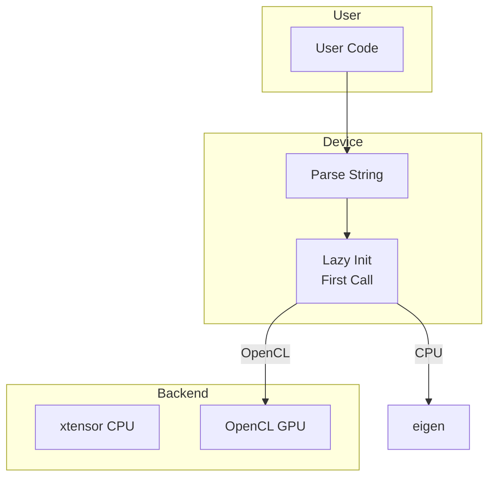

# Device

Device abstraction for CPU and OpenCL GPU computation with lazy initialization.

## Theoretical Background

### Device Abstraction

Modern ML systems support multiple compute devices:
- **CPU**: Universal, moderate performance
- **GPU (CUDA/OpenCL)**: High parallelism, tensor ops
- **TPU/NPU**: Specialized accelerators

### Lazy Initialization

OpenCL runtime initialization is expensive. Using lazy initialization:
- First call triggers one-time initialization
- Runtime lives for process lifetime
- No explicit cleanup needed

### GPU Memory Management

- **Allocation**: `clCreateBuffer`
- **Transfer**: `clEnqueueRead/WriteBuffer`
- **Pinned Memory**: `CL_MEM_ALLOC_HOST_PTR` for faster DMA

## How It Is Implemented Here

### Device Type

```cpp
// File: include/nn/device/DeviceType.hpp
namespace nn
{
enum class DeviceType
{
    CPU,
    OPENCL,
};
}
```

### Device

```cpp
// File: include/nn/device/Device.hpp
struct Device
{
    DeviceType type = DeviceType::CPU;
    std::string id = "cpu";
    bool profiling_enabled = false;

    static auto from_string(const std::string& s) -> Device
    {
        if (s == "cpu") return Device{DeviceType::CPU, s};
        if (s.rfind("opencl", 0) == 0) return Device{DeviceType::OPENCL, s};
        return Device{DeviceType::CPU, s};
    }

    bool is_cpu() const { return type == DeviceType::CPU; }
    bool is_opencl() const { return type == DeviceType::OPENCL; }
};
```

### Device Runtime

```cpp
// File: include/nn/device/DeviceRuntime.hpp
struct DeviceRuntime
{
    // Lazy initialization - thread-safe
    static void ensure_runtime(const Device& device);
};
```

## Data Flow



## Usage Example

```cpp
// File: src/core/tensor/opencl/DeviceRuntime.cpp
#include "nn/device/Device.hpp"
#include "nn/tensor/Tensor.hpp"

// Create device from string
nn::Device device = nn::Device::from_string("opencl");

// With profiling
nn::Device device_profiled = device.with_profiling(true);

// Lazy runtime initialization - called on first GPU operation
nn::DeviceRuntime::ensure_runtime(device);

// Model to device
model->to(device);
```

## Common Pitfalls

1. **Device Mismatch**: Can't mix CPU and GPU tensors in operations

2. **Memory**: GPU memory limited; watch allocation

3. **Pinned Memory**: Only for frequent CPU-GPU transfers

4. **Profiling Overhead**: Can slow down execution

## See Also

- [Tensor](./Tensor.md) - Backend selection
- [Architecture](./Architecture.md) - System overview

## References

[1] A. Munshi, "The OpenCL specification," Khronos OpenCL Working Group, 2009. [Online]. Available: https://www.khronos.org/opencl/

[2] J. D. Owens, M. Houston, D. Luebke, S. Green, J. E. Stone, and J. C. Phillips, "GPU computing," *Proc. IEEE*, vol. 96, no. 5, pp. 879–899, May 2008. [Online]. Available: https://doi.org/10.1109/JPROC.2008.917757