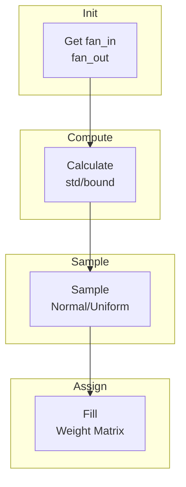

# Initializers

Weight initialization strategies to prevent vanishing/exploding gradients.

## Theoretical Background

Proper initialization ensures activations and gradients maintain reasonable magnitudes across layers. Without it, deep networks fail to train effectively [3].

### Xavier/Glorot Initialization

Designed for sigmoid/tanh activations. Weights sampled from:

$$W \sim U\left(-\frac{\sqrt{6}}{\sqrt{n_{in} + n_{out}}}, \frac{\sqrt{6}}{\sqrt{n_{in} + n_{out}}}\right)$$

Or equivalently from Gaussian $\mathcal{N}(0, \frac{2}{n_{in} + n_{out}})$.

This maintains variance of activations: $\text{Var}(y) = \text{Var}(x)$ across layers [3].

### Kaiming/He Initialization

Designed for ReLU and spiking (LIF) activations. This project uses the **He-uniform**
form implemented by `kaimingSNNInitializer` below, not a Gaussian:

$$\ell = \sqrt{\frac{6}{n_{in}}}, \qquad W_{ij} \sim \mathcal{U}(-\ell, +\ell), \qquad b = 0,$$

where $n_{in}$ is the fan-in. The uniform interval $[-\ell,\ell]$ has variance
$\ell^2/3 = 2/n_{in}$ — the same He target variance, reached via a uniform rather than
normal draw. This accounts for ReLU/spike-threshold nonlinearities zeroing about half
the values [4]. See [Weight-Initialisation](../Concepts/Weight-Initialisation.md) for
the full derivation.

## How It Is Implemented Here

```cpp
// File: include/initializers/xavier.hpp
class XavierInitializer
{
public:
    static void initialize(Tensor& weights, unsigned int seed = std::random_device{}())
    {
        auto [fan_in, fan_out] = get_fan(weights);
        float bound = std::sqrt(6.0f / (fan_in + fan_out));

        std::mt19937 gen(seed);
        std::uniform_real_distribution<float> dist(-bound, bound);

        for (size_t i = 0; i < weights.rows(); ++i)
        {
            for (size_t j = 0; j < weights.cols(); ++j)
            {
                weights.at(i, j) = dist(gen);
            }
        }
    }
};
```

```cpp
// File: include/initializers/kaiming_snn.hpp
// Free function that initializes a Linear layer in place with He-uniform weights
// (limit ℓ = sqrt(6/fan_in), W ~ U(-ℓ,+ℓ)) and zero bias.
template <typename Backend>
void kaimingSNNInitializer(const std::shared_ptr<LinearImpl<Backend>>& layer,
                           std::optional<unsigned int> seed = std::nullopt,
                           const std::string& sampler_default_type = "")
{
    const float limit = std::sqrt(6.0f / layer->in_features);
    std::mt19937 gen;
    if (seed.has_value())
        gen.seed(*seed ^ mix(sampler_default_type, *seed)); // deterministic
    else
        gen.seed(std::random_device{}());                    // NON-deterministic
    layer->weight = Tensor::rand(out, in, gen) * (2*limit) - limit;
    layer->bias.fill(0.0f);
}
// Pass `seed` for reproducible experiments; omit it for the historical
// random_device behavior. `SimpleResNetImpl` and `E05DsnnClassifier` both thread
// the experiment seed through so E05 runs are deterministic.
```

## Data Flow



## Usage Example

```cpp
// File: src/core/layers/dense/Linear.hpp
#include "nn/initializers/xavier.hpp"

template <typename Backend>
class Linear : public Module<Backend>
{
    Tensor weights_;

public:
    Linear(size_t in_features, size_t out_features)
    {
        weights_ = Tensor(in_features, out_features);
        XavierInitializer::initialize(weights_);
        bias_ = Tensor(1, out_features);
        bias_.fill(0.0f);
    }
};
```

## Common Pitfalls

1. **Wrong Initialization for Activation**: Use Xavier for sigmoid/tanh, Kaiming for ReLU

2. **Bias Initialization**: Set biases to zero initially

3. **Inconsistent Shape**: Ensure `fan_in`/`fan_out` computed correctly for conv layers

4. **Random Seed**: Always set seed for reproducibility in experiments

## See Also

- [Layers](./Layers.md) - Using initialized weights
- [Weight-Initialisation](../Concepts/Weight-Initialisation.md) - Detailed theory
- [Optimizers](./Optimizers.md) - Optimizing after initialization

## References

[1] X. Glorot and Y. Bengio, "Understanding the difficulty of training deep feedforward neural networks," in Proc. 13th Int. Conf. Artificial Intelligence and Statistics (AISTATS), 2010, pp. 249–256.

[2] K. He, X. Zhang, S. Ren, and J. Sun, "Delving deep into rectifiers: Surpassing human-level performance on ImageNet classification," in *Proc. IEEE Int. Conf. Computer Vision (ICCV)*, 2015. [Online]. Available: https://arxiv.org/abs/1502.01852