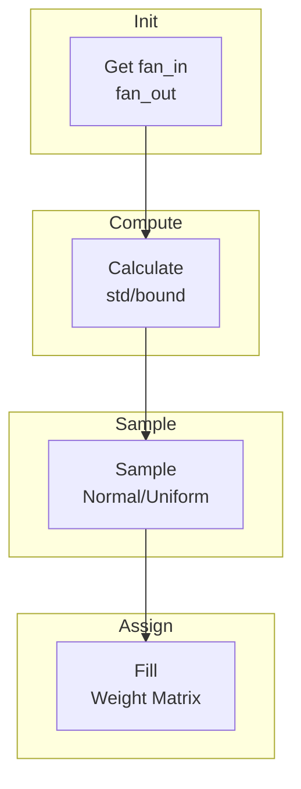

# Initializers

Before a network has seen any training data, its weights need *some* starting
values — and the choice of those starting values turns out to matter a great
deal. This page explains why, and documents the two initialisation strategies
`nn` provides: Xavier/Glorot and Kaiming/He.

## Theoretical Background

### Why initial weight values matter

If every weight in a network started at exactly the same value (say, zero),
every neuron in a layer would compute the exact same output and receive the
exact same gradient — the network would never break that symmetry, and every
neuron in a layer would learn to do the same thing, wasting almost all of the
network's capacity. So weights must start at *different* random values.

But random values chosen carelessly cause a subtler problem. As data flows
forward through many layers, each layer's output feeds the next layer's input.
If each layer tends to shrink the scale of the numbers passing through it
(even slightly), that shrinkage compounds across layers — by the time you're
ten layers deep, the signal can have shrunk to nearly nothing. The same thing
happens to *gradients* flowing backward during training. These are the
**vanishing gradient** and **exploding gradient** problems, and a bad choice of
initial weight scale is often the cause: with poorly-scaled initial weights,
a deep network may fail to learn no matter how long you train it [3]. The
initialisation strategies below are specifically designed to choose a starting
scale that keeps signals (and gradients) roughly the same size as they pass
through each layer.

### Xavier/Glorot initialization

Designed for layers that use "S-shaped" activations like sigmoid or tanh (see
[Layers](./Layers.md) for what an activation function is). Weights are drawn
from a uniform distribution:

$$W \sim U\left(-\frac{\sqrt{6}}{\sqrt{n_{in} + n_{out}}}, \frac{\sqrt{6}}{\sqrt{n_{in} + n_{out}}}\right)$$

(equivalently, from a Gaussian $\mathcal{N}(0, \frac{2}{n_{in} + n_{out}})$ —
both give the same target variance). Here $n_{in}$ and $n_{out}$ are the
number of inputs and outputs of the layer (its "fan-in" and "fan-out"). This
choice of range is derived specifically to keep the *variance* (spread) of the
activations the same going into a layer as coming out of it [3]:
$\text{Var}(y) = \text{Var}(x)$.

### Kaiming/He initialization

Designed for ReLU-style activations and, in this project, for the spiking
(LIF) layers too. This project uses the **He-uniform** variant, implemented by
`kaimingSNNInitializer` below — a uniform draw, not the Gaussian draw from
He et al.'s original paper:

$$\ell = \sqrt{\frac{6}{n_{in}}}, \qquad W_{ij} \sim \mathcal{U}(-\ell, +\ell), \qquad b = 0$$

where $n_{in}$ is the fan-in (number of inputs to the layer). A uniform draw
over $[-\ell,\ell]$ has variance $\ell^2/3 = 2/n_{in}$ — the same target
variance He et al. derive, just reached by a different (uniform, rather than
normal) distribution shape. The factor of 2 (rather than Xavier's use of both
fan-in and fan-out) exists specifically to account for ReLU/spike-threshold
nonlinearities: because they zero out roughly half of their inputs, using only
fan-in in the variance formula compensates for that loss [4]. See
[Weight Initialisation](../Concepts/Weight-Initialisation.md) for the full
derivation.

## How It Is Implemented Here

```cpp
// File: include/initializers/xavier.hpp
class XavierInitializer
{
public:
    static void initialize(Tensor& weights, unsigned int seed = std::random_device{}())
    {
        auto [fan_in, fan_out] = get_fan(weights);
        float bound = std::sqrt(6.0f / (fan_in + fan_out));

        std::mt19937 gen(seed);
        std::uniform_real_distribution<float> dist(-bound, bound);

        for (size_t i = 0; i < weights.rows(); ++i)
        {
            for (size_t j = 0; j < weights.cols(); ++j)
            {
                weights.at(i, j) = dist(gen);
            }
        }
    }
};
```

```cpp
// File: include/initializers/kaiming_snn.hpp
// Free function that initializes a Linear layer in place with He-uniform weights
// (limit ℓ = sqrt(6/fan_in), W ~ U(-ℓ,+ℓ)) and zero bias.
template <typename Backend>
void kaimingSNNInitializer(const std::shared_ptr<LinearImpl<Backend>>& layer,
                           std::optional<unsigned int> seed = std::nullopt,
                           const std::string& sampler_default_type = "")
{
    const float limit = std::sqrt(6.0f / layer->in_features);
    std::mt19937 gen;
    if (seed.has_value())
        gen.seed(*seed ^ mix(sampler_default_type, *seed)); // deterministic
    else
        gen.seed(std::random_device{}());                    // NON-deterministic
    layer->weight = Tensor::rand(out, in, gen) * (2*limit) - limit;
    layer->bias.fill(0.0f);
}
```

Pass an explicit `seed` when you need the exact same initial weights on every
run (any experiment whose results get reported); omit it to fall back to
non-reproducible randomness from the OS, which is only appropriate for
throwaway/exploratory runs. `SimpleResNetImpl` and `ThesisDsnnClassifier` both
thread the experiment's seed through to this function so that Experiment05
runs are fully reproducible end-to-end.

## Data Flow



## Usage Example

```cpp
// File: src/core/layers/dense/Linear.hpp
#include "initializers/xavier.hpp"

template <typename Backend>
class Linear : public Module<Backend>
{
    Tensor weights_;

public:
    Linear(size_t in_features, size_t out_features)
    {
        weights_ = Tensor(in_features, out_features);
        XavierInitializer::initialize(weights_);
        bias_ = Tensor(1, out_features);
        bias_.fill(0.0f);
    }
};
```

## Common Pitfalls

1. **Mismatched initializer and activation.** Use Xavier for sigmoid/tanh
   layers; use Kaiming for ReLU and spiking (LIF) layers. Using the wrong one
   doesn't crash anything — it just quietly reintroduces the
   vanishing/exploding-signal problem the initializer was supposed to prevent.

2. **Non-zero bias initialisation.** Biases should start at zero (weights are
   what need the careful random spread; biases don't have the same symmetry
   problem).

3. **Wrong fan-in/fan-out for convolutional layers.** A convolution's
   effective fan-in includes the kernel size, not just the number of input
   channels — get this wrong and the variance calculation above no longer
   holds.

4. **No random seed.** As with data loading, always set a seed for any
   initialisation you want to be able to reproduce later.

## See Also

- [Layers](./Layers.md) — where initialised weights are actually used
- [Weight Initialisation](../Concepts/Weight-Initialisation.md) — the full derivation, worked through
- [Optimizers](./Optimizers.md) — what happens to these weights during training

## References

[1] X. Glorot and Y. Bengio, "Understanding the difficulty of training deep feedforward neural networks," in *Proc. 13th Int. Conf. Artificial Intelligence and Statistics (AISTATS)*, 2010, pp. 249–256.

[2] K. He, X. Zhang, S. Ren, and J. Sun, "Delving deep into rectifiers: Surpassing human-level performance on ImageNet classification," in *Proc. IEEE Int. Conf. Computer Vision (ICCV)*, 2015. [Online]. Available: https://arxiv.org/abs/1502.01852

> In-text numbers follow the project-wide numbering in [References](../References.md). The entries cited above are reproduced here.

[3] X. Glorot and Y. Bengio, "Understanding the difficulty of training deep feedforward neural networks," in Proc. 13th Int. Conf. Artificial Intelligence and Statistics (AISTATS), 2010, pp. 249–256. [Online]. Available: http://proceedings.mlr.press/v9/glorot10a
[4] K. He, X. Zhang, S. Ren, and J. Sun, "Delving deep into rectifiers: Surpassing human-level performance on ImageNet classification," in Proc. IEEE Int. Conf. Computer Vision (ICCV), 2015, pp. 1026–1034. [Online]. Available: https://arxiv.org/abs/1502.01852
