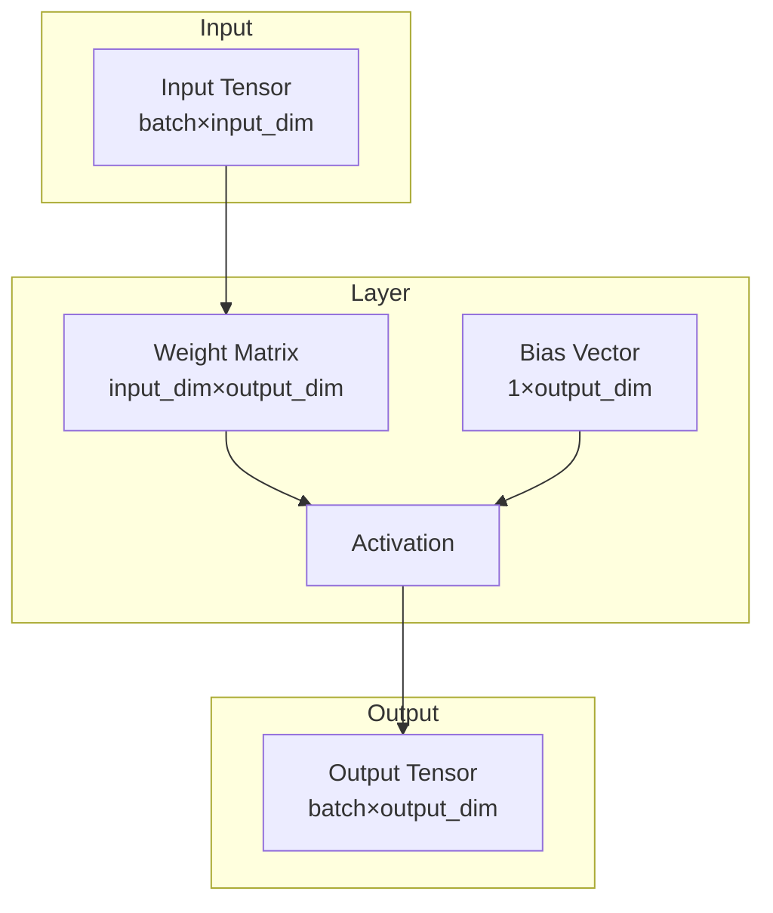

# Layers

The nn library provides a comprehensive set of neural network layers, including dense layers, convolutional layers, spiking neurons, and residual blocks.

## Theoretical Background

A neural network layer transforms input data through a weighted combination:

$$y = f(Wx + b)$$

Where:
- $x$ is the input vector
- $W$ is the weight matrix
- $b$ is the bias vector
- $f$ is the activation function

### Activation Functions

Common activations include:
- **ReLU**: $f(x) = \max(0, x)$ [4]
- **LeakyReLU**: $f(x) = x$ if $x > 0$, else $\alpha x$
- **Sigmoid**: $f(x) = 1/(1 + e^{-x})$
- **Tanh**: $f(x) = \tanh(x)$

### Convolutional Layers

Convolutional layers apply local filters:

$$y_{i,j,k} = \sum_{m,n} x_{i,m,n} \cdot w_{k,m,n} + b_k$$

This preserves spatial structure in images.

## How It Is Implemented Here

All layers inherit from `nn::Module`:

```cpp
// File: include/nn/layers/base/Module.hpp
template <typename Backend>
class Module
{
public:
    virtual auto forward(const Tensor& input, bool requires_grad) -> Tensor = 0;
    virtual void backward(const Tensor& grad_output) = 0;
    virtual auto params() -> std::vector<Tensor*> = 0;
};
```

### Dense (Linear) Layer

```cpp
// File: include/nn/layers/dense/Linear.hpp
template <typename Backend>
class Linear : public Module<Backend>
{
    Tensor weights_;   // (input_features, output_features)
    Tensor bias_;      // (1, output_features)

    auto forward(const Tensor& input, bool requires_grad) -> Tensor override
    {
        return input.matrixMultiply(weights_) + bias_;
    }
};
```

### Spiking Neuron (Leaky Integrate-and-Fire)

```cpp
// File: include/nn/layers/spiking/Leaky.hpp
class Leaky : public Module<EigenTensorBackend>
{
    float threshold_ = 1.0f;
    float leak_rate_ = 0.99f;

    auto forward(const Tensor& input, bool requires_grad) -> Tensor override
    {
        // Membrane potential update with leak
        Tensor output = membrane_potential_ * leak_rate_ + input;
        // Spike generation with threshold
        // ... see SNN-and-Surrogate-Gradients.md
    }
};
```

## Data Flow



## Usage Example

```cpp
// File: include/nn/layers/eigen/Layers.hpp
#include "nn/layers/dense/Linear.hpp"
#include "nn/layers/activations/ReLU.hpp"

// Create a simple MLP: 128 -> 64 -> 32
nn::layers::Linear<nn::EigenTensorBackend> fc1(128, 64);
nn::layers::ReLU relu1;
nn::layers::Linear<nn::EigenTensorBackend> fc2(64, 32);

// Forward pass
nn::Tensor x = /* input data */;
nn::Tensor h = fc1.forward(x, true);
h = relu1.forward(h, true);
nn::Tensor y = fc2.forward(h, true);
```

## Common Pitfalls

1. **Shape Mismatch**: Ensure layer input dimensions match previous layer output dimensions

2. **Gradient Accumulation**: Always call `optimizer.zero_grad()` before backward pass to avoid accumulating gradients

3. **Spiking Neuron Reset**: In SNN layers, ensure membrane potential is properly reset after spikes

4. **Weight Initialization**: Use appropriate initializers (Xavier/Kaiming) to avoid vanishing/exploding gradients

## See Also

- [Tensor](./Tensor.md) - Data structure used by layers
- [SNN and Surrogate Gradients](../Concepts/SNN-and-Surrogate-Gradients.md) - Spiking neuron implementation
- [Residual Blocks](../Concepts/Residual-Blocks.md) - Skip connections
- [Weight Initialisation](../Concepts/Weight-Initialisation.md) - Proper weight initialization

## References

[1] X. Glorot and Y. Bengio, "Understanding the difficulty of training deep feedforward neural networks," in Proc. 13th Int. Conf. Artificial Intelligence and Statistics (AISTATS), 2010, pp. 249–256.

[2] K. He, X. Zhang, S. Reshe, and J. Sun, "Delving deep into rectifiers: Surpassing human-level performance on ImageNet classification," in Proc. IEEE Int. Conf. Computer Vision (ICCV), 2015.
