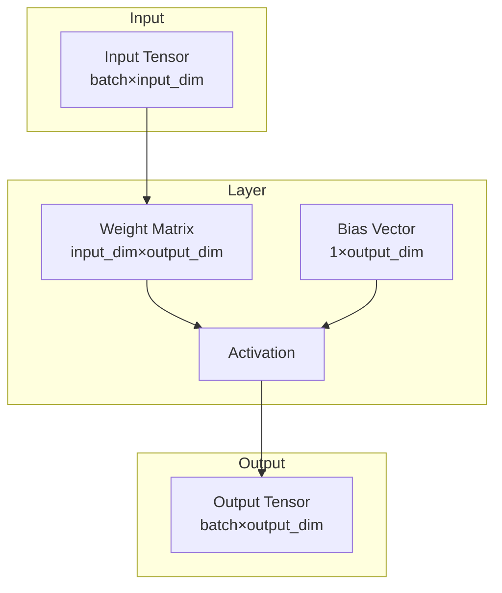

# Layers

The nn library provides a comprehensive set of neural network layers, including dense layers, convolutional layers, spiking neurons, and residual blocks.

## Theoretical Background

A neural network layer transforms input data through a weighted combination:

$$y = f(Wx + b)$$

Where:
- $x$ is the input vector
- $W$ is the weight matrix
- $b$ is the bias vector
- $f$ is the activation function

### Activation Functions

Common activations include:
- **ReLU**: $f(x) = \max(0, x)$ [4]
- **LeakyReLU**: $f(x) = x$ if $x > 0$, else $\alpha x$
- **Sigmoid**: $f(x) = 1/(1 + e^{-x})$
- **Tanh**: $f(x) = \tanh(x)$

#### Fast Activation Approximations

`include/layers/activations/FastActivations.hpp` provides rational approximations that avoid `exp()`:

| Function | Formula | Max error | Use case |
|---|---|---|---|
| `sigmoid_fast(x)` | $0.5 + x / (2(1+\|x\|))$ | < 0.01 | LSTM gates, anywhere exp() is hot |
| `tanh_fast(x)` | $x / (1 + \|x\|)$ | < 0.01 | LSTM cell candidate, cell state |

Fused variants read directly from a column range of a source tensor, skipping the intermediate `block()` copy:

```cpp
// Reads pre[:,col_start:col_start+gate_size] and applies sigmoid in one pass.
// Avoids one alloc + one read-scan vs. sigmoid_fast_tensor(pre.block(...)).
nn::activations::sigmoid_fast_block(pre, col_start, gate_size);
nn::activations::tanh_fast_block(pre, col_start, gate_size);
```

**Performance impact (B=1, D=128, H=32):** Gate computation fell from 43.7% → 1.1% of full LSTM timestep. Full timestep **2.85× faster**. See [LSTM-and-BPTT](../Concepts/LSTM-and-BPTT.md#performance-characteristics-and-optimizations) for full microbenchmark data.

**Backend-generic since the cross-backend ground-truth pass (2026-07-15):** all four functions above are templated on `Backend` (`nn::TensorImpl<Backend>` argument/return), not hardcoded to `nn::Tensor`. Before that fix they only compiled for whichever single backend the build had selected as `nn::Backend` — `LSTMLayerImpl<Backend>` (which calls `sigmoid_fast_block`/`tanh_fast_block` internally) silently failed to compile for any other backend, and nothing had ever instantiated it otherwise to catch this. Found by `pytorch_parity_gtest` (see [Ground-Truth-and-Smoke-Testing](../Guides/Ground-Truth-and-Smoke-Testing.md)), which now runs `LSTMLayerImpl<XT>/<CL>/<Device>/<SY>` side-by-side against the same PyTorch fixture.

### Convolutional Layers

Convolutional layers apply local filters:

$$y_{i,j,k} = \sum_{m,n} x_{i,m,n} \cdot w_{k,m,n} + b_k$$

Output length formula for 1D convolution: $L_{out} = \lfloor(L + 2P - K)/S\rfloor + 1$

This preserves spatial structure in images.

**Implementation status:** `Conv1dImpl` (file: `include/layers/convolution/Conv1d.hpp`) and
`MaxPool1dImpl` / `MaxPool2dImpl` (files: `convolution/MaxPool1d.hpp`, `MaxPool2d.hpp`) are documented
placeholders that validate input shape and return the input unchanged. Forward-only contract.
Tests in `fundamental_mechanisms_gtest` document this placeholder behaviour.

## How It Is Implemented Here

All layers inherit from `nn::Module`:

```cpp
// File: include/layers/base/Module.hpp
template <typename Backend>
class Module
{
public:
    virtual auto forward(const Tensor& input, bool requires_grad) -> Tensor = 0;
    virtual void backward(const Tensor& grad_output) = 0;
    virtual auto params() -> std::vector<Tensor*> = 0;
};
```

### Dense (Linear) Layer

```cpp
// File: include/layers/dense/Linear.hpp
template <typename Backend>
class Linear : public Module<Backend>
{
    Tensor weights_;   // (input_features, output_features)
    Tensor bias_;      // (1, output_features)

    auto forward(const Tensor& input, bool requires_grad) -> Tensor override
    {
        return input.matrixMultiply(weights_) + bias_;
    }
};
```

Backward-path note (OpenCL):
- For OpenCL backend, `dL/dW` uses direct lhs-transposed matmul
    (`matmul_lhs_transposed`) instead of explicit `transpose(dL/dY)` followed by
    regular matmul.
- This reduces backward hot-path cost for dense layers and is validated by
    OpenCL backend tests plus benchmark probe rows in
    `src/core/tensor/tests/tensor_perf_bench.cpp`.

### Spiking Neuron (Leaky Integrate-and-Fire)

`LifImpl` keeps persistent membrane state across sequential `forward()` calls.
Trainable parameters: `resistance` (R), `capacitance` (C), `voltage_threshold` (V_th).
Spike-frequency adaptation is available via `adapt_decay` / `adapt_coupling`.

```cpp
// File: include/layers/spiking/Lif.hpp
template <typename Backend>
struct LifImpl : public Module<Backend>
{
    float time_step = 1.0F;
    Tensor resistance, capacitance, voltage_threshold;  // trainable 1×1
    Tensor v_mem;           // persistent membrane state (B×F)
    float adapt_decay    = 0.9F;  // threshold decay factor
    float adapt_coupling = 0.0F;  // threshold rise per spike (0 = disabled)
    Tensor adapt_a;               // adaptation variable (B×F)

    // β = exp(-Δt/(R·C)); V[t] = β·V[t-1] + I[t]
    // Effective threshold: V_th + adapt_a
    // On spike: V → V_reset; adapt_a += adapt_coupling
};
```

`LifBPTTImpl` unrolls the full sequence in one `forward(input (T*B,F))` call and
computes exact BPTT gradients for R, C, V_th including the recurrent reset path.
It is serialisable: `state_dict`/`load_state_dict` persist `resistance`,
`capacitance`, and `voltage_threshold` (audit M-4 — added so checkpoints retain
LIF parameters; previously only `LifImpl` exposed them). See
[SNN and Surrogate Gradients](../Concepts/SNN-and-Surrogate-Gradients.md) for full detail.

> Note (audit m-2): R and C are not separately identifiable — only $\tau = R \cdot C$ matters. See [Membrane Dynamics](../Concepts/Membrane-Dynamics.md).

**Temporal DSNN classifier (Experiment05).** `E05DsnnClassifier` stacks
`Linear → LifBPTT → … → Linear` and runs the static feature vector over
`kSnnTimeSteps` (default 16) via constant-current rate encoding (time-major
`(T*B,F)`), reading out the mean spike rate over time as class logits (audit M-4).
This is a genuine temporal SNN — see [Experiment05](../Experiments/Experiment05.md).

OpenCL integration update (2026-05-10):
- `LifImpl` now uses a backend-gated fast path when the active backend exposes
    fused helpers:
    - `lif_step_inplace(...)` for forward membrane update + spike generation
    - `lif_grad(...)` for exponential surrogate gradient in backward
- Fallback behavior remains available for backends without these helpers.

Validation path:
- Backend helper correctness tests in `opencl_tensor_backend_gtest`.
- Layer-level OpenCL-instantiated tests in the same target:
    - `LeakyLayerForwardParityOnOpenCLBackend`
    - `LeakyLayerBackwardExponentialSurrogateOnOpenCLBackend`

### Threshold-Dependent Batch Normalization (tdBN)

Normalises the pre-spike current per channel — pooling statistics over **batch and
time** — and rescales by $\alpha V_{th}$ so the input to each LIF layer is distributed
as $N(0,(\alpha V_{th})^2)$, enabling stable training of deep SNNs [33]. Output is
$Y_k = \gamma_k(\alpha V_{th}\hat{X}_k) + \beta_k$ ($\beta$ unscaled). Full theory,
derivation and a worked example: [Threshold-Dependent Batch Normalization](../Concepts/Threshold-Dependent-Batch-Normalization.md).

```cpp
// File: include/layers/spiking/ThresholdDependentBatchNorm.hpp
template <typename Backend>
class ThresholdDependentBatchNormImpl : public Module<Backend>
{
public:
    float alpha = 1.0F;              // α: target std = α·V_th (paper default 1)
    float voltage_threshold = 1.0F;  // V_th of the downstream LIF layer
    int time_steps = 1;              // T: statistics pool over batch AND time
    float eps = 1e-5F;
    float momentum = 0.1F;           // EMA rate for inference running stats
    Tensor gamma;   // learned per-channel scale (1×F)
    Tensor beta;    // learned per-channel shift (1×F)
    Tensor running_mean, running_var; // inference buffers (1×F)

    explicit ThresholdDependentBatchNormImpl(
        size_t num_features, float vth = 1.0F, int T = 1,
        float alpha_ = 1.0F, float eps_ = 1e-5F, float momentum_ = 0.1F);
};
```

Insert between `Linear` and `LifBPTT` in deep SNN encoders:
```cpp
ThresholdDependentBatchNormImpl<Backend> tdbn(64, /*vth=*/1.0f, /*T=*/10);
auto h = tdbn.forward(fc.forward(input, true), true);
```

### ResidualBlock vs ResNetBlock

| Class | File | Status | Backward |
|---|---|---|---|
| `ResidualBlockImpl` | `residual/ResidualBlock.hpp` | Full | ✓ |
| `ResNetBlockImpl` | `residual/ResNetBlock.hpp` | Abstract | ✗ (not implemented) |

`ResNetBlockImpl` does not override `Module::backward()` and cannot be directly instantiated.
`ResidualBlockImpl` (MLP-style Linear/ReLU/Linear + skip) is fully tested in `fundamental_mechanisms_gtest`.

### Poisson Latent Layer (SNN-VAE)

Reparameterisable Poisson latent space for spiking variational autoencoders [29, 30].

> **Bug fix (2026-05-01):** KL sign error in `PoissonLatentLayer.hpp` line 115 corrected.
> Old code computed $-\text{KL}$ (always ≤ 0), adding it to total loss encouraged *divergence* from the prior.
> Correct formula: $\text{KL}(\text{Poisson}(\lambda) \| \text{Poisson}(\lambda_0)) = \lambda_0 - \lambda + \lambda \log(\lambda/\lambda_0) \geq 0$.
> Caught by `PoissonLatentTest.KLNonNegative` in `fundamental_mechanisms_gtest`.

```cpp
// File: include/layers/spiking/PoissonLatentLayer.hpp
template <typename Backend>
class PoissonLatentLayerImpl : public Module<Backend>
{
public:
    int time_steps = 1;
    float prior_rate = 0.1F;  // λ₀ for KL divergence
    float beta_kl = 1.0F;    // β weighting

    float kl_loss() const;              // add β*kl_loss() to total loss
    const Tensor& last_rates() const;   // λ values for sparsity logging

    explicit PoissonLatentLayerImpl(int T = 1, float prior_rate = 0.1F, float beta_kl = 1.0F);
    // forward(train): λ=softplus(z); s~Poisson(λ·T); return s/T
    // forward(infer): return λ (no stochastic sampling)
};
```

### LSTM Layer

Single-layer LSTM with full BPTT [5, 6]. Gate equations and backward derivation
verified against Hochreiter & Schmidhuber (1997) [5] and Greff et al. (2015) [6].

**Location:** `include/layers/lstm/LSTMLayer.hpp`

Weight layout (gates stacked [i|f|o|g] per [6]):
- `W_` : (4H × D) — input-to-hidden
- `U_` : (4H × H) — hidden-to-hidden
- `b_` : (4H × 1) — bias; forget-gate slice initialised to 1 [7]

```cpp
// File: include/layers/lstm/LSTMLayer.hpp
// forward dispatches on input rank:
//   (T, D)    → (T, H)     single sequence; persists h0_/c0_ across calls
//   (B, T, D) → (B, T, H)  batch; each of B samples starts from zero state

nn::models::lstm::LSTMLayer layer(input_size, hidden_size);

layer.reset_state();                             // zero h0_, c0_
auto out = layer.forward(seq_td,  true);         // (T,D)   → (T,H)
auto dx  = layer.backward(grad_th);              // (T,H)   → (T,D)

auto out3 = layer.forward(seq_btd, true);        // (B,T,D) → (B,T,H)
auto dx3  = layer.backward(grad_bth);            // (B,T,H) → (B,T,D)

auto params = layer.params();                    // span<nn::Tensor*>: {W_, U_, b_}
```

**Performance optimizations applied:**
- Gates use `sigmoid_fast_block` / `tanh_fast_block` (fused slice+activation, no intermediate copy).
- `b_T = b_.transpose()` computed once outside the time loop.
- `slice_time` / `setBlock` used for vectorized I/O instead of scalar loops.

See [LSTM-and-BPTT](../Concepts/LSTM-and-BPTT.md) for full equation derivation and microbenchmark data.

### Spike Losses

| Class | File | Use case |
|---|---|---|
| `SpikeCountLossImpl` | `losses/SpikeCountLoss.hpp` | Rate-coded SNN outputs; MSE on spike counts + rate regularization |
| `SpikeTimeLossImpl` | `losses/SpikeTimeLoss.hpp` | Latency-coded SNN outputs; MSE on first-spike times |

## Data Flow



## Usage Example

```cpp
// File: include/layers/Layers.hpp
#include "nn/layers/dense/Linear.hpp"
#include "nn/layers/activations/ReLU.hpp"

// Create a simple MLP: 128 -> 64 -> 32
nn::Linear fc1(128, 64);
nn::ReLU relu1;
nn::Linear fc2(64, 32);

// Forward pass
nn::Tensor x = /* input data */;
nn::Tensor h = fc1.forward(x, true);
h = relu1.forward(h, true);
nn::Tensor y = fc2.forward(h, true);
```

## Common Pitfalls

1. **Shape Mismatch**: Ensure layer input dimensions match previous layer output dimensions

2. **Gradient Accumulation**: Always call `optimizer.zero_grad()` before backward pass to avoid accumulating gradients

3. **Spiking Neuron Reset**: In SNN layers, ensure membrane potential is properly reset after spikes

4. **Weight Initialization**: Use appropriate initializers (Xavier/Kaiming) to avoid vanishing/exploding gradients

## See Also

- [Tensor](./Tensor.md) — Data structure used by layers
- [SNN and Surrogate Gradients](../Concepts/SNN-and-Surrogate-Gradients.md) — LIF neuron, tdBN, PoissonLatent
- [Spike Rate Regularization](../Concepts/Spike-Rate-Regularization.md) — SpikeCountLoss with dead/burst prevention
- [Spike Encoding](../Concepts/Spike-Encoding.md) — Rate vs latency coding; SpikeTimeLoss
- [Residual Blocks](../Concepts/Residual-Blocks.md) — Skip connections
- [Weight Initialisation](../Concepts/Weight-Initialisation.md) — Proper weight initialization

## References

[1] X. Glorot and Y. Bengio, "Understanding the difficulty of training deep feedforward neural networks," in *Proc. 13th Int. Conf. Artificial Intelligence and Statistics (AISTATS)*, 2010, pp. 249–256.

[2] K. He, X. Zhang, S. Ren, and J. Sun, "Delving deep into rectifiers: Surpassing human-level performance on ImageNet classification," in *Proc. IEEE Int. Conf. Computer Vision (ICCV)*, 2015. [Online]. Available: https://arxiv.org/abs/1502.01852

[29] K. Kamata et al., "Fully spiking variational autoencoder," in *Proc. AAAI Conf. Artificial Intelligence*, 2022.

[30] C. Chen et al., "ESVAE: An efficient spiking variational autoencoder with reparameterizable Poisson spiking sampling," arXiv:2310.14839, 2024.

[5] S. Hochreiter and J. Schmidhuber, "Long short-term memory," *Neural Computation*, vol. 9, no. 8, pp. 1735–1780, Nov. 1997. doi: [10.1162/neco.1997.9.8.1735](https://doi.org/10.1162/neco.1997.9.8.1735)

[6] K. Greff, R. K. Srivastava, J. Koutník, B. R. Steunebrink, and J. Schmidhuber, "LSTM: A search space odyssey," *IEEE Trans. Neural Netw. Learn. Syst.*, vol. 28, no. 10, pp. 2222–2232, 2017. arXiv: [1503.04069](https://arxiv.org/abs/1503.04069)

[7] R. Jozefowicz, W. Zaremba, and I. Sutskever, "An empirical evaluation of recurrent network architectures," in *Proc. ICML*, 2015, pp. 2342–2350.

[33] Y. Zheng et al., "Going deeper with directly-trained larger spiking neural networks," in *Proc. AAAI Conf. Artificial Intelligence*, 2021. [Online]. Available: https://arxiv.org/abs/2011.05280
