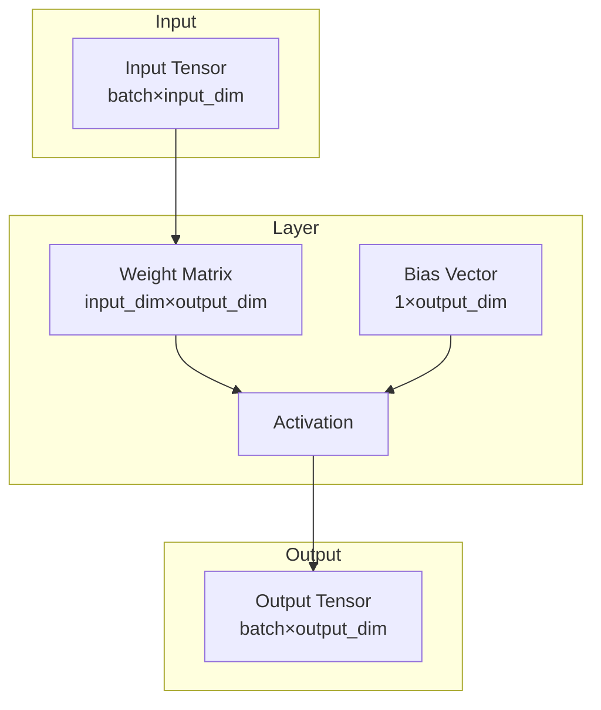

# Layers

A neural network is built by stacking small, reusable building blocks called
**layers**. Each layer takes a batch of numbers in, transforms them in some
fixed way, and passes numbers out to the next layer. This page catalogues
every layer type the `nn` library provides — dense (fully-connected), spiking,
convolutional, residual, and recurrent (LSTM) — and shows how to combine them.

If you are new to neural networks, read this alongside
[Autoencoders](../Concepts/Autoencoders.md) for the bigger picture of how
layers compose into a trainable model.

## Theoretical Background

### What a layer actually computes

The most common layer, the **dense** (or "fully-connected", or "linear")
layer, computes:

$$y = f(Wx + b)$$

In plain terms: take the input numbers $x$ (say, 128 of them), multiply each
one by a set of learned weights $W$ and add them up (that's $Wx$), add a
learned offset $b$ (the "bias"), and finally squash the result through a
non-linear function $f$ (the "activation function"). Multiple such layers
stacked in sequence is what makes a "deep" network.

Why the non-linearity $f$ matters: stacking two purely linear layers
($y = W_2(W_1 x)$) is mathematically identical to *one* linear layer — you gain
nothing. The activation function is what lets the network represent curves and
decision boundaries instead of only straight lines/planes.

### Activation functions

An activation function decides how strongly, and in what shape, a neuron's
combined input gets passed forward. Common choices:

- **ReLU**: $f(x) = \max(0, x)$ [4] — passes positive values through unchanged
  and zeroes out negative ones. Cheap to compute, and the default choice for
  most dense/convolutional networks.
- **LeakyReLU**: $f(x) = x$ if $x > 0$, else $\alpha x$ — like ReLU, but lets a
  small fraction ($\alpha$, e.g. 0.01) of negative values through instead of
  zeroing them. This avoids a failure mode called a "dead neuron", where a
  neuron gets stuck always outputting zero and its weights stop receiving any
  gradient to learn from.
- **Sigmoid**: $f(x) = 1/(1 + e^{-x})$ — squashes any real number into the
  range $(0, 1)$. Useful when the output should be interpreted as a
  probability or a gate that's "on" or "off" (see the LSTM gates below).
- **Tanh**: $f(x) = \tanh(x)$ — like sigmoid but squashes into $(-1, 1)$,
  centred at zero.

#### Fast activation approximations

Computing $e^x$ (needed by sigmoid and tanh) is one of the more expensive
single operations a CPU can do — expensive enough that, in a tight loop like an
LSTM running over hundreds of time steps, it shows up as a measurable fraction
of total training time. `include/layers/activations/FastActivations.hpp`
provides cheaper approximations that use only a division, trading a small,
bounded amount of accuracy for speed:

| Function | Formula | Max error | Use case |
|---|---|---|---|
| `sigmoid_fast(x)` | $0.5 + x / (2(1+\|x\|))$ | < 0.01 | LSTM gates, anywhere exp() is hot |
| `tanh_fast(x)` | $x / (1 + \|x\|)$ | < 0.01 | LSTM cell candidate, cell state |

The "fused" variants below go one step further: instead of first copying out a
slice of a larger tensor and *then* applying the activation to the copy (two
passes over memory, one allocation), they read the slice and apply the
activation in a single pass:

```cpp
// Reads pre[:,col_start:col_start+gate_size] and applies sigmoid in one pass.
// Avoids one alloc + one read-scan vs. sigmoid_fast_tensor(pre.block(...)).
nn::activations::sigmoid_fast_block(pre, col_start, gate_size);
nn::activations::tanh_fast_block(pre, col_start, gate_size);
```

**Measured impact** (batch size 1, input 128, hidden 32): before this fusion,
computing the LSTM's gates took 43.7% of the time spent on one time step; after,
it takes 1.1%, and a full time step runs 2.85× faster overall. See
[LSTM-and-BPTT](../Concepts/LSTM-and-BPTT.md#performance-characteristics-and-optimizations)
for the full measurement.

**Works with every tensor backend.** As of 2026-07-15, all four functions
above are written generically over the tensor backend type, rather than being
hard-wired to one specific backend. Before that, they silently compiled
correctly only for whichever single backend a given build happened to select —
nothing exercised them against any other backend, so a break would have gone
unnoticed. `pytorch_parity_gtest` (see
[Ground-Truth-and-Smoke-Testing](../Guides/Ground-Truth-and-Smoke-Testing.md))
now runs the LSTM layer against every backend side-by-side against the same
PyTorch reference to catch this class of bug.

### Convolutional layers

A convolutional layer applies the same small filter at every position of its
input, rather than a fully separate weight for every input/output pair. This
is what a "dense" layer would need to give up spatial structure entirely (it
treats the input as one long list of numbers); a convolution instead slides a
small pattern-detector across the input and asks "does this pattern appear
here?" at every position — which is why convolutions are the standard choice
for images, and also useful for 1D signals like audio:

$$y_{i,j,k} = \sum_{m,n} x_{i,m,n} \cdot w_{k,m,n} + b_k$$

For a 1D convolution, the output length depends on the input length $L$, the
padding $P$, the filter (kernel) size $K$, and the stride $S$ (how far the
filter moves between applications):

$$L_{out} = \lfloor(L + 2P - K)/S\rfloor + 1$$

**Implementation status:** `Conv1dImpl` (file:
`include/layers/convolution/Conv1d.hpp`) and `MaxPool1dImpl` / `MaxPool2dImpl`
(files: `convolution/MaxPool1d.hpp`, `MaxPool2d.hpp`) are **documented
placeholders** — they check that the input shape is valid and then return the
input unchanged, rather than performing an actual convolution or pooling
operation. This is deliberate and tested (`fundamental_mechanisms_gtest`), not
a bug: nothing in this project currently instantiates a network that needs a
working `Conv1d`.

## How It Is Implemented Here

Every layer in this codebase inherits from a common base class, `nn::Module`,
which fixes the contract every layer must satisfy: it must be able to run
forward (compute an output from an input) and backward (compute how the loss
would change if its inputs changed slightly — the gradient), and it must be
able to report which of its internal numbers are trainable weights:

```cpp
// File: include/layers/base/Module.hpp
template <typename Backend>
class Module
{
public:
    virtual auto forward(const Tensor& input, bool requires_grad) -> Tensor = 0;
    virtual void backward(const Tensor& grad_output) = 0;
    virtual auto params() -> std::vector<Tensor*> = 0;
};
```

### Dense (Linear) layer

The simplest layer, implementing exactly the $y = f(Wx+b)$ formula above (here
without an activation — the activation is applied by a separate layer, or
fused in for speed where noted):

```cpp
// File: include/layers/dense/Linear.hpp
template <typename Backend>
class Linear : public Module<Backend>
{
    Tensor weights_;   // (input_features, output_features)
    Tensor bias_;      // (1, output_features)

    auto forward(const Tensor& input, bool requires_grad) -> Tensor override
    {
        return input.matrixMultiply(weights_) + bias_;
    }
};
```

Backward-path note (OpenCL backend only): computing the weight gradient
$dL/dW$ needs the transpose of the incoming gradient. Rather than materialising
that transpose as its own tensor and then multiplying, the OpenCL backend has
a fused `matmul_lhs_transposed` kernel that does the transpose and the multiply
in one step. This exists purely for speed — it produces the same numbers,
just faster — and is checked by the OpenCL backend tests plus timing rows in
`src/core/tensor/tests/tensor_perf_bench.cpp`.

### Spiking neuron (Leaky Integrate-and-Fire)

A LIF ("Leaky Integrate-and-Fire") neuron is a different kind of building
block: instead of producing a continuous number every time it's called, it
accumulates ("integrates") its input over time into a "membrane voltage" that
slowly decays ("leaks"), and emits a single spike (a 1, otherwise 0) whenever
that voltage crosses a threshold — much like a bucket that fills with water,
slowly drains, and tips over once full. See
[SNN and Surrogate Gradients — Plain Language Guide](../Concepts/Plain/SNN-and-Surrogate-Gradients.md)
for the full intuition and analogy, and
[SNN and Surrogate Gradients](../Concepts/SNN-and-Surrogate-Gradients.md) for
the equations.

`LifImpl` keeps that membrane voltage as persistent state across sequential
`forward()` calls (i.e. calling it in a loop, once per time step, is how you
run it over a sequence). Its trainable parameters are the resistance `R`,
capacitance `C`, and firing threshold `voltage_threshold` (V_th) — the
"electrical circuit" constants that control how quickly the neuron forgets and
how easily it fires. An optional "spike-frequency adaptation" mechanism
(`adapt_decay` / `adapt_coupling`) can temporarily raise the threshold after
each spike, so a neuron doesn't fire on every single input:

```cpp
// File: include/layers/spiking/Lif.hpp
template <typename Backend>
struct LifImpl : public Module<Backend>
{
    float time_step = 1.0F;
    Tensor resistance, capacitance, voltage_threshold;  // trainable 1×1
    Tensor v_mem;           // persistent membrane state (B×F)
    float adapt_decay    = 0.9F;  // threshold decay factor
    float adapt_coupling = 0.0F;  // threshold rise per spike (0 = disabled)
    Tensor adapt_a;               // adaptation variable (B×F)

    // β = exp(-Δt/(R·C)); V[t] = β·V[t-1] + I[t]
    // Effective threshold: V_th + adapt_a
    // On spike: V → V_reset; adapt_a += adapt_coupling
};
```

`LifBPTTImpl` is the alternative you use when you want to train on a whole
sequence at once rather than one time step at a time. It unrolls the entire
sequence internally in a single `forward(input (T*B,F))` call (see
[Time-Major Layout](../Concepts/Time-Major-Layout.md) for what the `(T*B,F)`
shape means) and computes exact gradients for R, C, and V_th through the whole
sequence — this technique is called **Backpropagation Through Time (BPTT)**,
explained in [LSTM-and-BPTT](../Concepts/LSTM-and-BPTT.md). It can save and
reload its parameters via `state_dict`/`load_state_dict`, so a trained
network's learned R, C, and V_th survive being written to disk and loaded back.
Full detail: [SNN and Surrogate Gradients](../Concepts/SNN-and-Surrogate-Gradients.md).

> **Note:** R and C never need to be recovered individually — every equation
> in this layer only ever uses their product, the time constant
> $\tau = R \cdot C$. Two different (R, C) pairs with the same product behave
> identically. See [Membrane Dynamics](../Concepts/Membrane-Dynamics.md).

**Temporal classifier example (Experiment05).** `E05DsnnClassifier` stacks
`Linear → LifBPTT → … → Linear` and feeds a single static feature vector
repeatedly over `kSnnTimeSteps` (default 16) time steps — turning a
non-temporal input into a spike train by constant-current encoding — then reads
out the average spike rate over time as the class score. This is a genuine use
of the *temporal* dynamics of spiking neurons, not just a one-shot classifier
wearing an SNN costume. See [Experiment05](../Experiments/Experiment05.md).

**OpenCL backend note.** When running on the OpenCL (GPU) backend, `LifImpl`
uses two fused GPU kernels instead of the generic tensor operations: one that
does the membrane update and spike generation together
(`lif_step_inplace`), and one for the backward-pass surrogate gradient
(`lif_grad`). Backends that don't provide these fall back to the plain,
generic implementation automatically — this is purely a speed optimisation,
never a behaviour change. Verified by `opencl_tensor_backend_gtest`, including
`LeakyLayerForwardParityOnOpenCLBackend` and
`LeakyLayerBackwardExponentialSurrogateOnOpenCLBackend`.

### Threshold-Dependent Batch Normalization (tdBN)

Deep spiking networks have a stability problem: as a signal passes through
many LIF layers in sequence, the membrane voltages can drift — growing without
bound in some layers, shrinking to nothing in others — making training
unreliable. tdBN is a normalisation step, inserted between a dense layer and
its LIF layer, that rescales the incoming current so its statistics (mean and
spread) stay in the same, well-behaved range no matter how deep the network
is. Concretely, it normalises per-channel, pooling statistics over **both the
batch and the time dimension**, then rescales by $\alpha V_{th}$ so the LIF
layer downstream always receives input distributed as
$N(0,(\alpha V_{th})^2)$ [33]:

$$Y_k = \gamma_k(\alpha V_{th}\hat{X}_k) + \beta_k \qquad (\beta \text{ unscaled})$$

Full theory, derivation and a worked numeric example:
[Threshold-Dependent Batch Normalization](../Concepts/Threshold-Dependent-Batch-Normalization.md).

```cpp
// File: include/layers/spiking/ThresholdDependentBatchNorm.hpp
template <typename Backend>
class ThresholdDependentBatchNormImpl : public Module<Backend>
{
public:
    float alpha = 1.0F;              // α: target std = α·V_th (paper default 1)
    float voltage_threshold = 1.0F;  // V_th of the downstream LIF layer
    int time_steps = 1;              // T: statistics pool over batch AND time
    float eps = 1e-5F;
    float momentum = 0.1F;           // EMA rate for inference running stats
    Tensor gamma;   // learned per-channel scale (1×F)
    Tensor beta;    // learned per-channel shift (1×F)
    Tensor running_mean, running_var; // inference buffers (1×F)

    explicit ThresholdDependentBatchNormImpl(
        size_t num_features, float vth = 1.0F, int T = 1,
        float alpha_ = 1.0F, float eps_ = 1e-5F, float momentum_ = 0.1F);
};
```

Typical placement — between a `Linear` layer and its `LifBPTT`, in a deep SNN
encoder:
```cpp
ThresholdDependentBatchNormImpl<Backend> tdbn(64, /*vth=*/1.0f, /*T=*/10);
auto h = tdbn.forward(fc.forward(input, true), true);
```

### ResidualBlock vs ResNetBlock

A **residual (skip) connection** adds a layer's input directly to its output
($y = x + F(x)$ instead of just $y = F(x)$), which helps gradients flow
through very deep networks without vanishing. This project has two related
classes with different maturity levels:

| Class | File | Status | Backward |
|---|---|---|---|
| `ResidualBlockImpl` | `residual/ResidualBlock.hpp` | Full | ✓ |
| `ResNetBlockImpl` | `residual/ResNetBlock.hpp` | Abstract | ✗ (not implemented) |

`ResNetBlockImpl` does not implement `Module::backward()` and cannot be
instantiated directly — it exists as a scaffold for a future variant.
`ResidualBlockImpl` (a small MLP: Linear → ReLU → Linear, plus the skip
connection) is the complete, tested implementation — see
`fundamental_mechanisms_gtest` and [Residual Blocks](../Concepts/Residual-Blocks.md).

### Poisson Latent Layer (SNN-VAE)

This layer is the spiking-network equivalent of the "reparameterisation trick"
used in a standard Variational Autoencoder (VAE): instead of sampling a
Gaussian latent variable, it samples spike counts from a Poisson process
[29, 30]. See [Autoencoders](../Concepts/Autoencoders.md) if you are unfamiliar
with what a VAE's latent space is for.

> **Bug fix (2026-05-01):** a sign error in the KL-divergence formula (a term
> in the loss that measures how far the learned distribution has drifted from
> a fixed target) meant the old code always computed a *negative* penalty,
> which rewarded the network for drifting further away from the target rather
> than staying close to it — the opposite of the intended effect. The
> corrected formula, $\text{KL}(\text{Poisson}(\lambda) \| \text{Poisson}(\lambda_0)) = \lambda_0 - \lambda + \lambda \log(\lambda/\lambda_0) \geq 0$,
> is now enforced by a regression test, `PoissonLatentTest.KLNonNegative`, in
> `fundamental_mechanisms_gtest`.

```cpp
// File: include/layers/spiking/PoissonLatentLayer.hpp
template <typename Backend>
class PoissonLatentLayerImpl : public Module<Backend>
{
public:
    int time_steps = 1;
    float prior_rate = 0.1F;  // λ₀ for KL divergence
    float beta_kl = 1.0F;    // β weighting

    float kl_loss() const;              // add β*kl_loss() to total loss
    const Tensor& last_rates() const;   // λ values for sparsity logging

    explicit PoissonLatentLayerImpl(int T = 1, float prior_rate = 0.1F, float beta_kl = 1.0F);
    // forward(train): λ=softplus(z); s~Poisson(λ·T); return s/T
    // forward(infer): return λ (no stochastic sampling)
};
```

### LSTM layer

An LSTM ("Long Short-Term Memory") is the classical (non-spiking) way to give
a network memory across a sequence: at every time step, three learned "gates"
decide what to forget from the previous state, what new information to add,
and what to output. See [LSTM-and-BPTT](../Concepts/LSTM-and-BPTT.md) for the
full gate equations and a from-scratch derivation of the training procedure.
This implementation's equations and backward pass are checked against
Hochreiter & Schmidhuber's original paper [5] and Greff et al.'s
comprehensive comparison of LSTM variants [6].

**Location:** `include/layers/lstm/LSTMLayer.hpp`

The three weight tensors stack all four gates (named i, f, o, g, following the
convention in [6]) into single matrices, so one matrix multiply computes all
four gates' pre-activations at once instead of four separate multiplies:
- `W_` : (4H × D) — input-to-hidden weights
- `U_` : (4H × H) — hidden-to-hidden (recurrent) weights
- `b_` : (4H × 1) — bias; the forget-gate's slice is initialised to 1 rather
  than 0, a well-known trick [7] that makes the network default to
  "remember everything" early in training rather than forgetting by default.

```cpp
// File: include/layers/lstm/LSTMLayer.hpp
// forward dispatches on input rank:
//   (T, D)    → (T, H)     single sequence; persists h0_/c0_ across calls
//   (B, T, D) → (B, T, H)  batch; each of B samples starts from zero state

nn::models::lstm::LSTMLayer layer(input_size, hidden_size);

layer.reset_state();                             // zero h0_, c0_
auto out = layer.forward(seq_td,  true);         // (T,D)   → (T,H)
auto dx  = layer.backward(grad_th);              // (T,H)   → (T,D)

auto out3 = layer.forward(seq_btd, true);        // (B,T,D) → (B,T,H)
auto dx3  = layer.backward(grad_bth);            // (B,T,H) → (B,T,D)

auto params = layer.params();                    // span<nn::Tensor*>: {W_, U_, b_}
```

**Performance optimisations applied** (see
[LSTM Performance Guide](../Guides/LSTM-Performance.md) for the measurements
behind each one):
- Gate activations use the fused `sigmoid_fast_block` / `tanh_fast_block`
  helpers described above (no intermediate copy).
- The bias transpose `b_T = b_.transpose()` is computed once before the time
  loop starts, instead of being recomputed on every step.
- Reading and writing one time step's slice uses vectorised `slice_time` /
  `setBlock` calls instead of a manual element-by-element loop.

### Spike losses

A loss function measures how wrong the network's output is, and that number
is what backpropagation minimises. SNN outputs need loss functions matched to
how the spikes encode information — see
[Spike Encoding](../Concepts/Spike-Encoding.md) for the distinction between
these two encodings:

| Class | File | Use case |
|---|---|---|
| `SpikeCountLossImpl` | `losses/SpikeCountLoss.hpp` | Rate-coded outputs (information is in *how many* spikes fired) — mean-squared error on spike counts, plus a regularisation term that discourages neurons from always firing or never firing |
| `SpikeTimeLossImpl` | `losses/SpikeTimeLoss.hpp` | Latency-coded outputs (information is in *when* the first spike fires) — mean-squared error on first-spike timing |

## Data Flow



## Usage Example

```cpp
// File: include/layers/Layers.hpp
#include "layers/dense/Linear.hpp"
#include "layers/activations/ReLU.hpp"

// Create a simple MLP: 128 -> 64 -> 32
nn::Linear fc1(128, 64);
nn::ReLU relu1;
nn::Linear fc2(64, 32);

// Forward pass
nn::Tensor x = /* input data */;
nn::Tensor h = fc1.forward(x, true);
h = relu1.forward(h, true);
nn::Tensor y = fc2.forward(h, true);
```

## Common Pitfalls

1. **Shape mismatch.** A layer's input dimension must equal the previous
   layer's output dimension — if layer A outputs 64 numbers per sample, layer
   B must expect exactly 64 numbers in.

2. **Forgetting to zero gradients.** Gradients from `backward()` *accumulate*
   into each parameter by default — they don't automatically reset before the
   next batch. Always call `optimizer.zero_grad()` before computing a new
   `backward()` pass, or gradients from old batches will keep piling onto the
   new ones.

3. **Spiking neuron state not reset.** LIF layers keep their membrane voltage
   between calls, on purpose, so they can process a sequence one step at a
   time. But that means starting a *new, independent* sequence without
   calling `reset_state()` first will let the old sequence's leftover voltage
   leak into the new one.

4. **Weight initialisation.** Starting all weights at the same value, or at
   values too large/small, makes gradients vanish or explode as they pass
   through many layers. Use one of the provided initialisers (Xavier or
   Kaiming — see [Weight Initialisation](../Concepts/Weight-Initialisation.md))
   rather than ad-hoc random values.

## See Also

- [Tensor](./Tensor.md) — the data structure every layer operates on
- [SNN and Surrogate Gradients](../Concepts/SNN-and-Surrogate-Gradients.md) — LIF neuron, tdBN, PoissonLatent, in depth
- [Spike Rate Regularization](../Concepts/Spike-Rate-Regularization.md) — SpikeCountLoss with dead/burst prevention
- [Spike Encoding](../Concepts/Spike-Encoding.md) — rate vs latency coding; SpikeTimeLoss
- [Residual Blocks](../Concepts/Residual-Blocks.md) — skip connections, explained
- [Weight Initialisation](../Concepts/Weight-Initialisation.md) — why initial weight values matter

## References

[1] X. Glorot and Y. Bengio, "Understanding the difficulty of training deep feedforward neural networks," in *Proc. 13th Int. Conf. Artificial Intelligence and Statistics (AISTATS)*, 2010, pp. 249–256.

[2] K. He, X. Zhang, S. Ren, and J. Sun, "Delving deep into rectifiers: Surpassing human-level performance on ImageNet classification," in *Proc. IEEE Int. Conf. Computer Vision (ICCV)*, 2015. [Online]. Available: https://arxiv.org/abs/1502.01852

[29] K. Kamata et al., "Fully spiking variational autoencoder," in *Proc. AAAI Conf. Artificial Intelligence*, 2022.

[30] C. Chen et al., "ESVAE: An efficient spiking variational autoencoder with reparameterizable Poisson spiking sampling," arXiv:2310.14839, 2024.

[5] S. Hochreiter and J. Schmidhuber, "Long short-term memory," *Neural Computation*, vol. 9, no. 8, pp. 1735–1780, Nov. 1997. doi: [10.1162/neco.1997.9.8.1735](https://doi.org/10.1162/neco.1997.9.8.1735)

[6] K. Greff, R. K. Srivastava, J. Koutník, B. R. Steunebrink, and J. Schmidhuber, "LSTM: A search space odyssey," *IEEE Trans. Neural Netw. Learn. Syst.*, vol. 28, no. 10, pp. 2222–2232, 2017. arXiv: [1503.04069](https://arxiv.org/abs/1503.04069)

[7] R. Jozefowicz, W. Zaremba, and I. Sutskever, "An empirical evaluation of recurrent network architectures," in *Proc. ICML*, 2015, pp. 2342–2350.

[33] Y. Zheng et al., "Going deeper with directly-trained larger spiking neural networks," in *Proc. AAAI Conf. Artificial Intelligence*, 2021. [Online]. Available: https://arxiv.org/abs/2011.05280
