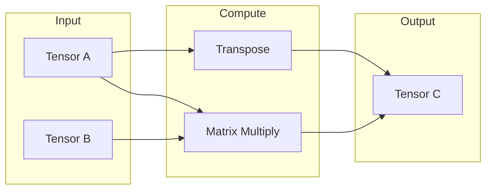

# Linear Algebra

Every neural network computation eventually boils down to a small set of
matrix operations: multiplying matrices together, transposing them, and
combining them element by element. This page documents the low-level
functions in `nn` that implement these operations — the ones every layer and
tensor backend ultimately calls into.

## Theoretical Background

If you think of a matrix as a rectangular grid of numbers, these are the three
operations everything else is built from:

- **Matrix multiplication**: $C = AB$, where each entry of the result is a sum
  of products: $C_{ik} = \sum_j A_{ij} B_{jk}$. In a neural network, this is
  literally the "combine every input with its corresponding weight" step
  inside every layer (see [Layers](./Layers.md)).
- **Transpose**: $(A^T)_{ij} = A_{ji}$ — flip a matrix along its diagonal, so
  its rows become columns and vice versa. Needed constantly during
  backpropagation, where gradients flow in the *opposite* direction data
  flowed forward.
- **Element-wise operations**: $C_{ij} = A_{ij} \odot B_{ij}$ — combine two
  matrices of the same shape position-by-position (the $\odot$ symbol here
  just means "whatever operation" — addition, multiplication, etc., applied
  independently to each matching pair of entries).

These operations are the computational bottleneck of most neural network
training — for a large network, the vast majority of total runtime is spent
inside matrix multiplications. That's why production code uses heavily
optimised libraries for them (xtensor on CPU, OpenCL/BLAS on GPU) rather than
naive loops.

## How It Is Implemented Here

### Matrix multiplication (GEMM)

"GEMM" is the traditional name (from Fortran's BLAS library) for "GEneral
Matrix Multiply" — a matrix multiply that also supports scaling and
accumulating into an existing result, which is more general than the plain
$C = AB$ shown above:

```cpp
// File: include/linear_algebra/linear_algebra.hpp

// General matrix multiplication
// C = alpha * A * B + beta * C
auto gemm(const Tensor& A, const Tensor& B, float alpha = 1.0f, 
          float beta = 0.0f) -> Tensor;
```

### Transpose

```cpp
// Transpose matrix
auto transpose(const Tensor& A) -> Tensor;

// In-place transpose for square matrices
auto transpose_inplace(Tensor& A) -> void;
```

### Inverse

The inverse of a matrix $A$ is the matrix $A^{-1}$ such that
$A \cdot A^{-1}$ gives the identity matrix — the matrix equivalent of
"division". It only exists for square matrices that are not "singular" (i.e.
don't collapse information — a singular matrix has no way back to the
original inputs once multiplied). Computed here via LU decomposition, a
standard numerically stable method for solving this:

```cpp
// Matrix inverse using LU decomposition
// Only for square, invertible matrices
auto inverse(const Tensor& A) -> Tensor;
```

## Data Flow



## Usage Example

```cpp
// File: src/core/tensor/XtensorTensorBackend.cpp
#include "linear_algebra/linear_algebra.hpp"

// Matrix multiplication
nn::Tensor A(3, 4);
nn::Tensor B(4, 2);
nn::Tensor C = nn::linear_algebra::gemm(A, B);  // Result: 3x2

// Transpose
nn::Tensor At = nn::linear_algebra::transpose(A);  // Result: 4x3
```

## Common Pitfalls

1. **Shape mismatch.** Matrix multiplication requires the "inner" dimensions
   to match: an $m \times n$ matrix can only be multiplied by an
   $n \times p$ matrix (same $n$ on both sides), producing an
   $m \times p$ result.

2. **Inverting a non-invertible (singular) matrix.** `inverse()` will fail —
   there is no matrix that "undoes" a singular matrix's transformation,
   because it has already thrown away information that can't be recovered.

3. **Memory usage at scale.** Very large matrix multiplications can exceed
   available memory; break the computation into smaller batched operations
   when working with large inputs.

4. **Floating-point precision.** `float32` (the default here) can accumulate
   small rounding errors over many operations. For computations where that
   error matters (e.g. ill-conditioned matrix inversion), consider `float64`.

## See Also

- [Tensor](./Tensor.md) — the data structure these operations act on
- [Optimizers](./Optimizers.md) — where matrix operations drive parameter updates
- [Layers](./Layers.md) — where matrix multiplication is the core layer computation

## References

[1] G. H. Golub and C. F. Van Loan, *Matrix Computations*, 4th ed. Johns Hopkins University Press, 2013.

[2] E. Anderson et al., *LAPACK Users' Guide*, 3rd ed. Philadelphia: SIAM, 1999. [Online]. Available: https://www.netlib.org/lapack/lug/
