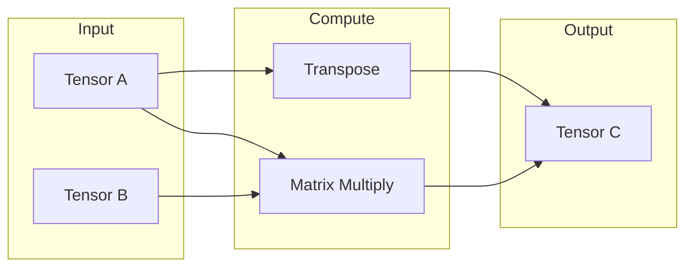

# Linear Algebra

Every neural network computation eventually boils down to a small set of
matrix operations: multiplying matrices together, transposing them, and
combining them element by element. This page documents the low-level
functions in `nn` that implement these operations — the ones every layer and
tensor backend ultimately calls into.

## Theoretical Background

If you think of a matrix as a rectangular grid of numbers, these are the three
operations everything else is built from:

- **Matrix multiplication**: $C = AB$, where each entry of the result is a sum
  of products: $C_{ik} = \sum_j A_{ij} B_{jk}$. In a neural network, this is
  literally the "combine every input with its corresponding weight" step
  inside every layer (see [Layers](./Layers.md)).
- **Transpose**: $(A^T)_{ij} = A_{ji}$ — flip a matrix along its diagonal, so
  its rows become columns and vice versa. Needed constantly during
  backpropagation, where gradients flow in the *opposite* direction data
  flowed forward.
- **Element-wise operations**: $C_{ij} = A_{ij} \odot B_{ij}$ — combine two
  matrices of the same shape position-by-position (the $\odot$ symbol here
  just means "whatever operation" — addition, multiplication, etc., applied
  independently to each matching pair of entries).

These operations are the computational bottleneck of most neural network
training — for a large network, the vast majority of total runtime is spent
inside matrix multiplications. That's why production code uses heavily
optimised libraries for them (xtensor on CPU, OpenCL/BLAS on GPU) rather than
naive loops.

## How It Is Implemented Here

### Matrix multiplication (GEMM)

"GEMM" is the traditional name (from Fortran's BLAS library) for "GEneral
Matrix Multiply" — a matrix multiply that also supports scaling and
accumulating into an existing result, which is more general than the plain
$C = AB$ shown above:

`include/linear_algebra/linear_algebra.hpp` does **not** implement a `Tensor`-facing
GEMM/transpose/inverse API — it is a separate, legacy `namespace linearAlgebra`
of `std::vector<double>`/`std::span<double>` signal-processing helpers
(`derivative`, `dot_product`, `convolution`, `discrete_cosine_transform`,
`solve_matrix`, `min_max_normalize_features`, ...) used by older preprocessing
code, unrelated to the neural-network `Tensor` type. The matrix multiply and
transpose every layer actually calls into are methods **on `TensorImpl`
itself**:

```cpp
// File: include/tensor/Tensor.hpp
auto matmul(const TensorImpl& other) const -> TensorImpl;             // C = A * B
auto matmul_transposed(const TensorImpl& other) const -> TensorImpl;  // C = A * Bᵀ
auto transpose() const -> TensorImpl;                                  // (Aᵀ)_ij = A_ji
```

`matmul_transposed` exists because `Linear`'s weight is stored as
`(out_features, in_features)` — computing `input.matmul_transposed(weight)`
avoids materialising a separate transposed copy of `weight` on every forward call.

### Inverse

<!-- STALE: no `inverse()` (or any matrix-inversion function) exists anywhere
     in the tensor/linear_algebra code as of this audit — searched
     include/tensor/ and include/linear_algebra/linear_algebra.hpp, neither
     defines one. This subsection describes functionality that was never
     implemented. Needs a human decision: drop the subsection, or note it as
     a known gap. -->

## Data Flow



## Usage Example

```cpp
// File: include/tensor/Tensor.hpp
#include "tensor/Tensor.hpp"

// Matrix multiplication
nn::Tensor A(3, 4);
nn::Tensor B(4, 2);
nn::Tensor C = A.matmul(B);  // Result: 3x2

// Transpose
nn::Tensor At = A.transpose();  // Result: 4x3
```

## Common Pitfalls

1. **Shape mismatch.** Matrix multiplication requires the "inner" dimensions
   to match: an $m \times n$ matrix can only be multiplied by an
   $n \times p$ matrix (same $n$ on both sides), producing an
   $m \times p$ result.

2. **Inverting a non-invertible (singular) matrix.** No matrix inversion
   exists anywhere in this codebase today (see the STALE note above) — this
   pitfall is a general linear-algebra fact, not a description of a function
   here: there is no matrix that "undoes" a singular matrix's transformation,
   because it has already thrown away information that can't be recovered.

3. **Memory usage at scale.** Very large matrix multiplications can exceed
   available memory; break the computation into smaller batched operations
   when working with large inputs.

4. **Floating-point precision.** `float32` (the default here) can accumulate
   small rounding errors over many operations. For computations where that
   error matters (e.g. ill-conditioned matrix inversion), consider `float64`.

## See Also

- [Tensor](./Tensor.md) — the data structure these operations act on
- [Optimizers](./Optimizers.md) — where matrix operations drive parameter updates
- [Layers](./Layers.md) — where matrix multiplication is the core layer computation

## References

[1] G. H. Golub and C. F. Van Loan, *Matrix Computations*, 4th ed. Johns Hopkins University Press, 2013.

[2] E. Anderson et al., *LAPACK Users' Guide*, 3rd ed. Philadelphia: SIAM, 1999. [Online]. Available: https://www.netlib.org/lapack/lug/
