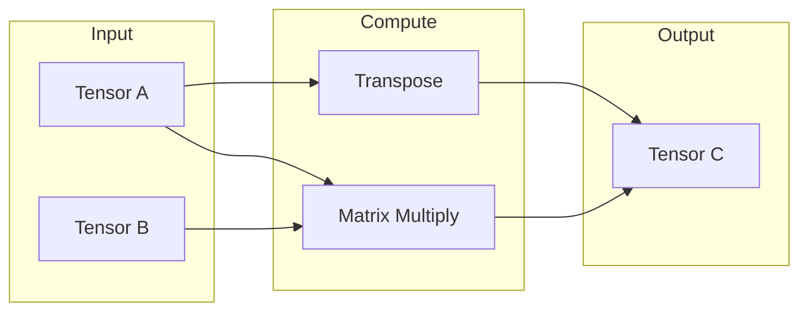

# Linear Algebra

Low-level linear algebra operations used by the tensor backend.

## Theoretical Background

Linear algebra operations form the foundation of neural network computations:

- **Matrix Multiplication**: $C = AB$ where $C_{ik} = \sum_j A_{ij} B_{jk}$
- **Transpose**: $(A^T)_{ij} = A_{ji}$
- **Element-wise operations**: $C_{ij} = A_{ij} \odot B_{ij}$

These operations are compute-intensive and benefit from optimized libraries (xtensor, OpenCL BLAS).

## How It Is Implemented Here

### Matrix Multiplication (GEMM)

```cpp
// File: include/linearAlgebra/linear_algebra.hpp

// General matrix multiplication
// C = alpha * A * B + beta * C
auto gemm(const Tensor& A, const Tensor& B, float alpha = 1.0f, 
          float beta = 0.0f) -> Tensor;
```

### Transpose

```cpp
// Transpose matrix
auto transpose(const Tensor& A) -> Tensor;

// In-place transpose for square matrices
auto transpose_inplace(Tensor& A) -> void;
```

### Inverse

```cpp
// Matrix inverse using LU decomposition
// Only for square, invertible matrices
auto inverse(const Tensor& A) -> Tensor;
```

## Data Flow



## Usage Example

```cpp
// File: src/core/tensor/XtensorTensorBackend.cpp
#include "nn/linearAlgebra/linear_algebra.hpp"

// Matrix multiplication
nn::Tensor A(3, 4);
nn::Tensor B(4, 2);
nn::Tensor C = nn::linearAlgebra::gemm(A, B);  // Result: 3x2

// Transpose
nn::Tensor At = nn::linearAlgebra::transpose(A);  // Result: 4x3
```

## Common Pitfalls

1. **Shape Mismatch**: Ensure $A_{m \times n} \cdot B_{n \times p} = C_{m \times p}$

2. **Non-Invertible Matrix**: `inverse()` fails for singular matrices

3. **Memory**: Large matrix multiplications can exceed memory; use batched operations

4. **Precision**: Float32 may accumulate errors; consider float64 for critical computations

## See Also

- [Tensor](./Tensor.md) - Uses linear algebra operations
- [Optimizers](./Optimizers.md) - Matrix operations in gradients
- [Layers](./Layers.md) - Layer computations

## References

[1] G. H. Golub and C. F. Van Loan, *Matrix Computations*, 4th ed. Johns Hopkins University Press, 2013.

[2] E. Anderson et al., *LAPACK Users' Guide*, 3rd ed. Philadelphia: SIAM, 1999. [Online]. Available: https://www.netlib.org/lapack/lug/
