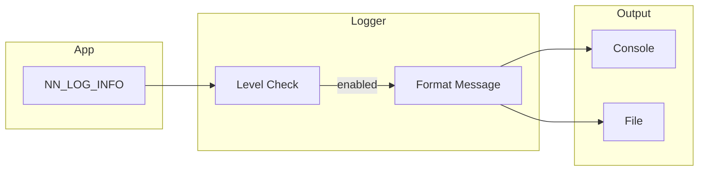

# Logging

Centralized logging system for the nn library with multiple severity levels.

## Theoretical Background

### Log Levels

Structured logging uses severity levels:
- **DEBUG**: Detailed diagnostic information
- **INFO**: General operational events
- **WARNING**: Unexpected but handled gracefully
- **ERROR**: Failures requiring attention

### Best Practices

- Use appropriate levels (don't log everything at ERROR)
- Include context (epoch, batch, device)
- Structured format (JSON or key-value)
- Avoid logging in hot paths (inner loops)

## How It Is Implemented Here

### Logger

```cpp
// File: include/logging/Logger.hpp
namespace nn::logging
{
// Note the *reversed* numeric order vs. usual convention: Error=0 is most
// severe/least verbose, Debug=3 is least severe/most verbose. `log()` only
// emits when `static_cast<int>(level) <= level_`, so this ordering is what
// makes `set_level(Info)` include Error/Warn/Info but exclude Debug.
enum class Level
{
    Error = 0,
    Warn = 1,
    Info = 2,
    Debug = 3,
};

class Logger
{
public:
    static Logger& instance();       // singleton

    void set_level(Level l);
    Level level() const;
    void log(Level l, const std::string& msg);   // single string, no formatting
};

// Free-function wrapper used by the macros below.
inline void log(Level l, const std::string& msg) { Logger::instance().log(l, msg); }
}
```

### Convenience Macros

There is no `fmt`-style formatting — each macro takes one already-built
`std::string` (real call sites build it with `+` concatenation or a
`std::ostringstream`, not a format string). `NN_LOG_DEBUG` compiles to a no-op
in every build — Debug-level logging exists in the enum but is not wired up:

```cpp
#define NN_LOG_ERROR(msg) ::nn::logging::log(::nn::logging::Level::Error, (msg))
#define NN_LOG_WARN(msg)  ::nn::logging::log(::nn::logging::Level::Warn, (msg))
#define NN_LOG_INFO(msg)  ::nn::logging::log(::nn::logging::Level::Info, (msg))
#define NN_LOG_DEBUG(msg) (void) 0
```

## Data Flow



## Usage Example

```cpp
// File: src/core/training/Trainer.hpp
#include "logging/Logger.hpp"

std::ostringstream oss;
oss << "Epoch " << epoch << "/" << config.epochs << " train loss: " << train_loss;
NN_LOG_INFO(oss.str());

if (val_loss < best_loss) {
    NN_LOG_INFO("New best validation loss: " + std::to_string(val_loss));
}

NN_LOG_WARN(std::string("Gradient norm ") + std::to_string(grad_norm) +
            " exceeded clip norm " + std::to_string(config.grad_clip_norm));

NN_LOG_ERROR(std::string("Failed to load dataset: ") + error.what());
```

### Configure Level

```cpp
// Set minimum log level
nn::logging::Logger::instance().set_level(nn::logging::Level::Info);

// Or for debugging (note: NN_LOG_DEBUG itself is a compiled-out no-op — see above)
nn::logging::Logger::instance().set_level(nn::logging::Level::Debug);
```

## Common Pitfalls

1. **Hot Path Logging**: Never log in inner loops (per-sample)

2. **String Concatenation**: Use format strings, not `+`

3. **Sensitive Data**: Don't log passwords, keys, personal info

4. **Performance**: Logging has overhead; disable in production if needed

## See Also

- [Architecture](../Architecture.md) - System overview
- [Training](./Training.md) - Training logs

## References

[1] ISO/IEC 25010:2011, *Systems and Software Engineering — Systems and Software Quality Requirements and Evaluation (SQuaRE)*.

[2] W. Xu, L. Huang, A. Fox, D. Patterson, and M. I. Jordan, "Detecting large-scale system problems by mining console logs," in *Proc. 22nd ACM Symp. Operating Systems Principles (SOSP)*, 2009, pp. 117–132. [Online]. Available: https://doi.org/10.1145/1629575.1629587