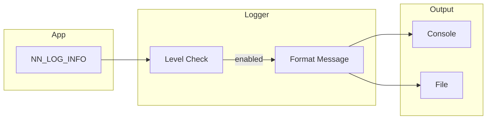

# Logging

Centralized logging system for the nn library with multiple severity levels.

## Theoretical Background

### Log Levels

Structured logging uses severity levels:
- **DEBUG**: Detailed diagnostic information
- **INFO**: General operational events
- **WARNING**: Unexpected but handled gracefully
- **ERROR**: Failures requiring attention

### Best Practices

- Use appropriate levels (don't log everything at ERROR)
- Include context (epoch, batch, device)
- Structured format (JSON or key-value)
- Avoid logging in hot paths (inner loops)

## How It Is Implemented Here

### Logger

```cpp
// File: include/logging/Logger.hpp
namespace nn::logging
{
enum class Level
{
    DEBUG,
    INFO,
    WARNING,
    ERROR
};

class Logger
{
public:
    static void log(Level level, const std::string& message);

    static void debug(const std::string& msg);
    static void info(const std::string& msg);
    static void warning(const std::string& msg);
    static void error(const std::string& msg);

    static void set_level(Level level);
    static auto get_level() -> Level;
};
}
```

### Convenience Macros

```cpp
#define NN_LOG_DEBUG(...) nn::logging::Logger::debug(fmt::format(__VA_ARGS__))
#define NN_LOG_INFO(...) nn::logging::Logger::info(fmt::format(__VA_ARGS__))
#define NN_LOG_WARNING(...) nn::logging::Logger::warning(fmt::format(__VA_ARGS__))
#define NN_LOG_ERROR(...) nn::logging::Logger::error(fmt::format(__VA_ARGS__))
```

## Data Flow



## Usage Example

```cpp
// File: src/core/training/Trainer.hpp
#include "logging/Logger.hpp"

NN_LOG_INFO("Training started with {} epochs", config.epochs);

NN_LOG_INFO("Epoch {}/{}", epoch, config.epochs);
NN_LOG_INFO("Train loss: {:.4f}", train_loss);

if (val_loss < best_loss) {
    NN_LOG_INFO("New best validation loss: {:.4f}", val_loss);
}

NN_LOG_WARNING("Gradient norm {} exceeded clip norm {}", 
               grad_norm, config.grad_clip_norm);

NN_LOG_ERROR("Failed to load dataset: {}", error.what());
```

### Configure Level

```cpp
// Set minimum log level
nn::logging::Logger::set_level(nn::logging::Level::INFO);

// Or for debugging
nn::logging::Logger::set_level(nn::logging::Level::DEBUG);
```

## Common Pitfalls

1. **Hot Path Logging**: Never log in inner loops (per-sample)

2. **String Concatenation**: Use format strings, not `+`

3. **Sensitive Data**: Don't log passwords, keys, personal info

4. **Performance**: Logging has overhead; disable in production if needed

## See Also

- [Architecture](../Architecture.md) - System overview
- [Training](./Training.md) - Training logs

## References

[1] ISO/IEC 25010:2011, *Systems and Software Engineering — Systems and Software Quality Requirements and Evaluation (SQuaRE)*.

[2] W. Xu, L. Huang, A. Fox, D. Patterson, and M. I. Jordan, "Detecting large-scale system problems by mining console logs," in *Proc. 22nd ACM Symp. Operating Systems Principles (SOSP)*, 2009, pp. 117–132. [Online]. Available: https://doi.org/10.1145/1629575.1629587