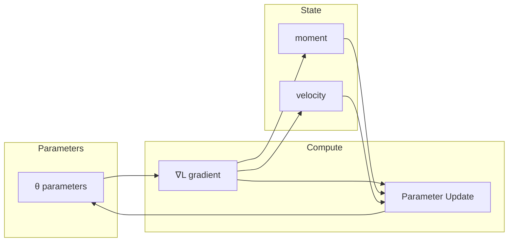

# Optimizers

The nn library provides optimization algorithms for training neural networks, including Adam and SGD.

## Theoretical Background

Neural network training minimizes a loss function $L(\theta)$ where $\theta$ represents the model parameters. Optimizers update parameters using gradients:

$$\theta_{t+1} = \theta_t - \eta \cdot \nabla L(\theta_t)$$

### Adam (Adaptive Moment Estimation)

Adam maintains per-parameter momentum and adaptive learning rates [2]:

$$m_t = \beta_1 m_{t-1} + (1 - \beta_1) g_t$$
$$v_t = \beta_2 v_{t-1} + (1 - \beta_2) g_t^2$$

With bias correction:
$$\hat{m}_t = \frac{m_t}{1 - \beta_1^t}$$
$$\hat{v}_t = \frac{v_t}{1 - \beta_2^t}$$

Update rule:
$$\theta_{t+1} = \theta_t - \eta \cdot \frac{\hat{m}_t}{\sqrt{\hat{v}_t} + \epsilon}$$

Default values: $\beta_1 = 0.9$, $\beta_2 = 0.999$, $\epsilon = 10^{-8}$

### SGD (Stochastic Gradient Descent)

Simple gradient descent with momentum:
$$v_t = \gamma v_{t-1} + \eta \nabla L(\theta_t)$$
$$\theta_{t+1} = \theta_t - v_t$$

## How It Is Implemented Here

```cpp
// File: include/nn/optimizers/Adam.hpp
class Adam
{
    std::vector<Tensor> m_;  // first moment (velocity)
    std::vector<Tensor> v_;  // second moment (adaptive learning rate)

    float beta1_ = 0.9f;
    float beta2_ = 0.999f;
    float epsilon_ = 1e-8f;

public:
    void step(std::vector<Tensor*> params)
    {
        for (size_t i = 0; i < params.size(); ++i)
        {
            auto& param = *params[i];
            auto grad = param.grad();

            // Update first moment
            m_[i] = beta1_ * m_[i] + (1 - beta1_) * grad;
            // Update second moment
            v_[i] = beta2_ * v_[i] + (1 - beta2_) * (grad * grad);

            // Bias correction
            Tensor m_hat = m_[i] / (1 - std::pow(beta1_, t_));
            Tensor v_hat = v_[i] / (1 - std::pow(beta2_, t_));

            // Update
            param = param - learning_rate_ * m_hat / (v_hat.sqrt() + epsilon_);
        }
        t_++;
    }
};
```

## Data Flow



## Usage Example

```cpp
// File: include/nn/optimizers/Optimizer.hpp
#include "nn/optimizers/Adam.hpp"

// Create optimizer with learning rate
nn::optimizers::Adam optimizer(0.001f, 0.9f, 0.999f, 1e-8f);

// Attach to model parameters
optimizer.attach(model.params());

// Training loop
for (int epoch = 0; epoch < epochs; ++epoch)
{
    for (auto& batch : dataloader)
    {
        optimizer.zero_grad();      // Clear previous gradients
        auto output = model.forward(batch, true);
        auto loss = criterion(output, target);
        model.backward(loss.grad());
        optimizer.step(model.params());  // Update weights
    }
}
```

## Common Pitfalls

1. **Learning Rate**: Too high causes divergence, too low causes slow convergence

2. **Gradient Clipping**: Use `grad_clip_norm` to prevent exploding gradients in deep networks

3. **Momentum**: High momentum can cause oscillations; start with defaults (0.9)

4. **Adam epsilon**: Default (1e-8) prevents division by zero; too large slows learning

## See Also

- [Tensor](./Tensor.md) - Gradient computation
- [Layers](./Layers.md) - Forward/backward passes
- [Adam Optimiser](../Concepts/Adam-Optimiser.md) - Detailed Adam explanation
- [Trainer (not written yet)]() - Training loop integration

## References

[1] D. P. Kingma and J. Ba, "Adam: A method for stochastic optimization," in *Proc. 3rd Int. Conf. on Learning Representations (ICLR)*, 2015. [Online]. Available: https://arxiv.org/abs/1412.6980

[2] S. Ruder, "An overview of gradient descent optimization algorithms," arXiv preprint arXiv:1609.04747, 2016. [Online]. Available: https://arxiv.org/abs/1609.04747
