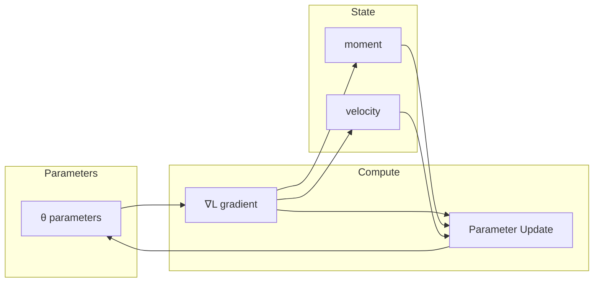

# Optimizers

Training a neural network means repeatedly nudging its weights in the
direction that reduces the loss (the number that measures how wrong its
predictions are). An **optimizer** is the algorithm that decides exactly how
big and in what direction each nudge should be, given the gradient (the
direction of steepest increase of the loss) that backpropagation computes.
This page covers the optimizers implemented in `nn`: Adam, SGD, Lion, and
Schedule-Free AdamW.

If the terms "gradient" and "loss function" are new to you,
[Autoencoders](../Concepts/Autoencoders.md) walks through a concrete training
loop from scratch.

## Theoretical Background

Training minimizes a loss function $L(\theta)$, where $\theta$ stands for
*all* of the model's weights collectively. The simplest possible update rule —
"take a small step in the direction that reduces the loss the fastest" — is:

$$\theta_{t+1} = \theta_t - \eta \cdot \nabla L(\theta_t)$$

Here $\nabla L(\theta_t)$ is the gradient (computed by `backward()`) and $\eta$
(eta) is the **learning rate**: how large a step to take. Every optimizer
below is a refinement of this basic idea — most of them keep some extra
memory ("state") about past gradients to decide the step size more cleverly
than a single fixed $\eta$ could.

### Adam (Adaptive Moment Estimation)

Plain gradient descent uses the *same* step size for every weight, all the
time. Adam instead tracks, per weight, a running average of recent gradients
(their "first moment", $m_t$ — essentially momentum) and a running average of
recent *squared* gradients (their "second moment", $v_t$ — a measure of how
noisy or large that weight's gradient has recently been) [2]:

$$m_t = \beta_1 m_{t-1} + (1 - \beta_1) g_t$$
$$v_t = \beta_2 v_{t-1} + (1 - \beta_2) g_t^2$$

Early in training these running averages are biased toward zero (they start at
zero and haven't accumulated much yet), so Adam corrects for that:

$$\hat{m}_t = \frac{m_t}{1 - \beta_1^t}$$
$$\hat{v}_t = \frac{v_t}{1 - \beta_2^t}$$

The update then divides the (corrected) average gradient by the square root of
the (corrected) average *squared* gradient — which automatically shrinks the
step for weights whose gradient has been large/noisy, and keeps a normal-sized
step for weights whose gradient has been small/stable:

$$\theta_{t+1} = \theta_t - \eta \cdot \frac{\hat{m}_t}{\sqrt{\hat{v}_t} + \epsilon}$$

$\epsilon$ (epsilon) is a tiny constant added only to avoid dividing by zero.
Default values used here: $\beta_1 = 0.9$, $\beta_2 = 0.999$,
$\epsilon = 10^{-8}$.

### SGD (Stochastic Gradient Descent) with momentum

A simpler alternative to Adam. Instead of the two running averages above, it
keeps one "velocity" term $v_t$ that behaves like physical momentum — it keeps
moving in whatever direction it's been moving, only gradually redirected by
the current gradient:

$$v_t = \gamma v_{t-1} + \eta \nabla L(\theta_t)$$
$$\theta_{t+1} = \theta_t - v_t$$

## Available Optimizers

| Token (`optimizer_type`) | Class | Reference default lr | State per parameter | Notes |
|---|---|---|---|---|
| `adam` (default) | `Adam` | 1e-3 | 2 numbers (m, v) | Becomes AdamW when `weight_decay > 0` |
| `sgd` | `SGD` | 0.01 | 1 number (velocity) | Classic (Polyak) momentum; becomes SGDW when `weight_decay > 0` |
| `lion` | `Lion` | 1e-4 | **1** number (momentum) | Updates by the *sign* of the gradient only, ignoring its magnitude — half the memory of Adam |
| `schedule-free-adamw` | `ScheduleFreeAdamW` | 2.5e-3 | 3 numbers (x, z, v) | Designed so you don't need to decay the learning rate over training; the values used for training and for evaluation differ on purpose (see the paper) |

An optimizer is selected by name (its "token") and built by `OptimizerFactory`
from `TrainerConfig::optimizer_type`; in Experiment05 this is set per profile
via `training.optimizer_type`. Passing an unrecognised name throws an error
immediately rather than silently falling back to a default — a wrong optimizer
name is a configuration mistake worth stopping the run for, not something to
paper over.

> **A single learning rate is not comparable across optimizers.** Their
> published reference defaults span from 1e-3 (Adam) down to 1e-4 (Lion) — a
> 10× difference. That's because Lion's update moves every weight by exactly
> `±lr`, regardless of how large or small that weight's actual gradient is,
> so it needs a much smaller step to stay stable. If you want to compare two
> optimizers fairly, you must tune the learning rate **separately for each
> one** — otherwise your experiment measures which learning rate you happened
> to pick, not which optimizer is better.

### Per-optimizer default learning rate

Because the right learning rate is specific to the optimizer, this project
lets you name an optimizer *without* naming a learning rate: leave
`training.learning_rate` out of an Experiment05 profile, and
`ThesisConfig::Training::effective_learning_rate()` looks up
`reference_learning_rate(token)` (defined once, in `OptimizerFactory.hpp`) and
uses the rate published for that specific optimizer. Naming a rate explicitly
still overrides this, so sweeping the learning rate as an experiment variable
still works normally.

The run's output summary always records both the learning rate actually used
and a `learning_rate_source` field (`"profile"` or `"optimizer_default"`), so
looking at a result file later tells you exactly what it was trained with —
closing a gap that once let a paper's published numbers come from a
learning rate ten times smaller than the profile files claimed, with nothing
recorded anywhere that would have revealed it. This is checked automatically
by `ThesisOptimizerLearningRate.*` and a per-profile assertion in
`thesis_profile_audit_gtest`.

### Optimizers considered but deliberately not implemented

- **Sophia** — estimating its diagonal Hessian (a measure of loss curvature)
  requires running a *second* backward pass with resampled labels partway
  through training. The training loop's `Optimizer::step(span<Tensor*>)`
  interface only ever receives the parameters and their gradients — it has no
  way to trigger an extra backward pass. Implementing Sophia without that
  extra pass would just reduce to Adam's existing second-moment tracking under
  a new name, so it was left out rather than faked.
- **SOAP** — needs an eigenvalue decomposition (`eigh`) of an internal
  matrix, an operation the `Tensor` interface does not currently expose on
  every backend. Adding it would mean extending the shared tensor-backend test
  contract across all four backends (XTensor, OpenCL, SYCL, Device) first.
- **Muon** — was implemented and checked against the reference `muon-optimizer`
  library, then removed at the author's request. It only orthogonalises 2-D
  weight matrices and silently falls back to plain Adam for everything else —
  so it would never have touched this project's 1×1 spiking-neuron parameters
  (R, C, V_th) — and its design target (very large language-model
  pretraining) had no clear connection to this thesis's ablation study. Still
  recoverable from git history if a future need arises.

### Checked against the original authors' code

Every optimizer here is verified, step by step, against the exact numbers its
original authors' own implementation produces — not just "does it look
reasonable", but bit-for-bit reproduction of a fixed sequence of updates.
`scripts/testing/gen_optimizer_refs.py` runs the reference implementation
(PyTorch's, or the original paper's own code) over a fixed sequence of
parameters and gradients and records the parameter value after each step into
a committed file, `src/core/optimizers/tests/fixtures/optimizer_refs.npz`.
`optimizer_parity_gtest` then replays the *identical* sequence through this
project's implementation and checks the numbers match. This means CI doesn't
need Python installed to verify correctness — the reference numbers were
already computed once, ahead of time, and just get compared against (the same
pattern used for [layer parity testing](../Guides/Ground-Truth-and-Smoke-Testing.md)).

| This project's class | Checked against |
|---|---|
| `Adam`, `Adam` + `weight_decay`, `SGD` | `torch.optim.Adam` / `torch.optim.AdamW` / `torch.optim.SGD` |
| `Lion` | `lion-pytorch` |
| `ScheduleFreeAdamW` | `schedulefree` (`AdamWScheduleFreeReference`) |

This comparison is not a formality — it caught two real, months-old bugs:

1. **Weight decay was applied at the wrong point in the update.** AdamW's
   definition applies the decay term against the *previous* step's
   parameters, and comparing against PyTorch confirmed this (applying decay
   before the main update reproduces PyTorch with zero error).
2. **Moving the decay step exposed a second bug**: re-assigning a value into
   a parameter tensor silently threw away that tensor's accumulated gradient,
   because `nn::Tensor` is a plain value type (copying it copies its data, not
   a shared reference) — so code that assigned a *new* tensor into a parameter
   slot lost that parameter's gradient without any error or warning.

Both are now fixed, and the reference-comparison tests permanently guard
against them recurring.

One difference from the original papers is intentional, and is baked into how
the reference fixtures themselves are generated:

- **Which parameters get weight decay.** The original Lion and Schedule-Free
  papers decay every parameter. This project decays only 2-D weight matrices,
  so that the SNN's 1×1 biophysical scalars (R, C, V_th — see
  [Membrane Dynamics](../Concepts/Membrane-Dynamics.md)) are never shrunk
  toward zero, which would silently corrupt the neuron's time constant
  $\tau = R \cdot C$. Every weight-decay fixture uses a 2-D parameter, where
  this project's behaviour and the original paper's agree exactly.

## How It Is Implemented Here

### Adam — standard usage

```cpp
// File: include/optimizers/Adam.hpp
struct Adam : public Optimizer
{
    float learning_rate;
    float decay_rate_moment1 = 0.9F;
    float decay_rate_moment2 = 0.999F;
    float epsilon = 1e-8F;

    std::vector<nn::Tensor> moment1;  // per-param first moment
    std::vector<nn::Tensor> moment2;  // per-param second moment

    explicit Adam(float learning_rate_ = 0.001F, ...);

    void attach(std::span<nn::Tensor*> params) override;
    void step(std::span<nn::Tensor*> params) override;
    void zero_grad(std::span<nn::Tensor*> params) override;
};
```

### Per-parameter-group learning rates

Some parameters need a much gentler learning rate than others. In particular,
the SNN's biophysical parameters (R, C, V_th) can be pushed into an invalid,
clamped region by an update that would be perfectly reasonable for an ordinary
weight matrix (see [Membrane Dynamics](../Concepts/Membrane-Dynamics.md)), so
this project uses a learning rate ten times smaller for them by default:
`lr_SNN ≈ 1e-4` when the global rate is `1e-3`
(`TrainerConfig::snn_lr_scale = 0.1`). This factor of 10 is this project's own
empirically-chosen setting, not a value taken from a published paper.

To set different learning-rate multipliers for different parameters, use
`attach_with_scales()`:

```cpp
// File: include/optimizers/Optimizer.hpp — base class, virtual
virtual auto attach_with_scales(std::span<nn::Tensor*> params,
                                std::span<const float> lr_scales) -> void;
```

This method — along with the `lr_scales_` array it fills in, and the
`weight_decay` setting described below — lives on the shared `Optimizer` base
class, not on any one specific optimizer. That means code holding a generic
`Optimizer&` or `unique_ptr<Optimizer>` (for instance
[`Trainer`](./Training.md), which builds whichever concrete optimizer the
config asks for) can set up per-group learning rates without needing to know
which concrete optimizer type it's actually holding. Every optimizer in this
project (`Adam`, `SGD`, `SGDMinimal`) reads from `lr_scales_` inside its
`step()`, computing each parameter's *effective* learning rate as

$$\eta_i = \eta_\text{global} \times \text{lr\_scales}[i]$$

(defaulting the multiplier to 1.0 for any parameter beyond the end of the
scales list). `attach_with_scales()` still calls the ordinary, per-optimizer
`attach()` internally first — so Adam's moment buffers, SGD's velocity, and so
on are still allocated exactly as they would be normally — and only then
records the scales on top.

> **A subtlety worth knowing if you're modifying an optimizer:** the base
> class's `attach()` is what records which parameters are currently attached
> (this is what lets the no-argument forms of `step()`/`zero_grad()` work, and
> is also where `lr_scales_` gets cleared out). Any optimizer that overrides
> `attach()` must call `Optimizer::attach(params)` itself first, or that
> bookkeeping never happens. This was previously a documented no-op that
> didn't actually do anything the comment claimed — so `SGD`, which depended
> on it, ended up with an empty parameter list and its no-argument `step()`
> always threw an exception. Now fixed.

Example — separate learning rates for ordinary weights vs. SNN biophysical
parameters:
```cpp
Adam optimizer(/*lr=*/0.001F);

// Collect all params from mixed ANN+SNN model
auto all_params = model.params();  // e.g., [W1, W2, R_snn, C_snn, Vth_snn]

// Scale: full lr for weights, 0.1× for SNN biophysical params
std::vector<float> scales = {1.0f, 1.0f, 0.1f, 0.1f, 0.1f};
optimizer.attach_with_scales(all_params, scales);

// Training loop: step() uses per-param lr automatically
optimizer.step(all_params);
```

`TrainerConfig::snn_lr_scale` (default 0.1) holds this factor; it's the
caller's job to build the actual `scales` vector.
[`Trainer`](./Training.md) does this automatically, applying the scale
**only to parameters whose `size()` is exactly 1** — R, C, and V_th are always
1×1 tensors, and no ordinary weight or bias ever is, so this rule reliably
picks out exactly the biophysical parameters. An earlier version of this code
filled the whole scales vector uniformly instead, which had the unintended
effect of throttling the *entire* network's learning rate by 10× rather than
just the biophysical parameters — a bug that went unnoticed for a while
because training still "worked", just ten times slower than intended.

### Decoupled weight decay (AdamW / SGDW)

**Weight decay** is a regularisation technique: after the normal gradient
update, every weight is also shrunk slightly toward zero, which discourages
the network from relying on any single very large weight and tends to improve
how well it generalises to new data. `Optimizer::weight_decay` (default
`0.0F`, i.e. off; settable through the shared base class on any optimizer)
implements the **decoupled** form of this idea, following Loshchilov & Hutter
(ICLR 2019) — the paper that defines both "AdamW" and "SGDW" as the decoupled
versions of Adam and SGD. All three optimizers here implement it identically:
after the normal update, each eligible parameter is shrunk multiplicatively:

$$\theta_i \leftarrow \theta_i - \eta_i \cdot \lambda_\text{wd} \cdot \theta_i$$

Why "decoupled" specifically matters: an older, simpler approach folds the
decay penalty directly into the gradient before Adam processes it. But Adam
already divides every gradient by an estimate of its own recent magnitude
(the $1/\sqrt{\hat v}$ term above) — so folding decay into the gradient means
Adam's per-weight scaling distorts how much each weight actually gets
decayed, in a way that depends on that weight's gradient history rather than
just its current value. Applying decay as a separate step *after* Adam's
update, as done here, avoids that distortion and shrinks every eligible
weight by the same proportion.

**Which parameters get decayed:** only ordinary 2-D weight matrices
(`rows > 1 && cols > 1`). Bias vectors (`N×1`) and the SNN's 1×1 biophysical
scalars (R, C, V_th) are exempt, so the membrane time constant
$\tau = R \cdot C$ and the firing threshold are never pulled toward zero by a
mechanism meant for weight matrices.

```cpp
// File: include/optimizers/Adam.hpp — inside step()
if (weight_decay > 0.0f && param.rows() > 1 && param.cols() > 1)
    param = param.add(param.multiply_scalar(-lr_i * weight_decay));
```

This is wired up from `TrainerConfig::weight_decay` in the `Trainer`
constructor (`optimizer_.weight_decay = cfg_.weight_decay;`); in Experiment05
it comes from the profile JSON's `training.weight_decay` field.

### Fused GPU update (2026-07-15)

When training runs on the OpenCL (GPU) backend, `Adam::step()` can run the
*entire* per-parameter update — both moment averages, the bias correction, and
the parameter step — as a single GPU kernel launch
(`OpenCLTensorBackend::adam_step_inplace()`), instead of roughly fifteen
separate tensor operations chained together. This kernel already existed in
`KernelManager.cpp` but nothing was calling it until this change; the dispatch
happens through a small helper, `try_fused_step()`, which checks at compile
time whether the active backend actually provides the fused kernel and only
uses it if so. Backends that don't provide a fused kernel (XTensor, Device,
SYCL) keep using the original, generic sequence of operations, and even on
OpenCL, the fused path falls back to the generic one automatically if
anything about it fails at runtime. Weight decay is applied identically on
both paths.

A second change in the same pass: gradients now flow through `grad_ref()`
(which hands out a direct reference, no copy) instead of the older
`param.grad()` accessor, which copied the gradient tensor — and on the OpenCL
backend, that copy meant every parameter's gradient made a round trip from
GPU memory to host memory and back, once per parameter per training batch.

Also, the `Trainer`'s per-batch OpenCL "batch scope" (a mechanism that lets
many GPU operations run back-to-back before waiting for the GPU to actually
finish, instead of waiting after every single operation) now covers
`zero_grad()`, gradient clipping, and `optimizer_.step()` as well. Previously
the optimizer ran *outside* that scope, so every one of its per-parameter GPU
operations had to wait for the GPU individually — on the SNN autoencoder this
meant roughly 250 separate GPU waits per training batch just from the
optimizer step.

## Data Flow



## Usage Example

```cpp
// File: include/optimizers/Optimizer.hpp
#include "optimizers/Adam.hpp"

// Create optimizer with learning rate
nn::optimizers::Adam optimizer(0.001f, 0.9f, 0.999f, 1e-8f);

// Attach to model parameters
optimizer.attach(model.params());

// Training loop
for (int epoch = 0; epoch < epochs; ++epoch)
{
    for (auto& batch : dataloader)
    {
        optimizer.zero_grad();      // Clear previous gradients
        auto output = model.forward(batch, true);
        auto loss = criterion(output, target);
        model.backward(loss.grad());
        optimizer.step(model.params());  // Update weights
    }
}
```

## Common Pitfalls

1. **Learning rate too high or too low.** Too high, and the loss oscillates or
   diverges (grows instead of shrinking); too low, and training makes almost
   no visible progress even after many epochs.

2. **Exploding gradients.** In deep or recurrent networks, gradients can grow
   very large as they propagate backward. Use `grad_clip_norm` to cap the
   overall gradient size before it reaches the optimizer.

3. **Momentum set too high.** A momentum value close to 1 makes the optimizer
   keep "coasting" in its previous direction even after the gradient has
   changed, which can cause the loss to oscillate. Start from the defaults
   (0.9) and only change it deliberately.

4. **Adam's epsilon.** The default (1e-8) exists purely to prevent a
   division by zero; making it much larger than that will measurably slow
   down learning, because it starts competing with the actual gradient
   magnitude in the denominator.

## See Also

- [Tensor](./Tensor.md) — how gradients are computed and stored
- [Layers](./Layers.md) — the forward/backward passes that produce gradients
- [Adam Optimiser — Plain](../Concepts/Plain/Adam-Optimiser.md) — Adam explained without the equations first
- [Adam Optimiser](../Concepts/Adam-Optimiser.md) — detailed Adam walkthrough
- [Training](./Training.md) — where `TrainerConfig.snn_lr_scale` is consumed
- [SNN and Surrogate Gradients](../Concepts/SNN-and-Surrogate-Gradients.md) — why SNN parameters need special treatment

## References

[1] D. P. Kingma and J. Ba, "Adam: A method for stochastic optimization," in *Proc. 3rd Int. Conf. on Learning Representations (ICLR)*, 2015. [Online]. Available: https://arxiv.org/abs/1412.6980

[2] S. Ruder, "An overview of gradient descent optimization algorithms," arXiv preprint arXiv:1609.04747, 2016. [Online]. Available: https://arxiv.org/abs/1609.04747

[3] I. Loshchilov and F. Hutter, "Decoupled weight decay regularization," in *Proc. 7th Int. Conf. on Learning Representations (ICLR)*, 2019. [Online]. Available: https://arxiv.org/abs/1711.05101
