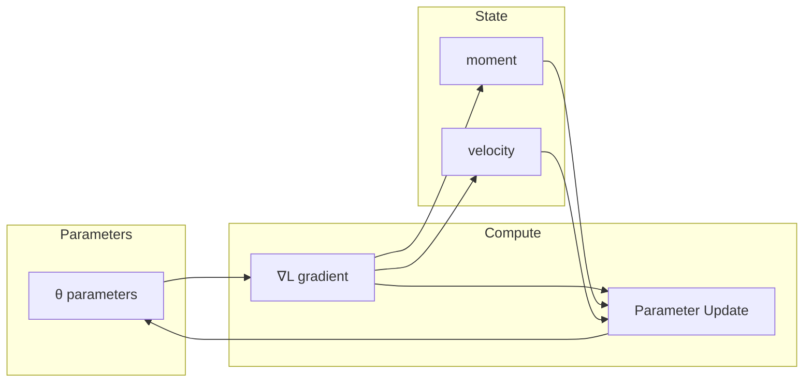

# Optimizers

The nn library provides optimization algorithms for training neural networks, including Adam and SGD.

## Theoretical Background

Neural network training minimizes a loss function $L(\theta)$ where $\theta$ represents the model parameters. Optimizers update parameters using gradients:

$$\theta_{t+1} = \theta_t - \eta \cdot \nabla L(\theta_t)$$

### Adam (Adaptive Moment Estimation)

Adam maintains per-parameter momentum and adaptive learning rates [2]:

$$m_t = \beta_1 m_{t-1} + (1 - \beta_1) g_t$$
$$v_t = \beta_2 v_{t-1} + (1 - \beta_2) g_t^2$$

With bias correction:
$$\hat{m}_t = \frac{m_t}{1 - \beta_1^t}$$
$$\hat{v}_t = \frac{v_t}{1 - \beta_2^t}$$

Update rule:
$$\theta_{t+1} = \theta_t - \eta \cdot \frac{\hat{m}_t}{\sqrt{\hat{v}_t} + \epsilon}$$

Default values: $\beta_1 = 0.9$, $\beta_2 = 0.999$, $\epsilon = 10^{-8}$

### SGD (Stochastic Gradient Descent)

Simple gradient descent with momentum:
$$v_t = \gamma v_{t-1} + \eta \nabla L(\theta_t)$$
$$\theta_{t+1} = \theta_t - v_t$$

## How It Is Implemented Here

### Adam — Standard Usage

```cpp
// File: include/optimizers/Adam.hpp
struct Adam : public Optimizer
{
    float learning_rate;
    float decay_rate_moment1 = 0.9F;
    float decay_rate_moment2 = 0.999F;
    float epsilon = 1e-8F;

    std::vector<nn::Tensor> moment1;  // per-param first moment
    std::vector<nn::Tensor> moment2;  // per-param second moment

    explicit Adam(float learning_rate_ = 0.001F, ...);

    void attach(std::span<nn::Tensor*> params) override;
    void step(std::span<nn::Tensor*> params) override;
    void zero_grad(std::span<nn::Tensor*> params) override;
};
```

### Per-Parameter-Group Learning Rates

SNN biophysical parameters (R, C, V_th) require a much smaller learning rate than
weight matrices, since large updates can push them into the `1e-6` clamp region
(see [Membrane-Dynamics](../Concepts/Membrane-Dynamics.md)) and destabilize $\tau=R\cdot C$
or the spike threshold. This project's own empirical default is a 10× reduction:
lr_SNN ≈ 1e-4 when global lr = 1e-3 (`TrainerConfig::snn_lr_scale = 0.1`) — an internal
engineering heuristic, not a literature-sourced figure (audit m-3: the citation
previously attached to this claim could not be verified and was removed).
Use `attach_with_scales()` to set per-parameter lr multipliers:

```cpp
// File: include/optimizers/Adam.hpp
void attach_with_scales(std::span<nn::Tensor*> params, std::span<const float> lr_scales);
```

The effective learning rate for parameter $i$ is:
$$\eta_i = \eta_\text{global} \times \text{lr\_scales}[i]$$

Example — separate lr for SNN layers vs weight matrices:
```cpp
Adam optimizer(/*lr=*/0.001F);

// Collect all params from mixed ANN+SNN model
auto all_params = model.params();  // e.g., [W1, W2, R_snn, C_snn, Vth_snn]

// Scale: full lr for weights, 0.1× for SNN biophysical params
std::vector<float> scales = {1.0f, 1.0f, 0.1f, 0.1f, 0.1f};
optimizer.attach_with_scales(all_params, scales);

// Training loop: step() uses per-param lr automatically
optimizer.step(all_params);
```

`TrainerConfig::snn_lr_scale` (default 0.1) documents the intended scale; the caller
is responsible for populating the `scales` vector accordingly.

### Decoupled Weight Decay (AdamW)

`Adam::weight_decay` (default `0.0F`, disabled) applies L2 regularization in the
**decoupled** form of Loshchilov & Hutter (ICLR 2019). After the standard Adam
update, each parameter is shrunk multiplicatively:

$$\theta_i \leftarrow \theta_i - \eta_i \cdot \lambda_\text{wd} \cdot \theta_i$$

Decoupling matters because folding the penalty into the gradient (classic L2)
makes Adam's per-coordinate $1/\sqrt{\hat v}$ scaling distort the effective decay
per weight; decoupled decay keeps a uniform shrink.

**Shape guard** — decay is applied **only to 2-D weight matrices**
(`rows > 1 && cols > 1`). Biases (`N×1`) and SNN biophysical scalars
(`1×1`: R, C, V_th) are skipped, so the membrane time constant $\tau = R\cdot C$
and the spike threshold are never pulled toward zero.

```cpp
// File: include/optimizers/Adam.hpp — inside step()
if (weight_decay > 0.0f && param.rows() > 1 && param.cols() > 1)
    param = param.add(param.multiply_scalar(-lr_i * weight_decay));
```

Wired from `TrainerConfig::weight_decay` in the `Trainer` constructor
(`optimizer_.weight_decay = cfg_.weight_decay;`). For Experiment05 it is set from
`training.weight_decay` in the profile JSON.

### Fused Backend Step (2026-07-15)

`Adam::step()` dispatches to a backend-fused kernel when the backend provides
one, via the concept-guarded template helper `try_fused_step()` (a template
because `if constexpr` only discards branches during template instantiation).
`OpenCLTensorBackend::adam_step_inplace()` runs the whole per-parameter update
(moment EMAs, bias correction, parameter step) as **one** `adam_step_kernel`
launch on device-resident buffers — the kernel had existed in
`KernelManager.cpp` but was never wired. The generic ~15-tensor-op path
remains for XTensor/Device/SYCL and as runtime fallback; decoupled weight
decay is layered identically on both paths. Gradients enter through
`grad_ref()` (no copy) instead of `param.grad()` (which copies and, on
OpenCL, forced a device→host→device round-trip per parameter per batch).

The `Trainer` batch loop's OpenCL `BatchScope` now also covers `zero_grad`,
gradient clipping, and `optimizer_.step()` — previously the optimizer ran
outside it, so each of its per-parameter kernels paid a full `clFinish`
(~250 per batch on the SNN-AE).

## Data Flow



## Usage Example

```cpp
// File: include/optimizers/Optimizer.hpp
#include "nn/optimizers/Adam.hpp"

// Create optimizer with learning rate
nn::optimizers::Adam optimizer(0.001f, 0.9f, 0.999f, 1e-8f);

// Attach to model parameters
optimizer.attach(model.params());

// Training loop
for (int epoch = 0; epoch < epochs; ++epoch)
{
    for (auto& batch : dataloader)
    {
        optimizer.zero_grad();      // Clear previous gradients
        auto output = model.forward(batch, true);
        auto loss = criterion(output, target);
        model.backward(loss.grad());
        optimizer.step(model.params());  // Update weights
    }
}
```

## Common Pitfalls

1. **Learning Rate**: Too high causes divergence, too low causes slow convergence

2. **Gradient Clipping**: Use `grad_clip_norm` to prevent exploding gradients in deep networks

3. **Momentum**: High momentum can cause oscillations; start with defaults (0.9)

4. **Adam epsilon**: Default (1e-8) prevents division by zero; too large slows learning

## See Also

- [Tensor](./Tensor.md) — Gradient computation
- [Layers](./Layers.md) — Forward/backward passes
- [Adam Optimiser](../Concepts/Adam-Optimiser.md) — Detailed Adam explanation
- [Training](./Training.md) — `TrainerConfig.snn_lr_scale` field
- [SNN and Surrogate Gradients](../Concepts/SNN-and-Surrogate-Gradients.md) — SNN parameter landscape

## References

[1] D. P. Kingma and J. Ba, "Adam: A method for stochastic optimization," in *Proc. 3rd Int. Conf. on Learning Representations (ICLR)*, 2015. [Online]. Available: https://arxiv.org/abs/1412.6980

[2] S. Ruder, "An overview of gradient descent optimization algorithms," arXiv preprint arXiv:1609.04747, 2016. [Online]. Available: https://arxiv.org/abs/1609.04747
