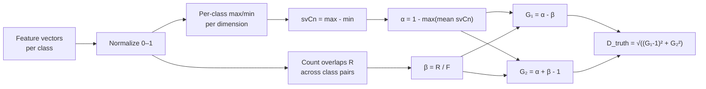

# Paraconsistent Feature Engineering

> **Plain language version:** [Paraconsistent — Plain Language Guide](./Plain/Paraconsistent.md)

Paraconsistent feature engineering quantifies the quality of extracted feature vectors using da Costa paraconsistent logic [1]. It measures intraclass similarity (α) and interclass overlap (β) to determine whether features are naturally separable *before* any classifier is trained.

This is the **primary novel contribution** of the thesis "Autenticação Biométrica de Locutores Drasticamente Disfônicos Aprimorada pela Imagined Speech" (A. Furlan, UNESP). The original method is published in [2].

## Theoretical Background

### Motivation

After extracting feature vectors via DTWPT + energy bands, the question is: *are these features naturally discriminative?* The paraconsistent approach provides a geometry-independent quality score before any classifier training.

### The Two Coefficients

Given $N$ classes $C_1, \ldots, C_N$, each with $X$ feature vectors of dimension $T$:

#### Intraclass Similarity (α)

1. Normalize all feature vectors so every component lies in $[0, 1]$.
2. For each class $C_n$ and each dimension $j$:

$$\text{max}_{j}(C_n) = \max_{x \in C_n} x_j, \qquad \text{min}_{j}(C_n) = \min_{x \in C_n} x_j$$

3. The **class similarity vector**:

$$\text{svC}_n[j] = \text{max}_{j}(C_n) - \text{min}_{j}(C_n)$$

4. Mean intraclass spread per class:

$$\overline{\text{svC}_n} = \frac{1}{T} \sum_{j=1}^{T} \text{svC}_n[j]$$

5. Final coefficient:

$$\alpha = 1 - \max_{n}\, \overline{\text{svC}_n}$$

$\alpha = 1$ → every class is perfectly compact. $\alpha = 0$ → at least one class spans the full $[0,1]$ range.

#### Interclass Overlap (β)

1. For each ordered pair $(C_n, C_m)$ with $n \neq m$, count $R$: number of feature component values from $C_n$ that fall within $[\text{min}_j(C_m),\, \text{max}_j(C_m)]$.

2. Maximum possible overlap count:

$$F = N \cdot (N-1) \cdot X \cdot T$$

3. Final coefficient:

$$\beta = \frac{R}{F}$$

$\beta = 0$ → no interclass overlap. $\beta = 1$ → complete overlap everywhere.

### The Paraconsistent Plane

Map $(\alpha, \beta)$ to certainty and contradiction degrees [2]:

$$G_1 = \alpha - \beta \qquad \text{(degree of certainty)}$$
$$G_2 = \alpha + \beta - 1 \qquad \text{(degree of contradiction)}$$

The four corners of the paraconsistent plane:

| $(G_1, G_2)$ | Meaning | Condition |
|---|---|---|
| $(1,\; 0)$ | **Truth** — classes fully separated | $\alpha=1,\;\beta=0$ |
| $(-1,\; 0)$ | **Falsity** — completely mixed | $\alpha=0,\;\beta=1$ |
| $(0,\; 1)$ | **Ambiguity** — compact but overlapping | $\alpha=1,\;\beta=1$ |
| $(0,\;-1)$ | **Indefinition** — no structure | $\alpha=0,\;\beta=0$ |

### Distance to Truth

Euclidean distance from $(G_1, G_2)$ to the truth vertex:

$$D_{\text{truth}} = \sqrt{(G_1 - 1)^2 + G_2^2}$$

Smaller $D_{\text{truth}}$ → closer to Truth. Distances to all four corners:

$$D_{\text{false}} = \sqrt{(G_1+1)^2 + G_2^2}, \quad
  D_{\text{indef}} = \sqrt{G_1^2 + (G_2+1)^2}, \quad
  D_{\text{ambig}} = \sqrt{G_1^2 + (G_2-1)^2}$$

### Selection metric: contradiction-penalized truth distance

$D_{\text{truth}}$ **alone is not used to select the winner**, because it is
exploitable. A collapsed ("dead") latent — one that emits the same vector for
every sample regardless of class — lands on the **Ambiguity** vertex
($\alpha=\beta=1$) and scores $D_{\text{truth}}=\sqrt2\approx1.41$, which can
*beat* genuinely informative feature sets despite carrying zero class
information. (This is a real failure mode: an SNN autoencoder trained at a low
learning rate reaches exactly $\alpha=\beta=1$.)

The primary metric is therefore $D_{\text{truth}}$ plus a penalty on the
**contradiction degree** $|G_2| = |\alpha+\beta-1|$, whose two poles are exactly
the degenerate Ambiguity ($G_2=+1$) and Indefinition ($G_2=-1$) vertices:

$$D_{\text{penalized}} = D_{\text{truth}} + \lambda\,|G_2|,
  \qquad \lambda = 2 - \sqrt2 \approx 0.586$$

Smaller $D_{\text{penalized}}$ → better feature set. The weight $\lambda=2-\sqrt2$
is chosen so that the three non-Truth vertices are penalized **equally**: Falsity,
Ambiguity and Indefinition all score exactly $2.0$, while Truth scores $0$. The
retained $D_{\text{truth}}$ term is what keeps Falsity penalized — dropping it
(penalizing only Ambiguity and Indefinition) would let a degenerate solution flee
to the Falsity vertex instead, so the full $D_{\text{truth}}$ must stay.

`kContradictionPenalty` in `ThesisParaconsistent.hpp` holds $\lambda$;
`ParaconsistentScore::d_penalized` holds the value; `rank_feature_sets` sorts by
it. Because it is a pure function of $(\alpha,\beta)$, existing results can be
re-ranked without re-running any experiment.

### Intuition

| $\alpha$ | $\beta$ | $(G_1, G_2)$ region | Meaning |
|---|---|---|---|
| High | Low | Near $(1,0)$ | Even simple classifiers work well |
| High | High | Near $(0,1)$ | Classes compact but occupying same space |
| Low | Low | Near $(0,-1)$ | Scattered, not overlapping, not consistent |
| Low | High | Near $(-1,0)$ | Completely mixed — features useless |

---

## How It Is Implemented Here

Two files, layered rather than independent:

```
include/paraconsistent/paraconsistent.hpp             # legacy engine: calculate_alpha,
                                                        # calculate_beta, calculate_certainty_
                                                        # degree_g1/calculate_contradiction_
                                                        # degree_g2, over std::map<string,
                                                        # vector<vector<double>>>; no namespace
src/experiments/thesis/lib/include/ThesisParaconsistent.hpp  # thin wrapper the thesis
                                                        # pipeline actually calls — groups
                                                        # samples by subject_id, calls the
                                                        # legacy functions, adds d_truth /
                                                        # d_penalized (see below)
```

### Core API (Experiment05 / thesis pipeline)

```cpp
// File: src/experiments/thesis/lib/include/ThesisParaconsistent.hpp
namespace thesis
{
// Chosen as 2 - sqrt(2) so the three non-Truth vertices score exactly 2.0.
inline constexpr double kContradictionPenalty = 0.5857864376269049;

struct ParaconsistentScore
{
    std::string label;
    double alpha = 0.0;
    double beta = 0.0;
    double g1 = 0.0;       // certainty degree  (alpha - beta)
    double g2 = 0.0;       // contradiction degree (alpha + beta - 1)
    double d_truth = 0.0;  // distance to Truth corner (1,0)
    double d_penalized = 0.0; // d_truth + kContradictionPenalty * |g2| — primary metric
};

// Score every feature set, sorted ascending by d_penalized (best first).
auto rank_feature_sets(const std::vector<ThesisSample>& samples,
    const std::vector<FeatureSet>& feature_sets) -> std::vector<ParaconsistentScore>;

auto score_feature_set(const std::vector<ThesisSample>& samples, const FeatureSet& fs)
    -> ParaconsistentScore;
}
```

### Usage Example

```cpp
// File: src/experiments/thesis/lib/src/ThesisParaconsistent.cpp
#include "ThesisParaconsistent.hpp"

// samples: ThesisSample per recording (carries the class label); feature_sets:
// one FeatureSet per (wavelet × scale) combination under evaluation.
auto scores = thesis::rank_feature_sets(samples, feature_sets);

// scores[0] is the winner — sorted by d_penalized, tie-broken by label so the
// result is a pure function of the data (see rank_feature_sets' comment on
// why std::sort's instability made this necessary).
const auto& best = scores.front();
std::printf("%s: alpha=%.3f beta=%.3f d_truth=%.3f d_penalized=%.3f\n",
    best.label.c_str(), best.alpha, best.beta, best.d_truth, best.d_penalized);
```

### Integration with the DTWPT Pipeline

Paraconsistent analysis is used to **select the best (wavelet × energy scale)** combination before classifier training:

```
for each wavelet ∈ {Haar, Daub4, Daub6, ...}:
    for each scale ∈ {BARK, MEL, LFCC}:
        feature_sets += FeatureSet{label: wavelet×scale, vectors: DTWPT(signal, wavelet) → energy_bands(scale)}

scores = thesis::rank_feature_sets(samples, feature_sets)
best   = scores.front()   // already sorted ascending by d_penalized
```

This avoids expensive classifier sweeps for feature selection.

---

## Data Flow



---

## Common Pitfalls

1. **Normalization is mandatory.** Computing on unnormalized features gives meaningless results.

2. **Class imbalance inflates β.** A class with many more samples has a wider per-dimension range → higher $\beta$. Balance classes before evaluating.

3. **Outliers depress α.** The per-class range is the global min/max — single outliers inflate `svCn`. Consider robust variants using percentiles.

4. **$D_{\text{truth}} > 0.5$ doesn't mean the task is hopeless.** Nonlinear classifiers can still learn; the measure quantifies *linear* separability.

---

## See Also

- [Wavelet](./Wavelet.md) — DTWPT feature extraction
- [Concepts/LFCC](../Concepts/LFCC.md) — Linear cepstral features evaluated by this method
- [Concepts/Imagined-Speech-and-EEG](../Concepts/Imagined-Speech-and-EEG.md) — EEG signal source
- [Research-Context](../Research-Context.md) — Thesis overview
- [Experiment Microscope](../Guides/Experiment-Microscope.md) — `score_feature_set` /
  `rank_feature_sets` are recomputed live in the GUI (`nn_microscope.thesis`), bit-exact vs
  persisted results

---

## References

[1] N. C. A. da Costa, "On the theory of inconsistent formal systems," *Notre Dame Journal of Formal Logic*, vol. 15, no. 4, pp. 497–510, 1974.

[2] R. C. Guido et al., "Paraconsistent feature engineering for EEG-based imagined speech classification," *Proceedings of SPIE*, vol. 10160, 2017. DOI: 10.1117/12.2255697.
