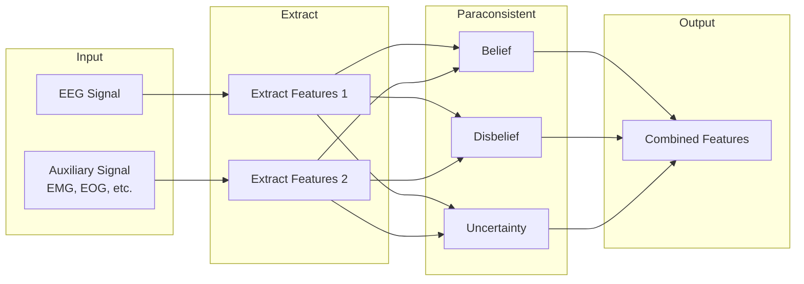

# Paraconsistent

Paraconsistent logic-based feature extraction for handling contradictory information in BCI systems.

## Theoretical Background

### The Problem with Noisy BCI Signals

EEG signals often contain artifacts and contradictory information:
- Eye blinks vs. imagined movements
- Muscle artifacts vs. neural activity
- Cross-modal inconsistencies

### Paraconsistent Logic

Unlike classical logic (explodes on contradictions), paraconsistent logic tolerates inconsistency:

- **Contradiction-tolerant**: Does not derive everything from $P \land \neg P$
- **Useful inference**: Still derives consistent conclusions

### Feature Extraction Approach

Given contradictory evidence $E_1$ and $E_2$:
1. Extract features from each evidence source independently
2. Compute paraconsistent measures:
   - Degree of belief ($\text{bel}$)
   - Degree of disbelief ($\text{dis}$)
   - Degree of uncertainty ($\text{unc}$)

Where $\text{bel} + \text{dis} + \text{unc} = 1$

## How It Is Implemented Here

```cpp
// File: include/nn/paraconsistent/ParaconsistentFeatureExtractor.hpp
class ParaconsistentFeatureExtractor
{
    float belief_threshold_;
    float uncertainty_threshold_;

public:
    // Extract paraconsistent features from EEG
    // Handles contradictory evidence
    auto extract(const Tensor& eeg_signal,
                const Tensor& auxiliary_signal) -> Tensor;

private:
    // Compute degree of belief
    auto compute_belief(const Tensor& evidence1,
                       const Tensor& evidence2) -> float;

    // Compute degree of disbelief  
    auto compute_disbelief(const Tensor& evidence1,
                        const Tensor& evidence2) -> float;

    // Compute degree of uncertainty
    auto compute_uncertainty(const Tensor& evidence1,
                          const Tensor& evidence2) -> float;
};
```

## Data Flow



## Usage Example

```cpp
// File: src/core/paraconsistent/tests/paraconsistent_gtest.cpp
#include "nn/paraconsistent/ParaconsistentFeatureExtractor.hpp"

// Create extractor
nn::paraconsistent::ParaconsistentFeatureExtractor extractor(
    belief_threshold = 0.7f,
    uncertainty_threshold = 0.3f
);

// Extract from EEG with auxiliary (EOG for eye artifacts)
nn::Tensor eeg_data = /* loaded EEG */;
nn::Tensor eog_data = /* loaded EOG */;

nn::Tensor features = extractor.extract(eeg_data, eog_data);
```

## Common Pitfalls

1. **Threshold Selection**: Must be tuned for specific BCI paradigm

2. **Auxiliary Signals**: Must be time-aligned with EEG

3. **Contradiction Detection**: Not all signals have contradictions

4. **Computation**: More expensive than single-source extraction

## See Also

- [Layers](./Layers.md) - Feature processing
- [Wave](./Wave.md) - Audio processing
- [Experiment03](../Experiments/Experiment03.md) - BCI experiments

## References

[1] N. C. C. da Costa, Theory of Paraconsistent Logic. Springer, 1990.

[2] F. Lotte, L. Bougrain, A. Cichocki, M. Clerc, M. Congedo, A. Rakotomamonjy, and F. Yger, "A review of classification algorithms for EEG-based brain-computer interfaces: A 10-year update," *J. Neural Eng.*, vol. 15, no. 3, p. 031005, 2018. [Online]. Available: https://doi.org/10.1088/1741-2552/aab2f2