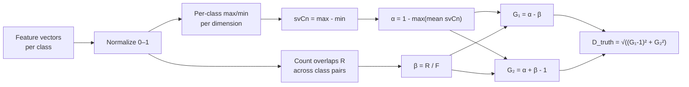

# Paraconsistent Feature Engineering

Paraconsistent feature engineering quantifies the quality of extracted feature vectors using da Costa paraconsistent logic [1]. It measures intraclass similarity (α) and interclass overlap (β) to determine whether features are naturally separable *before* any classifier is trained.

This is the **primary novel contribution** of the thesis "Autenticação Biométrica de Locutores Drasticamente Disfônicos Aprimorada pela Imagined Speech" (A. Furlan, UNESP). The original method is published in [2].

## Theoretical Background

### Motivation

After extracting feature vectors via DTWPT + energy bands, the question is: *are these features naturally discriminative?* The paraconsistent approach provides a geometry-independent quality score before any classifier training.

### The Two Coefficients

Given $N$ classes $C_1, \ldots, C_N$, each with $X$ feature vectors of dimension $T$:

#### Intraclass Similarity (α)

1. Normalize all feature vectors so every component lies in $[0, 1]$.
2. For each class $C_n$ and each dimension $j$:

$$\text{max}_{j}(C_n) = \max_{x \in C_n} x_j, \qquad \text{min}_{j}(C_n) = \min_{x \in C_n} x_j$$

3. The **class similarity vector**:

$$\text{svC}_n[j] = \text{max}_{j}(C_n) - \text{min}_{j}(C_n)$$

4. Mean intraclass spread per class:

$$\overline{\text{svC}_n} = \frac{1}{T} \sum_{j=1}^{T} \text{svC}_n[j]$$

5. Final coefficient:

$$\alpha = 1 - \max_{n}\, \overline{\text{svC}_n}$$

$\alpha = 1$ → every class is perfectly compact. $\alpha = 0$ → at least one class spans the full $[0,1]$ range.

#### Interclass Overlap (β)

1. For each ordered pair $(C_n, C_m)$ with $n \neq m$, count $R$: number of feature component values from $C_n$ that fall within $[\text{min}_j(C_m),\, \text{max}_j(C_m)]$.

2. Maximum possible overlap count:

$$F = N \cdot (N-1) \cdot X \cdot T$$

3. Final coefficient:

$$\beta = \frac{R}{F}$$

$\beta = 0$ → no interclass overlap. $\beta = 1$ → complete overlap everywhere.

### The Paraconsistent Plane

Map $(\alpha, \beta)$ to certainty and contradiction degrees [2]:

$$G_1 = \alpha - \beta \qquad \text{(degree of certainty)}$$
$$G_2 = \alpha + \beta - 1 \qquad \text{(degree of contradiction)}$$

The four corners of the paraconsistent plane:

| $(G_1, G_2)$ | Meaning | Condition |
|---|---|---|
| $(1,\; 0)$ | **Truth** — classes fully separated | $\alpha=1,\;\beta=0$ |
| $(-1,\; 0)$ | **Falsity** — completely mixed | $\alpha=0,\;\beta=1$ |
| $(0,\; 1)$ | **Ambiguity** — compact but overlapping | $\alpha=1,\;\beta=1$ |
| $(0,\;-1)$ | **Indefinition** — no structure | $\alpha=0,\;\beta=0$ |

### Distance to Truth

The primary quality metric — Euclidean distance from $(G_1, G_2)$ to the truth vertex:

$$D_{\text{truth}} = \sqrt{(G_1 - 1)^2 + G_2^2}$$

Smaller $D_{\text{truth}}$ → better feature set. Distances to all four corners:

$$D_{\text{false}} = \sqrt{(G_1+1)^2 + G_2^2}, \quad
  D_{\text{indef}} = \sqrt{G_1^2 + (G_2+1)^2}, \quad
  D_{\text{ambig}} = \sqrt{G_1^2 + (G_2-1)^2}$$

### Intuition

| $\alpha$ | $\beta$ | $(G_1, G_2)$ region | Meaning |
|---|---|---|---|
| High | Low | Near $(1,0)$ | Even simple classifiers work well |
| High | High | Near $(0,1)$ | Classes compact but occupying same space |
| Low | Low | Near $(0,-1)$ | Scattered, not overlapping, not consistent |
| Low | High | Near $(-1,0)$ | Completely mixed — features useless |

---

## How It Is Implemented Here

```
include/paraconsistent/paraconsistent.hpp    # Public header
src/core/paraconsistent/                     # Implementation + tests
```

### Core API

```cpp
#include "paraconsistent/paraconsistent.hpp"
using namespace nn::paraconsistent;

// Evaluate feature set quality across all classes
ParaconsistentResult evaluate(
    const std::vector<std::vector<nn::Tensor>>& class_feature_vectors);

struct ParaconsistentResult {
    float alpha;    // intraclass similarity ∈ [0,1]
    float beta;     // interclass overlap   ∈ [0,1]
    float G1;       // degree of certainty  ∈ [-1,1]
    float G2;       // degree of contradiction ∈ [-1,1]
    float D_truth;  // distance to (1,0) — primary quality metric
    float D_false;
    float D_indef;
    float D_ambig;
};
```

### Usage Example

```cpp
// Group feature vectors by class
std::vector<std::vector<nn::Tensor>> by_class(num_classes);
for (const auto& sample : dataset)
    by_class[sample.label].push_back(extract_features(sample.signal));

auto r = nn::paraconsistent::evaluate(by_class);
std::printf("α=%.3f β=%.3f G1=%.3f G2=%.3f D_truth=%.3f\n",
            r.alpha, r.beta, r.G1, r.G2, r.D_truth);

if (r.D_truth < 0.30f)
    std::puts("Feature set separable — proceed to classifier.");
```

### Integration with the DTWPT Pipeline

Paraconsistent analysis is used to **select the best (wavelet × energy scale)** combination before classifier training:

```
for each wavelet ∈ {Haar, Daub4, Daub6, ...}:
    for each scale ∈ {BARK, MEL, LFCC}:
        features = DTWPT(signal, wavelet) → energy_bands(scale)
        result   = paraconsistent::evaluate(features_by_class)
        record   (wavelet, scale, result.D_truth)

best = argmin D_truth over all (wavelet × scale) pairs
```

This avoids expensive classifier sweeps for feature selection.

---

## Data Flow



---

## Common Pitfalls

1. **Normalization is mandatory.** Computing on unnormalized features gives meaningless results.

2. **Class imbalance inflates β.** A class with many more samples has a wider per-dimension range → higher $\beta$. Balance classes before evaluating.

3. **Outliers depress α.** The per-class range is the global min/max — single outliers inflate `svCn`. Consider robust variants using percentiles.

4. **$D_{\text{truth}} > 0.5$ doesn't mean the task is hopeless.** Nonlinear classifiers can still learn; the measure quantifies *linear* separability.

---

## See Also

- [Wavelet](./Wavelet.md) — DTWPT feature extraction
- [Concepts/LFCC](../Concepts/LFCC.md) — Linear cepstral features evaluated by this method
- [Concepts/Imagined-Speech-and-EEG](../Concepts/Imagined-Speech-and-EEG.md) — EEG signal source
- [Research-Context](../Research-Context.md) — Thesis overview

---

## References

[1] N. C. A. da Costa, "On the theory of inconsistent formal systems," *Notre Dame Journal of Formal Logic*, vol. 15, no. 4, pp. 497–510, 1974.

[2] R. C. Guido et al., "Paraconsistent feature engineering for EEG-based imagined speech classification," *Proceedings of SPIE*, vol. 10160, 2017. DOI: 10.1117/12.2255697.
