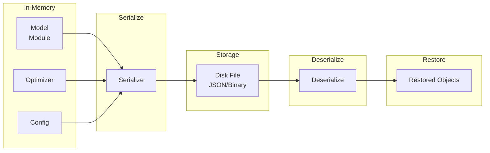

# Saver

Model serialization for saving and loading trained models.

## Theoretical Background

### State Dictionary

PyTorch-style serialization stores:
- **Model state**: All learnable parameters
- **Optimizer state**: For resuming training
- **Metadata**: Training configuration, epoch, etc.

### Serialization Formats

- **JSON**: Human-readable, good for config
- **Binary**: Efficient for large parameter tensors
- **Protocol Buffers**: Cross-language, efficient

## How It Is Implemented Here

### Network Serializer

`NetworkSerializer` is specific to `Sequential` models (not any `Module<Backend>`)
and has no optimizer-saving methods at all — it round-trips a network's
architecture + weights through an `.npz` file:

```cpp
// File: include/serialization/NetworkSerializer.hpp
class NetworkSerializer
{
public:
    static auto saveNetwork(const Sequential& model, const string& safe_filepath) -> bool;
    static auto loadNetwork(Sequential& model, const string& safe_filepath) -> bool;

    // private: per-layer save/load handlers (_saveLinear, _saveLeaky, ...)
    // dispatch on concrete layer type; architecture is encoded as a string
    // alongside the per-parameter weight/bias entries in the .npz.
};
```

### Binary State Dict (not YAML)

There is no `StateIO` class and no YAML support — `include/io/StateIO.hpp`
is a pair of free functions that (de)serialize a plain `std::map<std::string,
Tensor>` state dict to/from a project-specific binary format (entry count,
then per-entry key + rows/cols + raw float data), independent of any
particular model or optimizer type:

```cpp
// File: include/io/StateIO.hpp
namespace nn::io
{
using StateDict = std::map<std::string, nn::Tensor>;

auto save_state_dict(const StateDict& sd, const std::string& path) -> bool;
auto load_state_dict(StateDict& out, const std::string& path) -> bool;
auto load_state_dict(const std::string& path) -> StateDict;  // convenience overload
}
```

## Data Flow



## Usage Example

```cpp
// File: src/core/serialization/tests/NetworkSerializer_gtest.cpp
#include "serialization/NetworkSerializer.hpp"

// Save model (Sequential only)
nn::Sequential model = /* ... */;
NetworkSerializer::saveNetwork(model, "model.npz");

// Load model (architecture must already match; layers are filled in place)
nn::Sequential loaded_model = /* rebuild same architecture */;
NetworkSerializer::loadNetwork(loaded_model, "model.npz");
```

### Binary State Dict Save/Load

```cpp
#include "io/StateIO.hpp"

// Save any model's state_dict() as a plain binary file
nn::io::save_state_dict(model.state_dict(), "checkpoint.bin");

// Load it back
auto restored = nn::io::load_state_dict("checkpoint.bin");
model.load_state_dict(restored);
```

## Common Pitfalls

1. **Architecture Mismatch**: Can't load weights if layer sizes differ

2. **Device Mismatch**: OpenCL weights can't load to CPU model

3. **Version**: Saved format may change between versions

4. **Partial Load**: Some frameworks allow partial loading (strict=false)

## See Also

- [Optimizers](./Optimizers.md) - Saving optimizer state
- [Training](./Training.md) - Checkpoint integration
- [Architecture](../Architecture.md) - Save/load in training loop

## References

[1] A. Paszke et al., "PyTorch: An imperative style, high-performance deep learning library," in *Adv. Neural Inf. Process. Syst. (NeurIPS)*, vol. 32, 2019. [Online]. Available: https://arxiv.org/abs/1912.01703

[2] M. Abadi et al., "TensorFlow: A system for large-scale machine learning," in *Proc. 12th USENIX Symp. Operating Systems Design and Implementation (OSDI)*, 2016, pp. 265–283. [Online]. Available: https://arxiv.org/abs/1605.08695