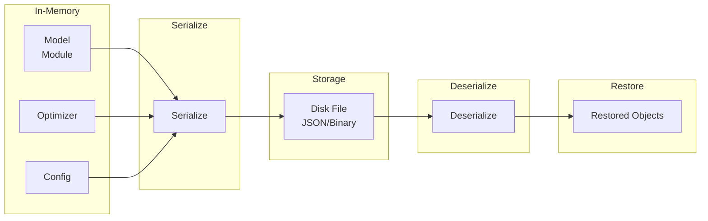

# Saver

Model serialization for saving and loading trained models.

## Theoretical Background

### State Dictionary

PyTorch-style serialization stores:
- **Model state**: All learnable parameters
- **Optimizer state**: For resuming training
- **Metadata**: Training configuration, epoch, etc.

### Serialization Formats

- **JSON**: Human-readable, good for config
- **Binary**: Efficient for large parameter tensors
- **Protocol Buffers**: Cross-language, efficient

## How It Is Implemented Here

### Network Serializer

```cpp
// File: include/nn/saver/NetworkSerializer.hpp
class NetworkSerializer
{
public:
    // Save model state dictionary
    auto save_state_dict(const std::string& path, 
                        const Module<Backend>& model) -> void;

    // Load model state dictionary
    auto load_state_dict(const std::string& path,
                        Module<Backend>& model) -> void;

    // Save optimizer state
    auto save_optimizer(const std::string& path,
                       const Optimizer& optimizer) -> void;

    // Load optimizer state
    auto load_optimizer(const std::string& path,
                      Optimizer& optimizer) -> void;
};
```

### YAML Configuration

```cpp
// File: include/nn/io/StateIO.hpp
class StateIO
{
public:
    // Save complete state (model + optimizer + config)
    auto save(const std::string& path,
             const Module<Backend>& model,
             const Optimizer& optimizer,
             const Config& config) -> void;

    // Load complete state
    auto load(const std::string& path,
             Module<Backend>& model,
             Optimizer& optimizer,
             Config& config) -> void;
};
```

## Data Flow



## Usage Example

```cpp
// File: src/core/saver/tests/NetworkSerializer_gtest.cpp
#include "nn/saver/NetworkSerializer.hpp"
#include "nn/optimizers/Adam.hpp"

// Save model
nn::saver::NetworkSerializer serializer;
serializer.save_state_dict("model.pt", *model);

// Load model
auto loaded_model = std::make_unique<MyModel>(config);
serializer.load_state_dict("model.pt", *loaded_model);

// Save optimizer for resume training
serializer.save_optimizer("optimizer.pt", optimizer);

// Load and resume
serializer.load_optimizer("optimizer.pt", optimizer);
```

### YAML Save/Load

```cpp
#include "nn/io/StateIO.hpp"

// Save complete training state
nn::io::StateIO state_io;
state_io.save("experiment01/checkpoint.yaml", *model, optimizer, config);

// Load complete state
MyModel restored_model(config);
nn::optimizers::Adam restored_optimizer(config.learning_rate);
ExperimentConfig restored_config;
state_io.load("experiment01/checkpoint.yaml", 
              restored_model, restored_optimizer, restored_config);
```

## Common Pitfalls

1. **Architecture Mismatch**: Can't load weights if layer sizes differ

2. **Device Mismatch**: OpenCL weights can't load to CPU model

3. **Version**: Saved format may change between versions

4. **Partial Load**: Some frameworks allow partial loading (strict=false)

## See Also

- [Optimizers](./Optimizers.md) - Saving optimizer state
- [Training](./Training.md) - Checkpoint integration
- [Architecture](./Architecture.md) - Save/load in training loop

## References

[1] A. Paszke et al., "PyTorch: An imperative style, high-performance deep learning library," in *Adv. Neural Inf. Process. Syst. (NeurIPS)*, vol. 32, 2019. [Online]. Available: https://arxiv.org/abs/1912.01703

[2] M. Abadi et al., "TensorFlow: A system for large-scale machine learning," in *Proc. 12th USENIX Symp. Operating Systems Design and Implementation (OSDI)*, 2016, pp. 265–283. [Online]. Available: https://arxiv.org/abs/1605.08695