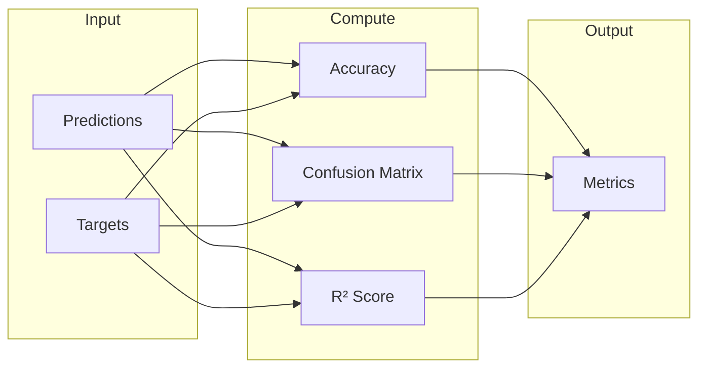

# Statistics

Statistical functions and metrics for model evaluation.

## Theoretical Background

### Metrics

Common classification/regression metrics:

- **Accuracy**: $\frac{1}{N} \sum_i \mathbb{1}(\hat{y}_i = y_i)$
- **Precision**: $\frac{TP}{TP + FP}$
- **Recall**: $\frac{TP}{TP + FN}$
- **F1**: $2 \cdot \frac{P \cdot R}{P + R}$

### Confusion Matrix

|  | Predicted Positive | Predicted Negative |
|--|---------------|----------------|
| **Actual Positive** | TP | FN |
| **Actual Negative** | FP | TN |

### K-Fold Cross-Validation

The dataset is split into $k$ equal-sized folds. Train on $k-1$, validate on 1, repeat $k$ times [6].

## How It Is Implemented Here

### K-Fold Splitters

```cpp
// File: include/statistics/kfold.hpp  (namespace statistics)

struct FoldSplit {
    std::vector<std::size_t> train_indices;
    std::vector<std::size_t> test_indices;
};

// Plain K-fold
class KFold {
public:
    explicit KFold(std::size_t n_splits, bool shuffle = false,
                   std::uint32_t random_seed = 0U);
    auto split(std::size_t n_samples) const -> std::vector<FoldSplit>;
};

// Stratified K-fold for classification
class StratifiedKFold {
public:
    explicit StratifiedKFold(std::size_t n_splits, bool shuffle = false,
                             std::uint32_t random_seed = 0U);
    auto split(const std::vector<int>& labels) const -> std::vector<FoldSplit>;
};
```

### Nested K-Fold

For unbiased hyperparameter evaluation in biomedical ML [41]:

```cpp
// File: include/statistics/kfold.hpp  (namespace statistics)

struct NestedFoldSplit {
    std::vector<std::size_t> test_indices;  // outer held-out test set
    std::vector<FoldSplit>   inner_splits;  // inner HPO train/val splits
};

class NestedKFold {
public:
    explicit NestedKFold(std::size_t n_outer_splits,
                         std::size_t n_inner_splits,
                         bool shuffle = false,
                         std::uint32_t random_seed = 0U);
    auto split(std::size_t n_samples) const -> std::vector<NestedFoldSplit>;
};
```

Usage pattern:
```cpp
statistics::NestedKFold nkf(5, 5, /*shuffle=*/true, 42U);
for (auto& outer : nkf.split(n_samples))
{
    // outer.test_indices — held out, never seen during HPO
    for (auto& [tr, va] : outer.inner_splits)
    {
        // tr → training, va → HPO validation
    }
}
```

See [K-Fold Cross-Validation](../Concepts/K-Fold-Cross-Validation.md) for theory and the bias-reduction rationale.

### Split policies (`ISplitPolicy`)

`NestedKFold` accepts a pluggable split strategy via the policy constructor:

```cpp
// File: include/statistics/kfold.hpp
struct ISplitPolicy {
    virtual auto make_splits(std::size_t n_samples,
                             const std::vector<int>& groups) const
        -> std::vector<FoldSplit> = 0;
};

// Sample-level (default, backward compat)
auto p = std::make_shared<statistics::SampleKFoldPolicy>(5, /*shuffle=*/true, seed);

// Speaker-grouped: all samples of same group label stay in same fold
auto p = std::make_shared<statistics::GroupKFoldPolicy>(5, /*shuffle=*/true, seed);

// Policy-based NestedKFold
statistics::NestedKFold nkf(5, 5, outer_policy, inner_policy);
// Pass group labels (e.g. speaker IDs) at split time:
auto splits = nkf.split(n_samples, group_ids);
```

`GroupKFoldPolicy` prevents **speaker data leakage**: with sample-level splitting, the same speaker's utterances appear in both train and test, giving optimistically biased accuracy and EER. `GroupKFoldPolicy` assigns all utterances of one speaker to one fold (sklearn `GroupKFold` round-robin behaviour).

Implement `ISplitPolicy::make_splits` to add time-ordered, stratified-grouped, or any other custom split strategy.

### EER scoring strategies (`IEERScorer`)

EER computation is pluggable via `statistics::IEERScorer`:

```cpp
// File: include/statistics/eer_scorer.hpp
struct IEERScorer {
    virtual auto compute_eer(const std::vector<std::vector<float>>& embeddings,
                             const std::vector<int>& labels,
                             int n_classes) const -> double = 0;
};
```

Two concrete implementations:

| Class | Protocol | When to use |
|---|---|---|
| `GenuineImpostorEERScorer` | enrollment template + cosine-similarity genuine/impostor trial sweep | Production / thesis results |
| `ClassificationEERScorer` | argmax → one-vs-rest confusion matrix → `calculateEER` | Legacy / ablation only |

`GenuineImpostorEERScorer(n_enroll)` protocol:
1. Per speaker: first `n_enroll` utterances → L2-normalised mean = enrollment template.  
2. Remaining utterances = probes.  
3. Each probe vs. all templates: cosine similarity → genuine or impostor trial.  
4. Sort trials by score descending; sweep threshold → FAR/FRR; linear-interpolate crossing = EER.  

Returns `NaN` when a speaker has ≤ `n_enroll` samples (no probes) or fewer than 2 speakers have templates (no impostor trials).

### Statistic Interface

Lightweight interface for incremental metric accumulation (reset per epoch, update per batch):

```cpp
// File: include/statistics/IStatistic.hpp
namespace nn::statistics {
class IStatistic {
public:
    virtual void        reset()           = 0;  // call at epoch begin
    virtual void        update(float v)   = 0;  // call at batch end
    virtual float       value()     const = 0;  // mean/sum/etc
    virtual std::string name()      const = 0;
    virtual ~IStatistic()                 = default;
};
} // namespace nn::statistics
```

**`RunningMean`** — concrete `IStatistic` for per-epoch loss tracking:

```cpp
// File: include/statistics/RunningMean.hpp
nn::statistics::RunningMean loss_stat("train_loss");
loss_stat.reset();
for (auto& batch : epoch_batches) {
    float lv = /* compute loss */;
    loss_stat.update(lv);
}
float epoch_mean = loss_stat.value();
```

### Metrics

```cpp
// File: include/statistics/multi_class_metrics.hpp

// Classification accuracy
auto accuracy(const Tensor& predictions, const Tensor& targets) -> float;

// Confusion matrix
auto confusion_matrix(const Tensor& predictions, const Tensor& targets) -> Tensor;

// Per-class metrics
auto precision(const Tensor& predictions, const Tensor& targets, int num_classes) -> Tensor;
auto recall(const Tensor& predictions, const Tensor& targets, int num_classes) -> Tensor;
auto f1_score(const Tensor& predictions, const Tensor& targets, int num_classes) -> Tensor;
```

### Regression Metrics

```cpp
// File: include/statistics/inference_tests.hpp

// R² score (coefficient of determination)
auto r2_score(const Tensor& predictions, const Tensor& targets) -> float;

// Mean Absolute Error
auto mae(const Tensor& predictions, const Tensor& targets) -> float;

// Mean Squared Error
auto mse(const Tensor& predictions, const Tensor& targets) -> float;
```

## Data Flow



## Usage Example

```cpp
// File: src/core/statistics/tests/metrics_gtest.cpp
#include "nn/statistics/multi_class_metrics.hpp"
#include "nn/statistics/inference_tests.hpp"

// Classification
nn::Tensor pred = /* model predictions */;
nn::Tensor true_labels = /* ground truth */;

float acc = nn::statistics::accuracy(pred, true_labels);
std::cout << "Accuracy: " << acc << std::endl;

// Confusion matrix
nn::Tensor cm = nn::statistics::confusion_matrix(pred, true_labels);

// Regression
nn::Tensor y_pred = /* predictions */;
nn::Tensor y_true = /* targets */;

float r2 = nn::statistics::r2_score(y_pred, y_true);
float mse = nn::statistics::mse(y_pred, y_true);
```

## Common Pitfalls

1. **Class Imbalance**: Use macro accuracy, not just overall accuracy

2. **Empty Predictions**: Handle edge cases in confusion matrix

3. **R² Negative**: Can be negative if model is worse than mean predictor

4. **Stratified Folds**: Always use stratified sampling for classification

## See Also

- [DataLoaders](./DataLoaders.md) — K-fold integration
- [K-Fold Cross-Validation](../Concepts/K-Fold-Cross-Validation.md) — Theory and nested CV rationale
- [Training](./Training.md) — `nested_cv_*` fields in `TrainerConfig`
- [Layers](./Layers.md) — Model evaluation

## References

[1] R. Kohavi, "A study of cross-validation and bootstrap for accuracy estimation and model selection," in *Proc. 14th Int. Joint Conf. Artificial Intelligence (IJCAI)*, 1995, pp. 1137–1143.

[2] D. M. W. Powers, "Evaluation: From precision, recall and F-measure to ROC, informedness, markedness and correlation," *J. Machine Learning Technologies*, vol. 2, no. 1, pp. 37–63, 2011. [Online]. Available: https://arxiv.org/abs/2010.16061

[41] A. Leal et al., "A guide to cross-validation for artificial intelligence in medical imaging," *Radiology: Artificial Intelligence*, 2023. [Online]. Available: https://pmc.ncbi.nlm.nih.gov/articles/PMC10388213/