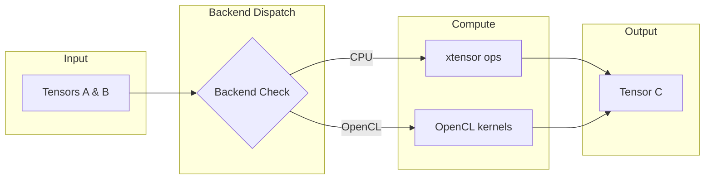

# Tensor

The `Tensor` is the core data structure in the nn library, representing multi-dimensional arrays with optional GPU support via OpenCL.

## Theoretical Background

A tensor is a generalization of matrices to arbitrary dimensions. In neural networks, tensors are used to store:

- **Input data**: $(batch\_size, features)$ for fully-connected layers
- **Images**: $(batch, channels, height, width)$ for convolutional layers
- **Sequences**: $(batch, time\_steps, features)$ for RNNs/LSTMs

The tensor supports gradient tracking through the `.grad()` mechanism, similar to PyTorch's autograd.

### Mathematical Operations

All tensor operations are element-wise by default:

- **Addition**: $C_{ij} = A_{ij} + B_{ij}$
- **Multiplication**: $C_{ij} = A_{ij} \cdot B_{ij}$
- **Matrix Multiplication**: $C_{ik} = \sum_j A_{ij} B_{jk}$

## How It Is Implemented Here

The core tensor is defined in `include/tensor/Tensor.hpp`:

```cpp
// File: include/tensor/Tensor.hpp
template <typename Backend>
class TensorImpl
{
    // Shape information
    std::vector<size_t> shape_;    // dimensions: rows, cols, etc.
    std::vector<size_t> strides_;  // memory layout

    // Data storage
    std::vector<float> data_;        // host data (xtensor backend)
    void* gpu_data_;              // GPU data (OpenCL backend)

    // Gradients
    bool requires_grad_;
    std::optional<Tensor> grad_;
};
```

### Backend Dispatch

The tensor uses a backend system to dispatch operations:

```cpp
// File: include/tensor/Tensor.hpp (simplified)
template <typename Backend>
class Tensor {
    // Delegates to backend for actual computation
    auto add(const Tensor& other) const -> Tensor {
        return Backend::add(*this, other);
    }

    auto matrixMultiply(const Tensor& other) const -> Tensor {
        return Backend::matrixMultiply(*this, other);
    }
};
```

Supported backends:
- `nn::XtensorTensorBackend` - CPU operations
- `nn::OpenCLTensorBackend` - GPU operations with lazy sync

## Data Flow



## Usage Example

```cpp
// File: src/core/tensor/tests/tensor_gtest.cpp (simplified)
#include "nn/tensor/Tensor.hpp"

// Create a 3x4 tensor
nn::Tensor input(3, 4);
input.at(0, 0) = 1.0f;

// Matrix multiplication: 3x4 @ 4x2 = 3x2
nn::Tensor weights(4, 2);
nn::Tensor output = input.matrixMultiply(weights);

// Enable gradient tracking
nn::Tensor model_param(10, 5);
model_param.set_requires_grad(true);

// Forward pass with gradient computation
nn::Tensor loss = forward(model_param, true);  // requires_grad=true
nn::Tensor d_loss = loss_fn.backward(output);

// Update gradients
nn::Tensor grad = model_param.grad();
optimizer.step(model_param.params());
```

## Recent OpenCL Optimization (2026-05-02)

The OpenCL backend now includes a tuned tiled kernel for direct
$A^T \cdot B$ (`matmul_lhs_transposed_kernel`) and uses this path in the
Linear-layer backward weight-gradient hot path (`dL/dW`).

Implementation points:
- Kernel source: `src/core/tensor/opencl/KernelManager.cpp`
- Backend API: `OpenCLTensorBackend::matmul_lhs_transposed(...)` in
    `src/core/tensor/opencl/OpenCLTensorBackend.cpp`
- Linear backward integration: `include/layers/dense/Linear.hpp`

Measured evidence (20-iteration samples on rusticl + AMD Radeon Graphics):
- `opencl,grad_weight_matmul_512x1024x256`: 5.662 and 5.858 ms/iter
- `opencl,grad_weight_matmul_via_transpose_probe_512x1024x256`:
    10.653 and 10.290 ms/iter
- Observed speedup for grad-weight path: about $1.76\times$ to $1.88\times$

Detailed benchmark log:
- [results/opencl_lhs_transposed_benchmark_2026-05-02.md](../../results/opencl_lhs_transposed_benchmark_2026-05-02.md)

## Recent OpenCL Stability and SNN Integration Update (2026-05-10)

The OpenCL backend and SNN layer integration were extended to validate LIF helper usage from layer code, not only from backend helper unit tests.

Implementation points:
- OpenCL backend default constructor now initializes empty host storage to avoid null host-state dereference during early shape checks.
    - `src/core/tensor/opencl/OpenCLTensorBackend.cpp`
- OpenCL tensor tests now include Lif layer forward/backward integration cases instantiated on `OpenCLTensorBackend`.
    - `src/core/tensor/tests/opencl_tensor_backend_gtest.cpp`

Observed behavior after the fix:
- Direct helper tests (`lif_step_inplace`, `lif_grad`) pass.
- Layer-level OpenCL tests for Lif forward parity and exponential-surrogate backward also pass.
- A previously reproducible segmentation fault in first-call Lif forward is removed.

## Recent OpenCL Buffer Pool Memory Cap (2026-07-14)

`OpenCLTensorBackend` allocates device buffers through a static, process-wide
`GPUBufferPool` (`include/tensor/opencl/GPUBufferPool.hpp`) that buckets
requests into fixed size classes (1KB … 64MB, then 64MB-aligned) and caches
idle buffers for reuse instead of calling `clCreateBuffer`/`clReleaseMemObject`
per tensor. Each bucket was already capped at 20 idle buffers, but nothing
capped the *number of buckets* — a long training run that touches many
distinct tensor shapes (per-layer activations, gradients, optimizer moments,
per-timestep SNN state) kept a growing set of buckets alive for the whole
process lifetime and never shrank.

This was found while investigating a memory report: four parallel
`experiment05` phase00 runs each plateaued at 2.1–4.4GB RSS+swap for a tiny
256→64→32 autoencoder — disproportionate for the actual weight/activation
sizes involved. Buffers use `CL_MEM_ALLOC_HOST_PTR` (pinned) by default, so on
this (integrated-GPU / unified-memory) hardware the pool's memory is real host
RAM, not separate VRAM — it shows up directly in `ps`/`free`.

It wasn't an active leak (memory was confirmed flat over repeated sampling
once a run plateaued) — the real trigger was `scripts/testing/run_profiles.sh`
under-budgeting per-job RAM and oversubscribing concurrency (see
[Running Experiment05 Profiles](../Guides/Running-Experiment05-Profiles.md)).
This pool fix is a bound on the secondary inefficiency, not the root cause.

Implementation points:
- Added `GPUBufferPool::kDefaultMaxPoolBytes` (1 GiB) and a `max_pool_bytes`
  constructor parameter — `include/tensor/opencl/GPUBufferPool.hpp`.
- `release()` now only caches a returned buffer if the per-bucket count is
  under 20 **and** the pool's total cached bytes (`cached_bytes_`) would stay
  under the ceiling; otherwise the buffer is dropped immediately (destructor
  calls `clReleaseMemObject`) instead of being retained forever —
  `src/core/tensor/opencl/GPUBufferPool.cpp`.
- `acquire()` decrements `cached_bytes_` when reusing a pooled buffer; `clear()`
  resets it to 0.
- No API break: `OpenCLTensorBackend::init_buffer_pool()` still constructs the
  pool with the two required args; the new parameter defaults to 1 GiB.

Verification: the pool's translation unit was compiled directly against the
project's recorded compiler flags (`compile_commands.json`) — clean, no
warnings. A full `cmake --build` reconfigure is currently blocked by an
unrelated stale Python venv (`venv/bin/python` missing after a system Python
upgrade to 3.14.6); not yet fixed.

## Common Pitfalls

1. **Shape Mismatch**: Ensure matrix multiply dimensions align: $A_{m \times n} \cdot B_{n \times p} = C_{m \times p}$

2. **Gradient Not Tracked**: Call `set_requires_grad(true)` before forward pass, or pass `requires_grad=true` to operations

3. **GPU Data Not Synced**: Use `sync_gpu_if_needed()` before accessing GPU tensor data on CPU, or use non-const `at()` accessor

## See Also

- [Layers](./Layers.md) - Uses Tensor for all operations
- [Optimizers](./Optimizers.md) - Operates on Tensor gradients
- [DataLoaders](./DataLoaders.md) - Produces Tensors from datasets
- [Architecture](./Architecture.md) - System interaction diagram

## References

[1] T. G. Kolda and B. W. Bader, "Tensor decompositions and applications," *SIAM Rev.*, vol. 51, no. 3, pp. 455–500, 2009. [Online]. Available: https://doi.org/10.1137/07070111X

[2] M. Abadi et al., "TensorFlow: A system for large-scale machine learning," in *Proc. 12th USENIX Symp. Operating Systems Design and Implementation (OSDI)*, 2016, pp. 265–283. [Online]. Available: https://www.usenix.org/conference/osdi16/technical-sessions/presentation/abadi