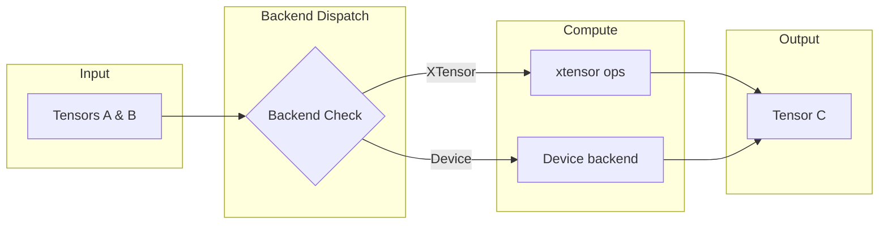

# Tensor

The `Tensor` is the core data structure in the nn library, representing multi-dimensional arrays dispatched to a swappable compute backend.

## Theoretical Background

A tensor is a generalization of matrices to arbitrary dimensions. In neural networks, tensors are used to store:

- **Input data**: $(batch\_size, features)$ for fully-connected layers
- **Images**: $(batch, channels, height, width)$ for convolutional layers
- **Sequences**: $(batch, time\_steps, features)$ for RNNs/LSTMs

The tensor supports gradient tracking through the `.grad()` mechanism, similar to PyTorch's autograd.

### Mathematical Operations

All tensor operations are element-wise by default:

- **Addition**: $C_{ij} = A_{ij} + B_{ij}$
- **Multiplication**: $C_{ij} = A_{ij} \cdot B_{ij}$
- **Matrix Multiplication**: $C_{ik} = \sum_j A_{ij} B_{jk}$

## How It Is Implemented Here

The core tensor is defined in `include/tensor/Tensor.hpp`:

```cpp
// File: include/tensor/Tensor.hpp
template <typename Backend>
class TensorImpl
{
    // The ONLY data member. Shape, strides, storage (host or GPU) and
    // gradient tracking all live inside the Backend object itself, not here —
    // TensorImpl is a thin, backend-agnostic wrapper that delegates every
    // operation to `backend_` (see Backend Dispatch below).
    Backend backend_;
};
```

### Backend Dispatch

The tensor uses a backend system to dispatch operations:

```cpp
// File: include/tensor/Tensor.hpp (simplified)
template <typename Backend>
class TensorImpl {
    Backend backend_;

    // Delegates to the backend INSTANCE (backend_), not a static call —
    // each TensorImpl owns its own backend object.
    auto add(const TensorImpl& other) const -> TensorImpl {
        return TensorImpl(backend_.add(other.backend_));
    }

    auto matmul(const TensorImpl& other) const -> TensorImpl {
        return TensorImpl(backend_.matmul(other.backend_));
    }
};
```

Supported backends (selected via `NN_BACKEND` CMake option; see `include/Backend.hpp`):
- `nn::XTensorBackend` — CPU operations (xtensor + BLAS); the reference implementation
- `nn::DeviceTensorBackend` — documented skeleton for adding new device
  backends. It always runs on an `XTensorBackend` host mirror — its
  "simulated device buffer" only exercises copy-semantics bookkeeping for
  tests, never real hardware. Since there's no real device to be
  "unsupported" on, the no-fallback policy doesn't map onto it directly;
  instead, selecting `NN_BACKEND=Device` prints a configure-time `WARNING`
  (top-level `CMakeLists.txt`) so it's never mistaken for testing a real
  accelerator.
  **Full `TensorBackendParityContract` coverage since 2026-07-15**: `divide`,
  `add_col_vector_to_rows_inplace`, all ten `compare_*`/`compare_*_scalar`
  variants, `clamp`/`clamp_inplace`, `mean()`, and the four `random(...)`
  overloads were missing (all delegating to `m_host` like every other method
  in the file, now added) — found because `pytorch_parity_gtest` instantiates
  every layer against every concrete backend, including `Device`, and those
  gaps were simple compile failures once something actually exercised them.
  See [Ground-Truth-and-Smoke-Testing](../Guides/Ground-Truth-and-Smoke-Testing.md).

## Data Flow



## Usage Example

```cpp
// File: src/core/tensor/tests/tensor_gtest.cpp (simplified)
#include "tensor/Tensor.hpp"

// Create a 3x4 tensor
nn::Tensor input(3, 4);
input.at(0, 0) = 1.0f;

// Matrix multiplication: 3x4 @ 4x2 = 3x2
nn::Tensor weights(4, 2);
nn::Tensor output = input.matmul(weights);

// There is no `set_requires_grad()` — gradient tracking is controlled by the
// `requires_grad` bool passed into each `forward()` call (see Module contract
// in Core/Layers.md), not a flag stored on the Tensor itself.
nn::Tensor model_param(10, 5);
nn::Tensor y = model.forward(model_param, /*requires_grad=*/true);
nn::Tensor d_input = model.backward(grad_output);   // backward() returns a Tensor

// Read/write the gradient explicitly
nn::Tensor grad = model_param.grad();
model_param.set_grad(grad);
optimizer.step(model.params());
```

## Common Pitfalls

1. **Shape Mismatch**: Ensure matrix multiply dimensions align: $A_{m \times n} \cdot B_{n \times p} = C_{m \times p}$

2. **Gradient Not Tracked**: There is no `set_requires_grad()` — pass `requires_grad=true` into the `forward()` call itself (see Usage Example above and the Module contract in [Layers](./Layers.md))

3. **Reshape is not reframing**: storage is column-major, so reshaping
   `(N, 1)` to `(T, D)` yields the strided/polyphase split
   $\{t, t+T, t+2T, \dots\}$ per row, not $D$ consecutive elements. To group
   consecutive elements, reshape to `(D, T)` and transpose (see
   `to_lstm_frames` in [Experiment04](../Experiments/Meeting01.md)).

## See Also

- [Layers](./Layers.md) - Uses Tensor for all operations
- [Optimizers](./Optimizers.md) - Operates on Tensor gradients
- [DataLoaders](./DataLoaders.md) - Produces Tensors from datasets
- [Architecture](../Architecture.md) - System interaction diagram
- [Device](./Device.md) - Device abstraction

## References

[1] T. G. Kolda and B. W. Bader, "Tensor decompositions and applications," *SIAM Rev.*, vol. 51, no. 3, pp. 455–500, 2009. [Online]. Available: https://doi.org/10.1137/07070111X

[2] M. Abadi et al., "TensorFlow: A system for large-scale machine learning," in *Proc. 12th USENIX Symp. Operating Systems Design and Implementation (OSDI)*, 2016, pp. 265–283. [Online]. Available: https://www.usenix.org/conference/osdi16/technical-sessions/presentation/abadi