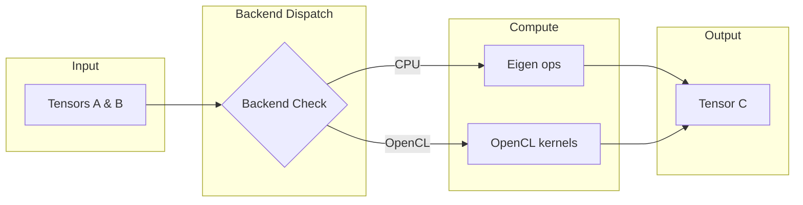

# Tensor

The `Tensor` is the core data structure in the nn library, representing multi-dimensional arrays with optional GPU support via OpenCL.

## Theoretical Background

A tensor is a generalization of matrices to arbitrary dimensions. In neural networks, tensors are used to store:

- **Input data**: $(batch\_size, features)$ for fully-connected layers
- **Images**: $(batch, channels, height, width)$ for convolutional layers
- **Sequences**: $(batch, time\_steps, features)$ for RNNs/LSTMs

The tensor supports gradient tracking through the `.grad()` mechanism, similar to PyTorch's autograd.

### Mathematical Operations

All tensor operations are element-wise by default:

- **Addition**: $C_{ij} = A_{ij} + B_{ij}$
- **Multiplication**: $C_{ij} = A_{ij} \cdot B_{ij}$
- **Matrix Multiplication**: $C_{ik} = \sum_j A_{ij} B_{jk}$

## How It Is Implemented Here

The core tensor is defined in `include/nn/tensor/Tensor.hpp`:

```cpp
// File: include/nn/tensor/Tensor.hpp
template <typename Backend>
class TensorImpl
{
    // Shape information
    std::vector<size_t> shape_;    // dimensions: rows, cols, etc.
    std::vector<size_t> strides_;  // memory layout

    // Data storage
    std::vector<float> data_;        // host data (Eigen backend)
    void* gpu_data_;              // GPU data (OpenCL backend)

    // Gradients
    bool requires_grad_;
    std::optional<Tensor> grad_;
};
```

### Backend Dispatch

The tensor uses a backend system to dispatch operations:

```cpp
// File: include/nn/tensor/Tensor.hpp (simplified)
template <typename Backend>
class Tensor {
    // Delegates to backend for actual computation
    auto add(const Tensor& other) const -> Tensor {
        return Backend::add(*this, other);
    }

    auto matrixMultiply(const Tensor& other) const -> Tensor {
        return Backend::matrixMultiply(*this, other);
    }
};
```

Supported backends:
- `nn::EigenTensorBackend` - CPU operations
- `nn::OpenCLTensorBackend` - GPU operations with lazy sync

## Data Flow



## Usage Example

```cpp
// File: src/core/tensor/tests/tensor_gtest.cpp (simplified)
#include "nn/tensor/Tensor.hpp"

// Create a 3x4 tensor
nn::Tensor input(3, 4);
input.at(0, 0) = 1.0f;

// Matrix multiplication: 3x4 @ 4x2 = 3x2
nn::Tensor weights(4, 2);
nn::Tensor output = input.matrixMultiply(weights);

// Enable gradient tracking
nn::Tensor model_param(10, 5);
model_param.set_requires_grad(true);

// Forward pass with gradient computation
nn::Tensor loss = forward(model_param, true);  // requires_grad=true
nn::Tensor d_loss = loss_fn.backward(output);

// Update gradients
nn::Tensor grad = model_param.grad();
optimizer.step(model_param.params());
```

## Common Pitfalls

1. **Shape Mismatch**: Ensure matrix multiply dimensions align: $A_{m \times n} \cdot B_{n \times p} = C_{m \times p}$

2. **Gradient Not Tracked**: Call `set_requires_grad(true)` before forward pass, or pass `requires_grad=true` to operations

3. **GPU Data Not Synced**: Use `sync_gpu_if_needed()` before accessing GPU tensor data on CPU, or use non-const `at()` accessor

## See Also

- [Layers](./Layers.md) - Uses Tensor for all operations
- [Optimizers](./Optimizers.md) - Operates on Tensor gradients
- [DataLoaders](./DataLoaders.md) - Produces Tensors from datasets
- [Architecture](./Architecture.md) - System interaction diagram

## References

[1] T. G. Kolda and B. W. Bader, "Tensor decompositions and applications," *SIAM Rev.*, vol. 51, no. 3, pp. 455–500, 2009. [Online]. Available: https://doi.org/10.1137/07070111X

[2] M. Abadi et al., "TensorFlow: A system for large-scale machine learning," in *Proc. 12th USENIX Symp. Operating Systems Design and Implementation (OSDI)*, 2016, pp. 265–283. [Online]. Available: https://www.usenix.org/conference/osdi16/technical-sessions/presentation/abadi