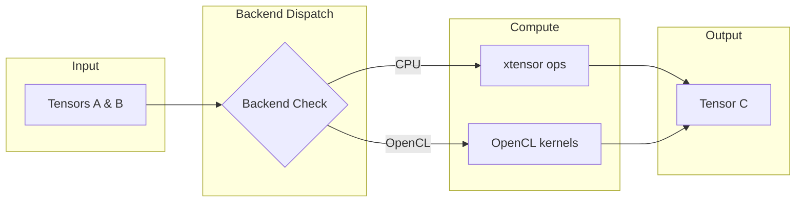

# Tensor

The `Tensor` is the core data structure in the nn library, representing multi-dimensional arrays with optional GPU support via OpenCL.

## Theoretical Background

A tensor is a generalization of matrices to arbitrary dimensions. In neural networks, tensors are used to store:

- **Input data**: $(batch\_size, features)$ for fully-connected layers
- **Images**: $(batch, channels, height, width)$ for convolutional layers
- **Sequences**: $(batch, time\_steps, features)$ for RNNs/LSTMs

The tensor supports gradient tracking through the `.grad()` mechanism, similar to PyTorch's autograd.

### Mathematical Operations

All tensor operations are element-wise by default:

- **Addition**: $C_{ij} = A_{ij} + B_{ij}$
- **Multiplication**: $C_{ij} = A_{ij} \cdot B_{ij}$
- **Matrix Multiplication**: $C_{ik} = \sum_j A_{ij} B_{jk}$

## How It Is Implemented Here

The core tensor is defined in `include/tensor/Tensor.hpp`:

```cpp
// File: include/tensor/Tensor.hpp
template <typename Backend>
class TensorImpl
{
    // Shape information
    std::vector<size_t> shape_;    // dimensions: rows, cols, etc.
    std::vector<size_t> strides_;  // memory layout

    // Data storage
    std::vector<float> data_;        // host data (xtensor backend)
    void* gpu_data_;              // GPU data (OpenCL backend)

    // Gradients
    bool requires_grad_;
    std::optional<Tensor> grad_;
};
```

### Backend Dispatch

The tensor uses a backend system to dispatch operations:

```cpp
// File: include/tensor/Tensor.hpp (simplified)
template <typename Backend>
class Tensor {
    // Delegates to backend for actual computation
    auto add(const Tensor& other) const -> Tensor {
        return Backend::add(*this, other);
    }

    auto matrixMultiply(const Tensor& other) const -> Tensor {
        return Backend::matrixMultiply(*this, other);
    }
};
```

Supported backends (selected via `NN_BACKEND` CMake option; see `include/Backend.hpp`):
- `nn::XTensorBackend` — CPU operations (xtensor + BLAS); the reference implementation
- `nn::OpenCLTensorBackend` — GPU operations via OpenCL kernels with lazy sync.
  **No CPU fallback**: despite the historical `warn_opencl_cpu_fallback_once`
  naming in `OpenCLTensorBackend.cpp`, every compute method already ends in
  `throw_opencl_only_failure(...)` when OpenCL is unavailable or unusable —
  there is no host-math substitute hidden behind those checks. Preset:
  `max-performance-opencl`. `cmake/OpenCLGpuCapabilityCheck.cmake` adds a
  configure-time gate (parses `clinfo -l`) that refuses to configure with a
  "BIG FAT WARNING" if no OpenCL device is present, mirroring the SYCL gate
  below; override with `-DNN_OPENCL_ACKNOWLEDGE_NO_GPU=ON`. Unlike SYCL there
  is no known-bad-hardware denylist — this project's dev machine already runs
  this backend successfully via Mesa's rusticl driver, an unrelated driver
  stack from AdaptiveCpp/HIP.
- `nn::SYCLTensorBackend` — Khronos SYCL 2020 kernels (AdaptiveCpp / oneAPI DPC++);
  copy-in/copy-out against an XTensorBackend host mirror for storage, but
  **compute ops have no CPU fallback**: every math op throws if no SYCL
  device is available. Preset: `max-performance-sycl` (requires AdaptiveCpp;
  parity suite: `sycl_backend_parity_gtest`).
  **No silent fallback, by policy**: this backend either runs on a real GPU
  or refuses to run at all — it never silently substitutes host math while
  claiming to be the SYCL/GPU backend. This is enforced twice:
  1. **Configure time** — `cmake/SyclGpuCapabilityCheck.cmake` parses
     `rocminfo` (grouping HSA agent blocks, matching each `GPU`-typed
     agent's `Name:` field — the actual gfx ISA code, e.g. `gfx90c` — against
     a denylist of chips confirmed unsafe) and refuses to configure
     (`FATAL_ERROR`, with a large "BIG FAT WARNING" banner) if the only GPU
     present is denylisted, or if no GPU is present at all. Override with
     `-DNN_SYCL_ACKNOWLEDGE_UNSUPPORTED_GPU=ON` if you've personally verified
     your exact machine handles concurrent SYCL kernel submission safely.
  2. **Run time** — `SYCLTensorBackend.cpp`'s queue construction throws with
     an actionable message if no SYCL device is available; there is no
     `device_ready()`-guarded host-mirror path in the compute methods
     anymore (removed; previously every op silently fell back to
     `XTensorBackend` when the device wasn't usable).
  Background: on this project's dev hardware (an AMD Renoir/Lucienne
  integrated GPU, ISA `gfx90c` — not on ROCm's officially supported hardware
  list), AdaptiveCpp routes SYCL compute through its HIP backend anyway,
  which reproducibly triggered a genuine GPU hang (`HW Exception ... reason:
  GPU Hang` from the ROCm HSA runtime) under concurrent kernel submission
  (e.g. parallel ctest workers) — it froze the whole display compositor with
  it, not just the test process. `acpp-info -l`'s device listing reports
  only a generic marketing name ("AMD Radeon Graphics") for this chip with
  no gfx-architecture codename, so the capability check uses `rocminfo`
  instead, which does expose it. The commonly-cited `HSA_OVERRIDE_GFX_VERSION`
  workaround (impersonate a supported chip) is documented elsewhere to
  sometimes crash the GPU badly enough to need a reboot, so it is not
  recommended as a fix. `ACPP_VISIBILITY_MASK=omp` (force CPU-only) was also
  tried as a possible safe escape hatch and found to silently produce wrong
  numeric results — a separate bug in this AdaptiveCpp install's
  generic/SSCP JIT path for the OpenMP backend — so it is not viable either.
  Net effect: on unsupported hardware, this backend simply cannot be built
  without an explicit, informed override; there is no safe default that lets
  it "just work."
- `nn::DeviceTensorBackend` — documented skeleton for adding new device
  backends. It always runs on an `XTensorBackend` host mirror — its
  "simulated device buffer" only exercises copy-semantics bookkeeping for
  tests, never real hardware. Since there's no real device to be
  "unsupported" on, the no-fallback policy doesn't map onto it directly;
  instead, selecting `NN_BACKEND=Device` prints a configure-time `WARNING`
  (top-level `CMakeLists.txt`) so it's never mistaken for testing a real
  accelerator.
  **Full `TensorBackendParityContract` coverage since 2026-07-15**: `divide`,
  `add_col_vector_to_rows_inplace`, all ten `compare_*`/`compare_*_scalar`
  variants, `clamp`/`clamp_inplace`, `mean()`, and the four `random(...)`
  overloads were missing (all delegating to `m_host` like every other method
  in the file, now added) — found because `pytorch_parity_gtest` instantiates
  every layer against every concrete backend, including `Device`, and those
  gaps were simple compile failures once something actually exercised them.
  See [Ground-Truth-and-Smoke-Testing](../Guides/Ground-Truth-and-Smoke-Testing.md).

## Data Flow



## Usage Example

```cpp
// File: src/core/tensor/tests/tensor_gtest.cpp (simplified)
#include "nn/tensor/Tensor.hpp"

// Create a 3x4 tensor
nn::Tensor input(3, 4);
input.at(0, 0) = 1.0f;

// Matrix multiplication: 3x4 @ 4x2 = 3x2
nn::Tensor weights(4, 2);
nn::Tensor output = input.matrixMultiply(weights);

// Enable gradient tracking
nn::Tensor model_param(10, 5);
model_param.set_requires_grad(true);

// Forward pass with gradient computation
nn::Tensor loss = forward(model_param, true);  // requires_grad=true
nn::Tensor d_loss = loss_fn.backward(output);

// Update gradients
nn::Tensor grad = model_param.grad();
optimizer.step(model_param.params());
```

## Recent OpenCL Optimization (2026-05-02)

The OpenCL backend now includes a tuned tiled kernel for direct
$A^T \cdot B$ (`matmul_lhs_transposed_kernel`) and uses this path in the
Linear-layer backward weight-gradient hot path (`dL/dW`).

Implementation points:
- Kernel source: `src/core/tensor/opencl/KernelManager.cpp`
- Backend API: `OpenCLTensorBackend::matmul_lhs_transposed(...)` in
    `src/core/tensor/opencl/OpenCLTensorBackend.cpp`
- Linear backward integration: `include/layers/dense/Linear.hpp`

Measured evidence (20-iteration samples on rusticl + AMD Radeon Graphics):
- `opencl,grad_weight_matmul_512x1024x256`: 5.662 and 5.858 ms/iter
- `opencl,grad_weight_matmul_via_transpose_probe_512x1024x256`:
    10.653 and 10.290 ms/iter
- Observed speedup for grad-weight path: about $1.76\times$ to $1.88\times$

Detailed benchmark log:
- [results/opencl_lhs_transposed_benchmark_2026-05-02.md](../../results/opencl_lhs_transposed_benchmark_2026-05-02.md)

## Recent OpenCL Stability and SNN Integration Update (2026-05-10)

The OpenCL backend and SNN layer integration were extended to validate LIF helper usage from layer code, not only from backend helper unit tests.

Implementation points:
- OpenCL backend default constructor now initializes empty host storage to avoid null host-state dereference during early shape checks.
    - `src/core/tensor/opencl/OpenCLTensorBackend.cpp`
- OpenCL tensor tests now include Lif layer forward/backward integration cases instantiated on `OpenCLTensorBackend`.
    - `src/core/tensor/tests/opencl_tensor_backend_gtest.cpp`

Observed behavior after the fix:
- Direct helper tests (`lif_step_inplace`, `lif_grad`) pass.
- Layer-level OpenCL tests for Lif forward parity and exponential-surrogate backward also pass.
- A previously reproducible segmentation fault in first-call Lif forward is removed.

## Recent OpenCL Buffer Pool Memory Cap (2026-07-14)

`OpenCLTensorBackend` allocates device buffers through a static, process-wide
`GPUBufferPool` (`include/tensor/opencl/GPUBufferPool.hpp`) that buckets
requests into fixed size classes (1KB … 64MB, then 64MB-aligned) and caches
idle buffers for reuse instead of calling `clCreateBuffer`/`clReleaseMemObject`
per tensor. Each bucket was already capped at 20 idle buffers, but nothing
capped the *number of buckets* — a long training run that touches many
distinct tensor shapes (per-layer activations, gradients, optimizer moments,
per-timestep SNN state) kept a growing set of buckets alive for the whole
process lifetime and never shrank.

This was found while investigating a memory report: four parallel
`experiment05` phase00 runs each plateaued at 2.1–4.4GB RSS+swap for a tiny
256→64→32 autoencoder — disproportionate for the actual weight/activation
sizes involved. Buffers use `CL_MEM_ALLOC_HOST_PTR` (pinned) by default, so on
this (integrated-GPU / unified-memory) hardware the pool's memory is real host
RAM, not separate VRAM — it shows up directly in `ps`/`free`.

It wasn't an active leak (memory was confirmed flat over repeated sampling
once a run plateaued) — the real trigger was `scripts/testing/run_profiles.sh`
under-budgeting per-job RAM and oversubscribing concurrency (see
[Running Experiment05 Profiles](../Guides/Running-Experiment05-Profiles.md)).
This pool fix is a bound on the secondary inefficiency, not the root cause.

Implementation points:
- Added `GPUBufferPool::kDefaultMaxPoolBytes` (1 GiB) and a `max_pool_bytes`
  constructor parameter — `include/tensor/opencl/GPUBufferPool.hpp`.
- `release()` now only caches a returned buffer if the per-bucket count is
  under 20 **and** the pool's total cached bytes (`cached_bytes_`) would stay
  under the ceiling; otherwise the buffer is dropped immediately (destructor
  calls `clReleaseMemObject`) instead of being retained forever —
  `src/core/tensor/opencl/GPUBufferPool.cpp`.
- `acquire()` decrements `cached_bytes_` when reusing a pooled buffer; `clear()`
  resets it to 0.
- No API break: `OpenCLTensorBackend::init_buffer_pool()` still constructs the
  pool with the two required args; the new parameter defaults to 1 GiB.

Verification: the pool's translation unit was compiled directly against the
project's recorded compiler flags (`compile_commands.json`) — clean, no
warnings. A full `cmake --build` reconfigure is currently blocked by an
unrelated stale Python venv (`venv/bin/python` missing after a system Python
upgrade to 3.14.6); not yet fixed.

## OpenCL Device-Resident Fast Path (2026-07-15)

Found while investigating why an SNN-AE Experiment05 profile ran ~9× slower
under the `NN_BACKEND=OpenCL` preset than on the CPU backend (~0.4s per
batch of 32×256 through a 3-layer autoencoder — transfer-bound, ~0% GPU
compute): **every op paid a full host↔device round-trip on its inputs**.
Each op began with `sync_gpu_if_needed()` (a blocking device→host download
of whatever the previous kernel just produced), then re-uploaded both
operands from the host mirror into pooled staging buffers — ignoring the
operand's own live `m_gpu_buffer`. The file's latent "GPU-resident" branches
(gated on `m_gpu_resident`) were unreachable in practice because training
tensors are host-built and nothing ever set the flag.

Fix, in `OpenCLTensorBackend.cpp`:

- **`ensure_device_current(what)`** — makes the tensor's own persistent
  buffer (allocated in the constructors) hold current data, uploading from
  host only when `m_needs_sync_to_device`; marks the tensor resident so
  later device-side writes are lazily pulled back by `sync_gpu_if_needed()`.
- **Elementwise/inplace ops** (`add`, `subtract`, `multiply`, `divide`,
  `exp`, `sqrt`, `square`, `abs`, `*_scalar`, `*_inplace`) got a uniform
  fast path via 5 generic launchers (`launch_binary_resident` etc.) that
  feed operands' buffers straight to kernels and leave results
  device-resident — zero transfers for chained ops.
- **All 35 latent resident gates** (matmul family, transpose, LIF, fill,
  reductions, fused bias+activation variants) rewritten from
  flag-checks to `ensure_device_current()`-based gates, making them
  reachable for any tensor.
- **Coherence fix this exposed**: ~29 sites wrote results back into host
  storage via `m_backend->mutable_data_ptr()` (bypassing the flag-setting
  wrapper) — harmless when every op re-uploaded from host, but stale-device
  poison once ops trust `m_needs_sync_to_device`. All now call
  `mark_host_dirty()` after the writeback. Caught by
  `backend_parity_gtest`'s `ChainedOpsWithoutHostReads` (LIF spike
  divergence) and `tensor_gtest`'s factory tests.

Measured on the same 3-epoch SNN-AE probe: **~400s/epoch → ~82s/epoch
(~5×)**. CPU (XTensor) still wins for these tiny tensors (~43s/epoch,
kernel-launch overhead is irreducible), but the GPU path is no longer
transfer-bound and scales properly with model size. Verified:
`opencl_tensor_backend_gtest` (37), `backend_parity_gtest` (11),
`pytorch_parity_gtest` (42), `tensor_gtest` (38) all pass under both the
OpenCL and XTensor presets.

## Concurrent GPU Test Serialization (2026-07-15, revised same day)

Two hard, reboot-requiring freezes hit this project's dev machine (AMD Renoir/
Lucienne integrated GPU) during this work cycle:

1. AdaptiveCpp's HIP backend, under concurrent SYCL ctest workers.
2. Immediately after, running the **full** ctest suite at high parallelism
   (`ctest -j$(nproc)`) under the `NN_BACKEND=OpenCL` preset.

Initial diagnosis treated both as the same root cause (concurrent kernel
submission from independent processes, different driver stacks) and locked
every test under both `NN_BACKEND=OpenCL` and `NN_BACKEND=SYCL` behind a
shared CTest `RESOURCE_LOCK`. That diagnosis was **wrong for OpenCL**: the
user determined incident 2 was residual fallout from incident 1 (SYCL/HIP),
not OpenCL concurrency itself — OpenCL-touching tests had already run fine at
high parallelism earlier in the same session (mixed into the default XTensor
preset's full suite). Re-running the full 3418-test suite at
`ctest -j$(nproc)` under the `NN_BACKEND=OpenCL` preset with the lock removed
confirmed this: clean pass in 45s, no freeze, no reboot.

Fix (revised): `cmake/GpuTestSerialization.cmake` provides
`nn_gtest_discover_tests()`, a drop-in wrapper around `gtest_discover_tests()`
that every test `CMakeLists.txt` in the project uses instead of calling it
directly. It attaches a shared CTest `RESOURCE_LOCK` (`nn_gpu_device`) only
where the actual reproduced hazard (SYCL/HIP) applies:

- The lock applies automatically to **every** discovered test only when
  `NN_BACKEND` is `SYCL` (every test binary in that preset uses it as
  `nn::Backend`, and it's the driver stack that actually reproduced the
  hang). `NN_BACKEND=OpenCL` no longer auto-locks.
- Pass `FORCE_GPU_LOCK` for a target that explicitly instantiates
  `SYCLTensorBackend` regardless of the selected `nn::Backend` — e.g.
  `pytorch_parity_gtest`, `sycl_backend_parity_gtest`. These touch a real
  SYCL device even under `NN_BACKEND=XTensor`/`OpenCL`/`Device`.
- Targets that only ever touch `OpenCLTensorBackend` directly
  (`backend_parity_gtest`, `tensor_all_backends_gtest`,
  `tensor_backend_switchability_gtest`, `opencl_tensor_backend_gtest`,
  `gpu_buffer_pool_gtest`) are **not** force-locked — OpenCL concurrency is
  not believed to be a hang trigger on this hardware.
- `device_backend_gtest` remains unlocked — `DeviceTensorBackend` is pure
  host math (see above), never touches real hardware.

Net effect: `ctest -j$(nproc)` under `NN_BACKEND=OpenCL` runs the full suite
at full parallelism again. Only `NN_BACKEND=SYCL` (and the two
SYCL-instantiating targets, under any preset) still serialize.

## Common Pitfalls

1. **Shape Mismatch**: Ensure matrix multiply dimensions align: $A_{m \times n} \cdot B_{n \times p} = C_{m \times p}$

2. **Gradient Not Tracked**: Call `set_requires_grad(true)` before forward pass, or pass `requires_grad=true` to operations

3. **GPU Data Not Synced**: Use `sync_gpu_if_needed()` before accessing GPU tensor data on CPU, or use non-const `at()` accessor

## See Also

- [Layers](./Layers.md) - Uses Tensor for all operations
- [Optimizers](./Optimizers.md) - Operates on Tensor gradients
- [DataLoaders](./DataLoaders.md) - Produces Tensors from datasets
- [Architecture](./Architecture.md) - System interaction diagram

## References

[1] T. G. Kolda and B. W. Bader, "Tensor decompositions and applications," *SIAM Rev.*, vol. 51, no. 3, pp. 455–500, 2009. [Online]. Available: https://doi.org/10.1137/07070111X

[2] M. Abadi et al., "TensorFlow: A system for large-scale machine learning," in *Proc. 12th USENIX Symp. Operating Systems Design and Implementation (OSDI)*, 2016, pp. 265–283. [Online]. Available: https://www.usenix.org/conference/osdi16/technical-sessions/presentation/abadi