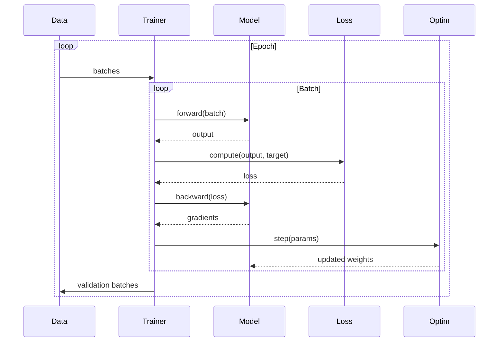

# Training

Training loop implementation with optimizer integration, gradient management, and real-time progress tracking.

## Theoretical Background

### Training Loop

Neural network training minimizes a loss function through iterative gradient descent:

1. **Forward pass**: Compute predictions $\hat{y} = f(x; \theta)$
2. **Loss**: Compute $L(y, \hat{y})$
3. **Backward pass**: Compute gradients $\nabla_\theta L$
4. **Update**: $\theta \leftarrow \theta - \eta \nabla_\theta L$

### Gradient Clipping

Prevents exploding gradients by scaling:

$$\nabla_\theta L \leftarrow \min\left(1, \frac{\text{max\_norm}}{|\nabla_\theta L\|}\right) \nabla_\theta L$$

### Mini-batch SGD

Instead of full dataset, use batches:
- Reduces computation per iteration
- Provides noise that helps escape local minima

## Progress Tracking

The codebase includes a non-blocking, thread-safe progress bar system for real-time training feedback:

### ProgressBar (RAII Handle)

```cpp
// File: include/nn/progress/ProgressBar.hpp
namespace nn::progress
{
class ProgressBar
{
public:
    explicit ProgressBar(const std::string& label, float total);
    ~ProgressBar();

    void update(float current, const std::map<std::string, float>& metrics = {});
    void mark_complete();

    auto id() const -> uint32_t;
};
}
```

### ProgressManager (Singleton Renderer)

```cpp
// File: include/nn/progress/ProgressManager.hpp
namespace nn::progress
{
class ProgressManager
{
public:
    static auto instance() -> ProgressManager&;

    auto create_bar(const std::string& label, float total) -> uint32_t;
    void update_bar(uint32_t id, float current, const std::map<std::string, float>& metrics = {});
    void mark_complete(uint32_t id);

private:
    ProgressManager();
    ~ProgressManager();
};
}
```

### Features

- **Non-blocking**: Background rendering thread (does not stall training)
- **Multi-track**: Supports multiple concurrent progress bars
- **Linear**: Strictly 0% → 100% progress
- **Callbacks**: Updates via `update()` rather than polling
- **No external deps**: Uses ANSI escape codes directly

### ANSI Progress Output

```cpp
// Example output:
// LSTM Training   [===================           ] 67% | loss: 0.4523
// SNN Training    [======================        ] 88% | loss: 0.2314
```

## How It Is Implemented Here

### Trainer Configuration

```cpp
// File: src/core/training/TrainerConfig.hpp
namespace nn::training
{
struct TrainerConfig
{
    int epochs = 10;
    float learning_rate = 0.001F;
    
    // Adam parameters
    float adam_beta1 = 0.9F;
    float adam_beta2 = 0.999F;
    float adam_epsilon = 1e-8F;
    
    // Gradient clipping
    float grad_clip_norm = 0.0F;
    
    // Batch
    int batch_size = 1;
    unsigned int sampler_shuffle_seed = 42;
};
}
```

### Epoch Result

```cpp
// File: src/core/training/EpochResult.hpp
struct EpochResult
{
    int epoch;
    float train_loss;
    float val_loss;
    float epoch_ms;
};
```

### Trainer

```cpp
// File: src/core/training/Trainer.hpp
template <typename ModelType>
class Trainer
{
public:
    using Sample = nn::Tensor;
    using SamplePair = std::pair<nn::Tensor, nn::Tensor>;

    explicit Trainer(ModelType& model, const TrainerConfig& cfg);

    // For autoencoders (input = target)
    auto fit_autoencoder(
        const std::vector<Sample>& train_samples,
        const std::vector<Sample>& val_samples = {}
    ) -> std::vector<EpochResult>;

    // For supervised learning (input != target)
    auto fit_supervised(
        const std::vector<SamplePair>& train_pairs,
        const std::vector<SamplePair>& val_pairs = {}
    ) -> std::vector<EpochResult>;
};
```

## Data Flow



## Usage Example

```cpp
// File: src/core/training/tests/trainer_gtest.cpp
#include "nn/training/Trainer.hpp"
#include "nn/training/TrainerConfig.hpp"
#include "nn/optimizers/Adam.hpp"

// Configure training
nn::training::TrainerConfig config{
    .epochs = 10,
    .learning_rate = 0.001f,
    .batch_size = 32,
    .grad_clip_norm = 1.0f
};

// Create trainer
nn::training::Trainer trainer(*model, config);

// Train autoencoder
std::vector<nn::Tensor> train_data = /* load data */;
std::vector<nn::Tensor> val_data = /* load validation */;

auto history = trainer.fit_autoencoder(train_data, val_data);

// Print results
for (const auto& result : history)
{
    std::cout << "Epoch " << result.epoch 
              << " train_loss=" << result.train_loss
              << " val_loss=" << result.val_loss
              << " time=" << result.epoch_ms << "ms\n";
}
```

### Progress Bar Integration in Training

The Trainer automatically creates and updates progress bars during training/validation:

```cpp
// Inside Trainer::fit_generic():
for (int epoch = 1; epoch <= cfg_.epochs; ++epoch)
{
    nn::progress::ProgressBar train_bar("Training", static_cast<float>(train_samples.size()));
    
    // ... training loop ...
    train_bar.update(static_cast<float>(batch_start), {{"loss", loss_val}});
    
    nn::progress::ProgressBar val_bar("Validating", static_cast<float>(val_samples.size()));
    // ... validation loop ...
    val_bar.update(static_cast<float>(val_batch_start), {{"loss", vloss}});
}
```

Output:
```
Training   [===================           ] 67% | loss: 0.4523
Validating [======================        ] 88% | loss: 0.2314
```

## Common Pitfalls

1. **Learning Rate**: Too high causes divergence; too low is slow

2. **Gradient Clipping**: Essential for RNNs/LSTMs; can hurt CNNs

3. **Batch Size**: Large = stable but may hurt generalization

4. **Validation**: Always validate to detect overfitting

## See Also

- [Optimizers](./Optimizers.md) - Adam/SGD
- [Layers](./Layers.md) - Model layers
- [Tensor](./Tensor.md) - Data structure
- [Autoencoders](./Autoencoders.md) - Model being trained
- [Progress Tracking](./Progress.md) - Non-blocking progress bars

## References

[1] D. P. Kingma and J. Ba, "Adam: A method for stochastic optimization," in *Proc. 3rd Int. Conf. on Learning Representations (ICLR)*, 2015. [Online]. Available: https://arxiv.org/abs/1412.6980

[2] L. Bottou, "Large-scale machine learning with stochastic gradient descent," in *Proc. 19th Int. Conf. Computational Statistics (COMPSTAT)*, 2010, pp. 177–186. [Online]. Available: https://doi.org/10.1007/978-3-7908-2604-3_16