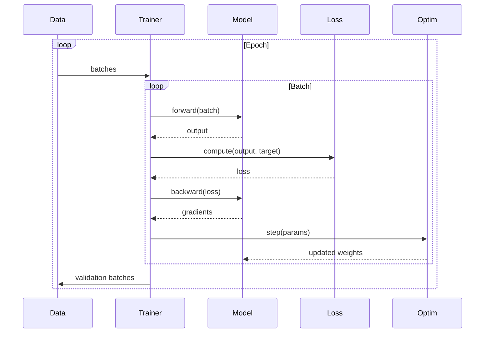

# Training

The `Trainer` class is what actually runs a training run: it takes a model, a
dataset, and a configuration, and repeatedly runs forward passes, computes the
loss, runs backward passes, and updates the weights — while reporting progress
and (optionally) stopping early if the model stops improving. This page covers
the training loop itself, its configuration options, and the progress-bar and
callback system that reports on it.

## Theoretical Background

### The training loop

Training a neural network means repeating this cycle, over and over, once per
batch of data:

1. **Forward pass**: run the current inputs through the model to get its
   current predictions, $\hat{y} = f(x; \theta)$ (read: "the model $f$, with
   its current weights $\theta$, applied to input $x$").
2. **Loss**: compute a single number, $L(y, \hat{y})$, that measures how wrong
   those predictions were compared to the true answer $y$.
3. **Backward pass**: compute the gradient $\nabla_\theta L$ — for every
   weight in the model, how much (and in which direction) changing that
   weight slightly would change the loss.
4. **Update**: nudge every weight a little in the direction that reduces the
   loss: $\theta \leftarrow \theta - \eta \nabla_\theta L$, where $\eta$ is the
   learning rate (see [Optimizers](./Optimizers.md) for what happens here in
   more sophisticated optimizers than plain gradient descent).

### Gradient clipping

Sometimes, especially in recurrent networks like LSTMs, the gradient computed
in step 3 above can become extremely large — large enough that the update in
step 4 overshoots wildly and destabilises training instead of improving it.
**Gradient clipping** guards against this by shrinking the gradient (without
changing its direction) whenever its overall size exceeds a chosen limit
`max_norm`:

$$\nabla_\theta L \leftarrow \min\left(1, \frac{\text{max\_norm}}{|\nabla_\theta L\|}\right) \nabla_\theta L$$

In plain terms: if the gradient's size is already under the limit, leave it
alone; if it's over, scale it down until it exactly reaches the limit.

### Mini-batch training

Rather than computing the loss and gradient over the *entire* training set
before every single update (which would be extremely slow, and requires
holding the whole dataset's activations in memory at once), training
typically processes a small random subset — a **mini-batch** — at a time.
This has two benefits: it's much cheaper per step, and the randomness of
which samples end up in each batch acts as a mild source of noise that
actually *helps* the optimizer avoid getting permanently stuck in a poor
local solution.

## Progress Tracking

Long training runs need visible, live feedback — but printing progress
information from inside a tight inner loop can itself slow that loop down if
done carelessly. This project's progress-bar system is built to avoid that: it
runs the actual screen-drawing on a background thread, so calling `update()`
from the training loop is cheap and never blocks waiting for the terminal to
redraw.

### ProgressBar (a self-contained handle)

Creating a `ProgressBar` registers a new bar to be drawn; destroying it
(falling out of scope) automatically removes it — this "resource acquisition
is initialisation" (RAII) pattern means you never have to remember to
explicitly clean one up:

```cpp
// File: include/progress/ProgressBar.hpp
namespace nn::progress
{
class ProgressBar
{
public:
    explicit ProgressBar(const std::string& label, float total);
    ~ProgressBar();

    void update(float current, const std::map<std::string, float>& metrics = {});
    void mark_complete();

    auto id() const -> uint32_t;
};
}
```

### ProgressManager (the shared renderer behind the scenes)

A single, shared `ProgressManager` actually owns the background rendering
thread and knows about every currently-active bar — `ProgressBar` itself is
just a lightweight handle into it:

```cpp
// File: include/progress/ProgressManager.hpp
namespace nn::progress
{
class ProgressManager
{
public:
    static auto instance() -> ProgressManager&;

    auto create_bar(const std::string& label, float total) -> uint32_t;
    void update_bar(uint32_t id, float current, const std::map<std::string, float>& metrics = {});
    void mark_complete(uint32_t id);

private:
    ProgressManager();
    ~ProgressManager();
};
}
```

### Design properties

- **Non-blocking**: rendering happens on a background thread, so it never
  stalls the actual training loop waiting for the terminal.
- **Multi-track**: several bars can be active and updating at once (e.g. one
  per model being trained in a comparative experiment).
- **Strictly linear**: progress only ever goes from 0% up to 100%, never
  backward.
- **Push-based**: bars update when `update()` is called, not by polling on a
  timer.
- **No external dependencies**: implemented directly with ANSI terminal escape
  codes, rather than a third-party terminal UI library.

### Example output

```cpp
// Example output:
// LSTM Training   [===================           ] 67% | loss: 0.4523
// SNN Training    [======================        ] 88% | loss: 0.2314
```

## How It Is Implemented Here

### Trainer configuration

```cpp
// File: src/core/training/TrainerConfig.hpp
namespace nn::training
{
struct TrainerConfig
{
    int epochs = 10;
    float learning_rate = 0.001F;

    // Which Optimizer the Trainer builds (via OptimizerFactory):
    // "adam" | "sgd" | "lion" | "schedule-free-adamw".
    std::string optimizer_type = "adam";
    float optimizer_momentum = 0.0F;  // SGD only; ignored by the others

    // Adam parameters
    float adam_beta1 = 0.9F;
    float adam_beta2 = 0.999F;
    float adam_epsilon = 1e-8F;

    // Gradient clipping
    float grad_clip_norm = 0.0F;

    // Decoupled L2 weight decay (AdamW). 0 = disabled. Applied only to 2-D
    // weight matrices; biases and SNN scalars (R, C, V_th) are excluded [Loshchilov2019].
    float weight_decay = 0.0F;

    // Batch
    int batch_size = 1;
    unsigned int sampler_shuffle_seed = 42;

    // SNN-specific: per-group learning rate for biophysical parameters (R, C, V_th).
    // Effective SNN lr = learning_rate * snn_lr_scale.
    // 0.1 (10x smaller than the weight lr) is this project's own empirical
    // default, not a figure taken from a published paper.
    float snn_lr_scale = 0.1F;

    // Nested k-fold cross-validation (0 = disabled, plain k-fold).
    // Set nested_cv_outer_folds > 0 for unbiased hyperparameter evaluation [41].
    int nested_cv_outer_folds = 0;
    int nested_cv_inner_folds = 5;
};
}
```

**Choosing an optimizer.** `optimizer_type` names which optimizer
implementation to use; the `Trainer` constructor builds the actual object
through `OptimizerFactory` and stores it as a generic `Optimizer` pointer, so
the training loop's code doesn't need to know or care which concrete
optimizer is behind it — this makes it straightforward to add a new optimizer
without touching the training loop itself. The default, `"adam"`, matches
what every existing caller was already getting before this flexibility was
added; naming an unrecognised optimizer throws an error immediately, rather
than silently falling back to something else. See [Optimizers](Optimizers.md).

**Why SNN parameters get their own, smaller learning rate.** The spiking
network's biophysical parameters (R, C, V_th) control the neuron's firing
threshold and its membrane dynamics directly — a large update to one of them
can push it into an invalid region that the code has to clamp
(see [Membrane Dynamics](../Concepts/Membrane-Dynamics.md)), which destabilises
the derived time constant $\tau = R \cdot C$. Setting `snn_lr_scale = 0.1`
gives these parameters roughly one-tenth the learning rate of ordinary
weights (≈1e-4 when the global rate is 1e-3) — again, this ratio is this
project's own empirically-chosen default, not a number taken from a specific
paper. The `Trainer` constructor passes this scale to
`Optimizer::attach_with_scales()`, which applies the reduced rate **only to
parameters whose `size()` is exactly 1** — R, C, and V_th are always 1×1
tensors, and no ordinary weight or bias tensor ever is, so this rule reliably
targets just the biophysical parameters. (An earlier version of this code
filled the scale uniformly across *every* parameter, which had the
unintended side effect of making `snn_lr_scale` throttle the learning rate of
the *entire* network by 10×, not just the SNN parameters — a bug that's now
covered by a dedicated regression test,
`TrainerGenericity.SnnLrScaleOnlyAppliesToSizeOneParams`.)

**Weight decay.** Setting `weight_decay > 0` turns on decoupled L2
regularisation (see [Optimizers](Optimizers.md#decoupled-weight-decay-adamw--sgdw)
for what "decoupled" means and why it matters). The `Trainer` constructor
simply forwards this value to `Optimizer::weight_decay`, which shrinks only
ordinary 2-D weight matrices by `lr·weight_decay·θ` after every step — biases
and the SNN's biophysical scalars are exempt, so their values aren't pulled
toward zero by a mechanism meant for weight matrices.

**Nested cross-validation.** If you tune hyperparameters using the same
validation split you report your final accuracy on, your reported accuracy
will tend to be optimistic — the model has, in effect, been allowed to "peek"
at the validation data through the hyperparameter search. Nested k-fold
cross-validation [41] avoids this by using two loops: an outer loop that holds
out data purely for the final, unbiased performance estimate, and an inner
loop (run only on the remaining data) that does the actual hyperparameter
search.

### Epoch result

At the end of each epoch (one full pass over the training data), the trainer
reports a summary of what happened:

```cpp
// File: src/core/training/EpochResult.hpp
namespace nn::training
{
struct EpochResult
{
    int epoch = 0;
    float train_loss = 0.0F;
    float val_loss = 0.0F;
    float epoch_ms = 0.0F;

    // SNN energy-efficiency indicators
    // mean_spike_rate: mean firing rate over all SNN neurons in last training batch [0,1].
    // NaN for ANN models (not measured). Target range: [0.05, 0.80] (see SpikeCountLoss).
    float mean_spike_rate = std::numeric_limits<float>::quiet_NaN();

    // sops: estimated Synaptic OPerations for one forward pass.
    // SOPs = Σ_layer(total_spikes × fan_out).  0 when not measured.
    // Compare against ANN FLOP count to quantify energy advantage [26].
    long long sops = 0LL;
};
}
```

`mean_spike_rate` and `sops` only make sense for spiking networks — they stay
`NaN`/`0` for ordinary (non-spiking) models, since there's no meaningful value
to report. **SOPs** ("Synaptic Operations") is the spiking-network equivalent
of a FLOP count: instead of counting floating-point multiply-adds, it counts
how many spikes actually fired, weighted by how many downstream connections
("fan-out") each firing neuron has — comparing this number to an equivalent
ANN's FLOP count is one way to quantify the energy-efficiency argument for
spiking networks (see
[SNN and Surrogate Gradients — Plain](../Concepts/Plain/SNN-and-Surrogate-Gradients.md)
for why fewer/sparser spikes correspond to less energy used):

$$\text{SOPs} = \sum_l \left(\sum_{i,f} s_{i,f}^{(l)}\right) \times \text{fan\_out}^{(l)}$$

where $l$ indexes the layers, the inner sum counts how many spikes occurred in
one batch, and fan_out is how many downstream connections each neuron in that
layer has.

### Trainer

```cpp
// File: src/core/training/Trainer.hpp
template <typename ModelType,
           typename LossType = MSELossImpl<nn::XtensorTensorBackend>>
class Trainer
{
public:
    using Sample      = nn::Tensor;
    using SamplePair  = std::pair<nn::Tensor, nn::Tensor>;
    // Optional per-sample preprocessing (encoding, model state reset, etc.)
    using SampleTransform = std::function<nn::Tensor(const nn::Tensor&, std::size_t idx)>;

    explicit Trainer(ModelType& model, const TrainerConfig& cfg);
    explicit Trainer(ModelType& model, const TrainerConfig& cfg, LossType loss);

    // Register a callback (called at train/epoch/batch boundaries)
    void add_callback(std::shared_ptr<ITrainingCallback> cb);

    // Optional per-sample transform applied before model.forward() in both train and val.
    // Use for: encoding, model.reset_state() side effects, data augmentation.
    void set_sample_transform(SampleTransform fn);

    // For autoencoders (input = target)
    auto fit_autoencoder(
        const std::vector<Sample>& train_samples,
        const std::vector<Sample>& val_samples = {}
    ) -> std::vector<EpochResult>;

    // For supervised learning (input != target)
    auto fit_supervised(
        const std::vector<SamplePair>& train_pairs,
        const std::vector<SamplePair>& val_pairs = {}
    ) -> std::vector<EpochResult>;

    const TrainerConfig& config() const;
};
```

`Trainer` is generic over the loss function type (default
`MSELossImpl<XtensorTensorBackend>`, i.e. mean-squared error) — any loss type
used in its place must provide three things: a way to tell it what the target
value is (`set_target`), a `forward()` that computes the loss as a single
1×1-tensor number, and a `backward()` that computes the gradient of that loss
with respect to the model's predictions.

**Fixed relative to an earlier version of this training loop:**
1. Gradients are now zeroed **before** the forward pass rather than after —
   zeroing after left a stale gradient sitting around between the backward
   pass and the next batch's zeroing, which is harmless in the common case but
   fragile.
2. Each batch now runs exactly one forward pass, one loss computation, and one
   backward pass (an earlier version computed the forward pass twice per
   batch, wasting half its compute).
3. The loss function is now a template parameter instead of being hard-wired
   to mean-squared error, so callers can plug in e.g. `SpikeCountLoss` for
   spiking-network training.
4. `snn_lr_scale` is now actually wired through to the optimizer via
   `attach_with_scales()` — an earlier version accepted this config value but
   silently never used it.
5. Supervised training's batches are now genuinely batched: all $B$ samples in
   a batch are stacked into one $(B, D)$ matrix and run through a single
   forward/backward pass, rather than looping over $B$ separate $(1, D)$
   single-sample passes. The single-sample-loop version worked correctly, but
   made the GPU do $B$ tiny, inefficient operations instead of one
   appropriately-sized one — a significant slowdown on small feature sets.
6. `EpochResult.mean_spike_rate` is now populated whenever the loss type
   exposes a `last_mean_rate()` method.
7. `Trainer` itself never writes to the console directly anymore — all
   reporting goes through the callback system described below, so callers can
   redirect, filter, or silence it without touching `Trainer`'s code.

### True-batch supervised training (`fit_loop_supervised`)

Concretely, for each mini-batch the trainer stacks all $B$ samples into one
$(B, D)$ input tensor and one $(B, C)$ target tensor, and runs a single
forward+backward pass over the whole batch at once:

```cpp
// Stack batch
Tensor batch_inp = Tensor::zeros(B, in_cols);
Tensor batch_tgt = Tensor::zeros(B, tgt_cols);
for (size_t k = batch_start; k < batch_end; ++k)
{
    batch_inp.setBlock(row, 0, transform(train_inputs[k], k));
    batch_tgt.setBlock(row, 0, train_targets[k]);
}
// Single forward+backward — one GPU kernel per layer, not B
Tensor output  = model_.forward(batch_inp, true);
loss_.set_target(batch_tgt);
Tensor loss_t  = loss_.forward(output, true);
Tensor d_out   = loss_.backward(output);
model_.backward(d_out);
```

This produces mathematically the same result as averaging $B$ individually-
computed gradients (`CrossEntropyLoss` uses a `mean` reduction over
`x.rows()`, i.e. it averages over the batch dimension) — nothing about *what*
is computed changes. The benefit is purely computational: one appropriately-
sized operation per layer instead of $B$ tiny ones, which matters a great deal
on backends (like OpenCL) where each individual operation carries fixed
overhead regardless of how much data it processes (see
[OpenCL Debugging and Performance](../Guides/OpenCL-Debugging-And-Performance.md)
for measurements of exactly how much that overhead is).

Validation batches are handled the same way: every validation sample is
stacked into one $(N_v, D)$ tensor and forwarded once per epoch, rather than
sample-by-sample.

### OpenCL batching (2026-07-15)

When running on the OpenCL (GPU) backend, both training loops wrap the entire
per-batch sequence — zero gradients → forward → loss → backward → clip
gradients → optimizer step — inside a single `OpenCLContext::BatchScope`. This
lets many GPU operations be issued back-to-back without waiting for the GPU to
actually finish after each one; the wait happens only once, when the whole
batch's worth of work has been issued. Before this change the optimizer step
ran *outside* that scope, so Adam's roughly 15 small operations per parameter
each individually waited for the GPU to catch up — on the SNN autoencoder,
about 250 of these waits per training batch, all avoidable. Combined with the
fused [`adam_step_inplace`](./Optimizers.md#fused-gpu-update-2026-07-15) GPU
kernel and other transfer-reduction work described in
[OpenCL Debugging and Performance](../Guides/OpenCL-Debugging-And-Performance.md),
this addresses one specific source of the OpenCL backend being slower than
the CPU backend for small networks — though, as that guide explains in
detail, it is not the whole story on this project's hardware.

## Data Flow



## Usage Example

```cpp
#include "core/training/Trainer.hpp"
#include "core/training/TrainerConfig.hpp"
#include "nn/training/ProgressCallback.hpp"
#include "nn/training/EarlyStoppingCallback.hpp"

// Configure training
nn::training::TrainerConfig config{
    .epochs        = 100,
    .learning_rate = 0.001f,
    .batch_size    = 32,
    .grad_clip_norm = 1.0f,
    .snn_lr_scale  = 1.0f  // 1.0 = disabled; 0.1 = SNN biophysical params
};

// Create trainer (MSELoss default; plug in SpikeCountLoss for SNN)
nn::training::Trainer<MyAutoencoder> trainer(*model, config);

// Add callbacks
trainer.add_callback(std::make_shared<nn::training::ProgressCallback>("Train"));
auto stopper = std::make_shared<nn::training::EarlyStoppingCallback>(/*patience=*/20);
trainer.add_callback(stopper);

// Train autoencoder
std::vector<nn::Tensor> train_data = /* load data */;
std::vector<nn::Tensor> val_data   = /* load validation */;

auto history = trainer.fit_autoencoder(train_data, val_data);

// Results
for (const auto& r : history)
{
    // r.epoch, r.train_loss, r.val_loss, r.epoch_ms
    // r.mean_spike_rate (NaN for ANN), r.sops (0 for ANN)
}
```

### Callback interface

A **callback** is a small object that gets notified at fixed points during
training (start/end of training, start/end of each epoch, start/end of each
batch) — this is how progress reporting, early stopping, and metric logging
all hook into the training loop without `Trainer` itself needing to know
anything about progress bars, stopping criteria, or logging formats:

```cpp
// File: include/training/ITrainingCallback.hpp
namespace nn::training {

struct TrainingState {
    int epoch; int total_epochs;
    int batch; int total_batches;
    float batch_loss;
    const EpochResult* last_epoch_result = nullptr;
};

struct ITrainingCallback {
    virtual void on_train_begin(int total_epochs) {}
    virtual void on_train_end(const std::vector<EpochResult>&) {}
    virtual void on_epoch_begin(const TrainingState&) {}
    virtual void on_epoch_end(const TrainingState&, const EpochResult&) {}
    virtual void on_batch_begin(const TrainingState&) {}
    virtual void on_batch_end(const TrainingState&) {}
    virtual bool should_stop() const { return false; }
    virtual ~ITrainingCallback() = default;
};
} // namespace nn::training
```

### Built-in callbacks

**`ProgressCallback`** — wraps the `ProgressManager` described above to draw
a live progress bar:

```cpp
// File: include/training/ProgressCallback.hpp
trainer.add_callback(std::make_shared<nn::training::ProgressCallback>("LSTM run 1/5"));
// Output: LSTM run 1/5  [=====               ] 25% | train_loss: 0.42 | val_loss: 0.38
```

**`EarlyStoppingCallback`** — monitors the validation loss and signals the
trainer to stop once it hasn't improved for a given number of epochs (the
"patience"), which prevents wasting time training a model well past the point
where it's still getting better (or, worse, starting to overfit):

```cpp
// File: include/training/EarlyStoppingCallback.hpp
auto stopper = std::make_shared<nn::training::EarlyStoppingCallback>(
    /*patience=*/20, /*min_delta=*/1e-8f);
trainer.add_callback(stopper);
// After training:
float best = stopper->best_val_loss(); // for RunMetrics reporting
```

`Trainer` checks every callback's `should_stop()` after each epoch ends; if
any callback returns `true`, the training loop exits early and
`on_train_end` still fires normally.

### Sample transform

Some models need a small transformation applied to each sample right before
it's fed into the model — for example, resetting an LSTM's or SNN's internal
state before a new, independent sequence begins, or converting a raw signal
into a spike encoding:

```cpp
// Reset LSTM state and encode each sample before forward pass
trainer.set_sample_transform(
    [&model, &encoding, seed](const nn::Tensor& s, std::size_t idx) -> nn::Tensor {
        model.reset_state();
        return encode_sample(s, encoding, seed + static_cast<uint32_t>(idx));
    });
```

This transform runs in **both** the training and validation loops, immediately
before `model.forward()` is called.

## Common Pitfalls

1. **Learning rate too high or too low.** Too high causes the loss to
   oscillate or diverge; too low makes training take an impractically long
   time to make visible progress.

2. **Gradient clipping.** Usually essential for RNNs/LSTMs, where gradients
   can spike in size unpredictably; can sometimes hurt convolutional networks
   if set too aggressively, since it can suppress genuinely large (and
   useful) gradients.

3. **Batch size.** A larger batch size gives a more stable, less noisy
   gradient estimate, but can also make the model generalise slightly worse
   to new data — there's a real trade-off here, not a universally "correct"
   value.

4. **Skipping validation.** Always evaluate on held-out validation data during
   training — training loss alone cannot tell you whether the model is
   starting to overfit (memorising the training set rather than learning
   generalisable patterns).

## See Also

- [Optimizers](./Optimizers.md) — the pluggable `Optimizer` base class and per-group learning rates (`attach_with_scales`)
- [Layers](./Layers.md) — the model layers being trained
- [Tensor](./Tensor.md) — the underlying data structure
- [Autoencoders](../Concepts/Autoencoders.md) — the model type most commonly trained here
- [K-Fold Cross-Validation](../Concepts/K-Fold-Cross-Validation.md) — the nested cross-validation theory in full
- [Spike Rate Regularization](../Concepts/Spike-Rate-Regularization.md) — what `mean_spike_rate` and SOPs are used for

## References

[1] D. P. Kingma and J. Ba, "Adam: A method for stochastic optimization," in *Proc. 3rd Int. Conf. on Learning Representations (ICLR)*, 2015. [Online]. Available: https://arxiv.org/abs/1412.6980

[2] L. Bottou, "Large-scale machine learning with stochastic gradient descent," in *Proc. 19th Int. Conf. Computational Statistics (COMPSTAT)*, 2010, pp. 177–186.

[26] W. Fang et al., "SpikingJelly: An open-source machine learning infrastructure platform for spike-based intelligence," *Science Advances*, vol. 9, no. 40, eadi1480, 2023.

[41] A. Leal et al., "A guide to cross-validation for artificial intelligence in medical imaging," *Radiology: Artificial Intelligence*, 2023. [Online]. Available: https://pmc.ncbi.nlm.nih.gov/articles/PMC10388213/
