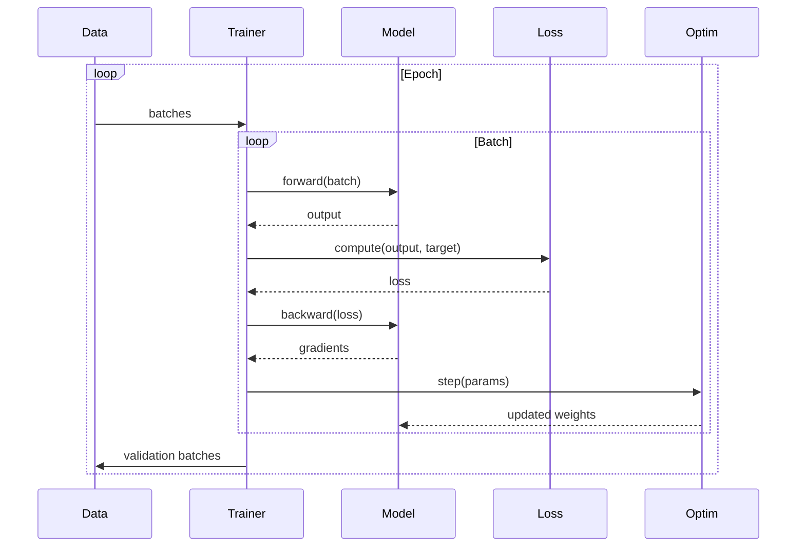

# Training

Training loop implementation with optimizer integration, gradient management, and real-time progress tracking.

## Theoretical Background

### Training Loop

Neural network training minimizes a loss function through iterative gradient descent:

1. **Forward pass**: Compute predictions $\hat{y} = f(x; \theta)$
2. **Loss**: Compute $L(y, \hat{y})$
3. **Backward pass**: Compute gradients $\nabla_\theta L$
4. **Update**: $\theta \leftarrow \theta - \eta \nabla_\theta L$

### Gradient Clipping

Prevents exploding gradients by scaling:

$$\nabla_\theta L \leftarrow \min\left(1, \frac{\text{max\_norm}}{|\nabla_\theta L\|}\right) \nabla_\theta L$$

### Mini-batch SGD

Instead of full dataset, use batches:
- Reduces computation per iteration
- Provides noise that helps escape local minima

## Progress Tracking

The codebase includes a non-blocking, thread-safe progress bar system for real-time training feedback:

### ProgressBar (RAII Handle)

```cpp
// File: include/nn/progress/ProgressBar.hpp
namespace nn::progress
{
class ProgressBar
{
public:
    explicit ProgressBar(const std::string& label, float total);
    ~ProgressBar();

    void update(float current, const std::map<std::string, float>& metrics = {});
    void mark_complete();

    auto id() const -> uint32_t;
};
}
```

### ProgressManager (Singleton Renderer)

```cpp
// File: include/nn/progress/ProgressManager.hpp
namespace nn::progress
{
class ProgressManager
{
public:
    static auto instance() -> ProgressManager&;

    auto create_bar(const std::string& label, float total) -> uint32_t;
    void update_bar(uint32_t id, float current, const std::map<std::string, float>& metrics = {});
    void mark_complete(uint32_t id);

private:
    ProgressManager();
    ~ProgressManager();
};
}
```

### Features

- **Non-blocking**: Background rendering thread (does not stall training)
- **Multi-track**: Supports multiple concurrent progress bars
- **Linear**: Strictly 0% → 100% progress
- **Callbacks**: Updates via `update()` rather than polling
- **No external deps**: Uses ANSI escape codes directly

### ANSI Progress Output

```cpp
// Example output:
// LSTM Training   [===================           ] 67% | loss: 0.4523
// SNN Training    [======================        ] 88% | loss: 0.2314
```

## How It Is Implemented Here

### Trainer Configuration

```cpp
// File: src/core/training/TrainerConfig.hpp
namespace nn::training
{
struct TrainerConfig
{
    int epochs = 10;
    float learning_rate = 0.001F;

    // Adam parameters
    float adam_beta1 = 0.9F;
    float adam_beta2 = 0.999F;
    float adam_epsilon = 1e-8F;

    // Gradient clipping
    float grad_clip_norm = 0.0F;

    // Batch
    int batch_size = 1;
    unsigned int sampler_shuffle_seed = 42;

    // SNN-specific: per-group learning rate for biophysical parameters (R, C, V_th).
    // Effective SNN lr = learning_rate * snn_lr_scale.
    // Literature recommends 0.1 (10× smaller than weight lr) [37].
    float snn_lr_scale = 0.1F;

    // Nested k-fold cross-validation (0 = disabled, plain k-fold).
    // Set nested_cv_outer_folds > 0 for unbiased hyperparameter evaluation [41].
    int nested_cv_outer_folds = 0;
    int nested_cv_inner_folds = 5;
};
}
```

**SNN learning rate rationale**: SNN biophysical parameters (R, C, V_th) are more sensitive to large gradient updates than weight matrices because they control the spike generation threshold and membrane dynamics.  Setting `snn_lr_scale = 0.1` gives lr ≈ 1e-4 for SNN params when global lr = 1e-3.  Pass this scale to `Adam::attach_with_scales()`.

**Nested CV rationale**: Single-level k-fold cross-validation with hyperparameter tuning leads to optimistic performance estimates.  Nested k-fold [41] uses an outer loop for unbiased test estimation and an inner loop for hyperparameter selection.

### Epoch Result

```cpp
// File: src/core/training/EpochResult.hpp
namespace nn::training
{
struct EpochResult
{
    int epoch = 0;
    float train_loss = 0.0F;
    float val_loss = 0.0F;
    float epoch_ms = 0.0F;

    // SNN energy-efficiency indicators
    // mean_spike_rate: mean firing rate over all SNN neurons in last training batch [0,1].
    // NaN for ANN models (not measured). Target range: [0.05, 0.80] (see SpikeCountLoss).
    float mean_spike_rate = std::numeric_limits<float>::quiet_NaN();

    // sops: estimated Synaptic OPerations for one forward pass.
    // SOPs = Σ_layer(total_spikes × fan_out).  0 when not measured.
    // Compare against ANN FLOP count to quantify energy advantage [26].
    long long sops = 0LL;
};
}
```

**SOPs formula**: $\text{SOPs} = \sum_l \left(\sum_{i,f} s_{i,f}^{(l)}\right) \times \text{fan\_out}^{(l)}$

where $l$ indexes layers, the inner sum counts spikes in one batch, and fan_out is the number of post-synaptic connections per neuron.

### Trainer

```cpp
// File: src/core/training/Trainer.hpp
template <typename ModelType,
           typename LossType = MSELossImpl<nn::XtensorTensorBackend>>
class Trainer
{
public:
    using Sample      = nn::Tensor;
    using SamplePair  = std::pair<nn::Tensor, nn::Tensor>;
    // Optional per-sample preprocessing (encoding, model state reset, etc.)
    using SampleTransform = std::function<nn::Tensor(const nn::Tensor&, std::size_t idx)>;

    explicit Trainer(ModelType& model, const TrainerConfig& cfg);
    explicit Trainer(ModelType& model, const TrainerConfig& cfg, LossType loss);

    // Register a callback (called at train/epoch/batch boundaries)
    void add_callback(std::shared_ptr<ITrainingCallback> cb);

    // Optional per-sample transform applied before model.forward() in both train and val.
    // Use for: encoding, model.reset_state() side effects, data augmentation.
    void set_sample_transform(SampleTransform fn);

    // For autoencoders (input = target)
    auto fit_autoencoder(
        const std::vector<Sample>& train_samples,
        const std::vector<Sample>& val_samples = {}
    ) -> std::vector<EpochResult>;

    // For supervised learning (input != target)
    auto fit_supervised(
        const std::vector<SamplePair>& train_pairs,
        const std::vector<SamplePair>& val_pairs = {}
    ) -> std::vector<EpochResult>;

    const TrainerConfig& config() const;
};
```

**LossType template** (default `MSELossImpl<XtensorTensorBackend>`) — must implement:
- `set_target(const Tensor&)`
- `forward(const Tensor& pred, bool requires_grad) -> Tensor` (returns 1×1 scalar)
- `backward(const Tensor& pred) -> Tensor` (gradient w.r.t. pred)

**Bugs fixed** vs prior implementation:
1. `zero_grad` called **before** forward (was after)
2. Single forward+loss+backward per batch (was double-forward)
3. Loss type pluggable via template (was hardcoded MSE)
4. `snn_lr_scale` wired via `attach_with_scales()` (was silently ignored)
5. Supervised batch: per-sample forward within batch loop (was merged-batch shape mismatch)
6. `EpochResult.mean_spike_rate` populated when `LossType::last_mean_rate()` exists
7. No `cout` inside Trainer — output goes through `ITrainingCallback`

## Data Flow



## Usage Example

```cpp
#include "core/training/Trainer.hpp"
#include "core/training/TrainerConfig.hpp"
#include "nn/training/ProgressCallback.hpp"
#include "nn/training/EarlyStoppingCallback.hpp"

// Configure training
nn::training::TrainerConfig config{
    .epochs        = 100,
    .learning_rate = 0.001f,
    .batch_size    = 32,
    .grad_clip_norm = 1.0f,
    .snn_lr_scale  = 1.0f  // 1.0 = disabled; 0.1 = SNN biophysical params
};

// Create trainer (MSELoss default; plug in SpikeCountLoss for SNN)
nn::training::Trainer<MyAutoencoder> trainer(*model, config);

// Add callbacks
trainer.add_callback(std::make_shared<nn::training::ProgressCallback>("Train"));
auto stopper = std::make_shared<nn::training::EarlyStoppingCallback>(/*patience=*/20);
trainer.add_callback(stopper);

// Train autoencoder
std::vector<nn::Tensor> train_data = /* load data */;
std::vector<nn::Tensor> val_data   = /* load validation */;

auto history = trainer.fit_autoencoder(train_data, val_data);

// Results
for (const auto& r : history)
{
    // r.epoch, r.train_loss, r.val_loss, r.epoch_ms
    // r.mean_spike_rate (NaN for ANN), r.sops (0 for ANN)
}
```

### Callback Interface

Callbacks observe training at well-defined hook points. All output, early stopping, and metric logging go through callbacks — Trainer has no `cout`.

```cpp
// File: include/nn/training/ITrainingCallback.hpp
namespace nn::training {

struct TrainingState {
    int epoch; int total_epochs;
    int batch; int total_batches;
    float batch_loss;
    const EpochResult* last_epoch_result = nullptr;
};

struct ITrainingCallback {
    virtual void on_train_begin(int total_epochs) {}
    virtual void on_train_end(const std::vector<EpochResult>&) {}
    virtual void on_epoch_begin(const TrainingState&) {}
    virtual void on_epoch_end(const TrainingState&, const EpochResult&) {}
    virtual void on_batch_begin(const TrainingState&) {}
    virtual void on_batch_end(const TrainingState&) {}
    virtual bool should_stop() const { return false; }
    virtual ~ITrainingCallback() = default;
};
} // namespace nn::training
```

### Concrete Callbacks

**`ProgressCallback`** — wraps `nn::progress::ProgressManager` (thread-safe singleton):

```cpp
// File: include/nn/training/ProgressCallback.hpp
trainer.add_callback(std::make_shared<nn::training::ProgressCallback>("LSTM run 1/5"));
// Output: LSTM run 1/5  [=====               ] 25% | train_loss: 0.42 | val_loss: 0.38
```

**`EarlyStoppingCallback`** — stops training when validation loss stops improving:

```cpp
// File: include/nn/training/EarlyStoppingCallback.hpp
auto stopper = std::make_shared<nn::training::EarlyStoppingCallback>(
    /*patience=*/20, /*min_delta=*/1e-8f);
trainer.add_callback(stopper);
// After training:
float best = stopper->best_val_loss(); // for RunMetrics reporting
```

The Trainer checks `should_stop()` after every `on_epoch_end` fires. When any callback returns `true`, the loop breaks and `on_train_end` is called.

### Sample Transform

For models that need per-sample preprocessing (LSTM state reset, SNN encoding):

```cpp
// Reset LSTM state and encode each sample before forward pass
trainer.set_sample_transform(
    [&model, &encoding, seed](const nn::Tensor& s, std::size_t idx) -> nn::Tensor {
        model.reset_state();
        return encode_sample(s, encoding, seed + static_cast<uint32_t>(idx));
    });
```

Transform is applied in **both** training and validation loops, immediately before `model.forward()`.

## Common Pitfalls

1. **Learning Rate**: Too high causes divergence; too low is slow

2. **Gradient Clipping**: Essential for RNNs/LSTMs; can hurt CNNs

3. **Batch Size**: Large = stable but may hurt generalization

4. **Validation**: Always validate to detect overfitting

## See Also

- [Optimizers](./Optimizers.md) — Adam with per-group lr (`attach_with_scales`)
- [Layers](./Layers.md) — Model layers
- [Tensor](./Tensor.md) — Data structure
- [Autoencoders](./Autoencoders.md) — Model being trained
- [K-Fold Cross-Validation](../Concepts/K-Fold-Cross-Validation.md) — Nested CV theory
- [Spike Rate Regularization](../Concepts/Spike-Rate-Regularization.md) — `mean_spike_rate` and SOPs context

## References

[1] D. P. Kingma and J. Ba, "Adam: A method for stochastic optimization," in *Proc. 3rd Int. Conf. on Learning Representations (ICLR)*, 2015. [Online]. Available: https://arxiv.org/abs/1412.6980

[2] L. Bottou, "Large-scale machine learning with stochastic gradient descent," in *Proc. 19th Int. Conf. Computational Statistics (COMPSTAT)*, 2010, pp. 177–186.

[26] W. Fang et al., "SpikingJelly: An open-source machine learning infrastructure platform for spike-based intelligence," *Science Advances*, vol. 9, no. 40, eadi1480, 2023.

[37] Y. Cao et al., "Direct training of spiking neural networks: Challenges and insights," *Frontiers in Neuroscience*, 2025.

[41] A. Leal et al., "A guide to cross-validation for artificial intelligence in medical imaging," *Radiology: Artificial Intelligence*, 2023. [Online]. Available: https://pmc.ncbi.nlm.nih.gov/articles/PMC10388213/