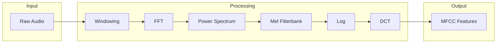

# Wave

Audio signal processing for MFCC, filterbank, and related features. Also includes WAV file loading for datasets like FSDD.

## Theoretical Background

### Short-Time Fourier Transform

Audio signals are analyzed using short-time windows: 

$$X(m, k) = \sum_{n=0}^{N-1} x(n + mR) \cdot w(n) \cdot e^{-j2\pi kn/N}$$

Where:
- $w(n)$ is the window function
- $R$ is the hop size (window step)
- $N$ is the window length

### Mel Filterbank

Human auditory perception is logarithmic. Mel scale transforms frequency [1]:

$$m = 2595\log_{10}\left(1 + \frac{f}{700}\right)$$

### MFCC (Mel-Frequency Cepstral Coefficients)

MFCCs are computed as:
1. Apply FFT to windowed frames
2. Compute power spectrum
3. Apply mel filterbank
4. Take log of filterbank energies
5. Apply DCT to decorrelate

## WAV File Loading

The codebase includes a WAV reader for loading audio datasets like FSDD:

### Supported Formats

- **Format**: PCM (WAVE file)
- **Bit Depth**: 16-bit
- **Channels**: Mono
- **Sample Rate**: Any (typically 8kHz for FSDD)

### Wav Class API

```cpp
// File: include/wave/Wav.hpp
class Wav
{
public:
    Wav();
    
    Wav(uint32_t samplingRate,
        uint16_t bitsPerSample,
        uint16_t numOfChan,
        const double* audioData,
        size_t audioDataSize);

    void read(const std::string& _path);     // Read WAV file
    void write(const std::string& _path);    // Write WAV file
    
    auto get_path() const -> std::string;
    auto get_data() const -> const std::vector<double>&;
    auto get_data_left() const -> const std::vector<double>&;
    auto get_data_right() const -> const std::vector<double>&;
};
```

### Usage for FSDD

```cpp
// File: src/core/data_loaders/10.5281/zenodo.1342401/loaders/FsddLoader.cpp
#include "wave/Wav.hpp"

Wav wav;
wav.read(wav_path.string());
const auto& raw = wav.get_data();
if (raw.empty())
    throw std::runtime_error("Empty WAV file: " + wav_path.string());

nn::Tensor signal(static_cast<nn::Index>(raw.size()), 1);
for (std::size_t i = 0; i < raw.size(); ++i)
    signal.at(static_cast<nn::Index>(i), 0) = static_cast<float>(raw[i]);
```

## How It Is Implemented Here

The MFCC/LFCC pipeline (windowing → FFT → filterbank → log → DCT → deltas)
lives entirely in `include/wave/audioFeatureExtraction.hpp`, namespace
`nn::core::wave` — not in `signal_operations.hpp` (which is unrelated: AMDF
pitch-period estimation and raw in-place effects like echo/amplification) or
`filter_operations.hpp` (which is unrelated too: FIR low/high/band-pass
*filter* coefficient generation, not mel filterbanks):

### Windowing and Filterbank

```cpp
// File: include/wave/audioFeatureExtraction.hpp
namespace nn::core::wave
{
void pre_emphasis_inplace(std::vector<float>& signal, float coefficient);

auto framing_and_window(const std::vector<float>& signal, FramingConfig& context)
    -> std::vector<std::vector<float>>;

auto rfft_power(const std::vector<std::vector<float>>& frames, int fft_points) -> nn::Tensor;

void build_linear_filterbank(int fft_points, FilterbankConfig& context);

auto dot_power_filterbank(const nn::Tensor& power_spectrum, const PowerFilterbankConfig& context)
    -> nn::Tensor;

auto hanning_window(int length) -> std::vector<double>;
auto apply_window(const std::vector<double>& signal, const std::vector<double>& window)
    -> std::vector<double>;
}
```

`FilterbankConfig` (from `include/wave/audioTypes.hpp`):
```cpp
// File: include/wave/audioTypes.hpp
struct FilterbankConfig
{
    nn::Tensor& filterbank;              // Mel filterbank matrix
    std::vector<float>& center_frequencies;
    const LoadingAndProcessingParameters& loading_params;
};
```

### Cepstral Coefficients (DCT)

```cpp
// File: include/wave/audioFeatureExtraction.hpp
namespace nn::core::wave
{
// Discrete Cosine Transform (Type II) — named dct2, not dct
auto dct2(const nn::Tensor& log_energies, const LoadingAndProcessingParameters& loading_params)
    -> nn::Tensor;

auto compute_deltas(
    const nn::Tensor& features, const LoadingAndProcessingParameters& loading_params) -> nn::Tensor;
}
```

## Data Flow



## Usage Example

```cpp
// File: src/demos/cppDemos/lfcc_feature_demo/lfcc_pipeline.cpp
#include "wave/audioFeatureExtraction.hpp"
#include "wave/audioTypes.hpp"

using namespace nn::core::wave;

// signal: raw audio samples; ctx/fb_ctx/pfb_ctx: pre-built config structs
// (frame_length/frame_step, LoadingAndProcessingParameters, filterbank buffers)
pre_emphasis_inplace(signal, ctx.loading_params.audio_params.preemphasis_coefficient);

auto frames = framing_and_window(signal, ctx);          // framing + windowing
auto power = rfft_power(frames, fft_points);             // FFT -> power spectrum

build_linear_filterbank(fft_points, fb_ctx);              // build filterbank matrix
auto log_energies = dot_power_filterbank(power, pfb_ctx); // apply + log

auto mfcc = dct2(log_energies, loading_params);            // cepstral coefficients
auto mfcc_with_deltas = compute_deltas(mfcc, loading_params);
```

## Common Pitfalls

1. **Window Size**: Too short = poor frequency resolution; too long = poor temporal resolution

2. **Hop Size**: Smaller = more frames, more computation; larger = aliasing

3. **Mel Filter Number**: Too few = coarse features; too many = redundant

4. **Pre-emphasis**: Often needed for speech ($y[n] = x[n] - 0.97x[n-1]$)

## See Also

- [DataLoaders](./DataLoaders.md) - Audio dataset loading
- [Windowing](./Windowing.md) - Window functions
- [AutoencoderRunner](../Experiments/AutoencoderRunner.md) - Audio autoencoder

## References

[1] S. Davis and P. Mermelstein, "Comparison of parametric representations for monosyllabic word recognition in continuously spoken sentences," *IEEE Trans. Acoust., Speech, Signal Process.*, vol. 28, no. 4, pp. 357–366, Aug. 1980. [Online]. Available: https://doi.org/10.1109/TASSP.1980.1163420

[2] L. R. Rabiner and B.-H. Juang, *Fundamentals of Speech Recognition*. Prentice Hall, 1993.