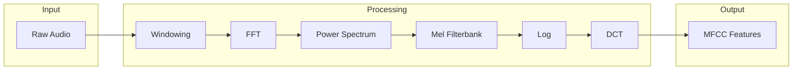

# Wave

Audio signal processing for MFCC, filterbank, and related features.

## Theoretical Background

### Short-Time Fourier Transform

Audio signals are analyzed using short-time windows:

$$X(m, k) = \sum_{n=0}^{N-1} x(n + mR) \cdot w(n) \cdot e^{-j2\pi kn/N}$$

Where:
- $w(n)$ is the window function
- $R$ is the hop size (window step)
- $N$ is the window length

### Mel Filterbank

Human auditory perception is logarithmic. Mel scale transforms frequency [1]:

$$m = 2595 \log_{10}\left(1 + \frac{f}{700}\right)$$

### MFCC (Mel-Frequency Cepstral Coefficients)

MFCCs are computed as:
1. Apply FFT to windowed frames
2. Compute power spectrum
3. Apply mel filterbank
4. Take log of filterbank energies
5. Apply DCT to decorrelate

## How It Is Implemented Here

### Window Functions

```cpp
// File: include/nn/wave/signal_operations.hpp

// Apply Hamming window to frame
// w[n] = 0.54 - 0.46 * cos(2πn / (N-1))
auto apply_hamming_window(Tensor& frame) -> Tensor;

// Apply Hann window
// w[n] = 0.5 - 0.5 * cos(2πn / (N-1))
auto apply_hann_window(Tensor& frame) -> Tensor;
```

### Filterbank

```cpp
// File: include/nn/wave/audioTypes.h
struct FilterbankConfig
{
    Tensor& filterbank;  // Mel filterbank matrix
    std::vector<float>& center_frequencies;
    const LoadingAndProcessingParameters& loading_params;
};

// Apply mel filterbank to power spectrum
auto mel_filterbank(const Tensor& power_spectrum, 
                    const FilterbankConfig& config) -> Tensor;
```

### MFCC Extraction

```cpp
// File: include/nn/wave/filter_operations.hpp

// Apply mel filterbank
auto mel_filterbank(const Tensor& power_spectrum, 
                    int num_filters) -> Tensor;

// Discrete Cosine Transform (Type II)
// Used to compute cepstral coefficients
auto dct(const Tensor& filterbank_energies, 
         int num_cepstra) -> Tensor;
```

## Data Flow



## Usage Example

```cpp
// File: src/demos/lfcc_pipeline/lfcc_pipeline.cpp
#include "nn/wave/signal_operations.hpp"
#include "nn/wave/filter_operations.hpp"

// Extract MFCC from audio signal
nn::Tensor extract_mfcc(const nn::Tensor& audio, 
                       int sample_rate = 16000,
                       int num_cepstra = 13)
{
    // Parameters
    int frame_length = 400;   // 25ms at 16kHz
    int frame_step = 160;     // 10ms hop
    
    // Windowing
    auto frames = create_windows(audio, frame_length, frame_step);
    
    // FFT
    auto spectrum = fft(frames);
    auto power = spectrum.square();
    
    // Mel filterbank
    auto mel_filters = create_mel_filterbank(sample_rate, num_cepstra);
    auto mel_energies = matrixMultiply(power, mel_filters);
    
    // Log
    auto log_mel = log(mel_energies + 1e-10f);
    
    // DCT
    auto mfcc = dct(log_mel, num_cepstra);
    
    return mfcc;
}
```

## Common Pitfalls

1. **Window Size**: Too short = poor frequency resolution; too long = poor temporal resolution

2. **Hop Size**: Smaller = more frames, more computation; larger = aliasing

3. **Mel Filter Number**: Too few = coarse features; too many = redundant

4. **Pre-emphasis**: Often needed for speech ($y[n] = x[n] - 0.97x[n-1]$)

## See Also

- [DataLoaders](./DataLoaders.md) - Audio dataset loading
- [Windowing](./Windowing.md) - Window functions
- [Experiment03](../Experiments/Experiment03.md) - Audio autoencoder

## References

[1] S. Davis and P. Mermelstein, "Comparison of parametric representations for monosyllabic word recognition in continuously spoken sentences," *IEEE Trans. Acoust., Speech, Signal Process.*, vol. 28, no. 4, pp. 357–366, Aug. 1980. [Online]. Available: https://doi.org/10.1109/TASSP.1980.1163420

[2] L. R. Rabiner and B.-H. Juang, *Fundamentals of Speech Recognition*. Prentice Hall, 1993.