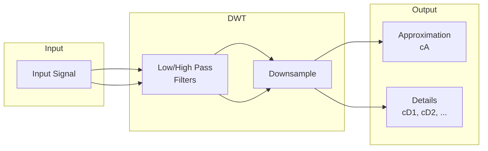

# Wavelet

Wavelet transform utilities for time-frequency analysis.

## Theoretical Background

Wavelet transforms provide multi-resolution analysis, unlike Fourier which gives only frequency content.

### Continuous Wavelet Transform

$$W(a, b) = \int_{-\infty}^{\infty} x(t) \psi_{a,b}^*(t) \, dt$$

Where:
- $\psi_{a,b}(t) = \frac{1}{\sqrt{a}} \psi\left(\frac{t-b}{a}\right)$
- $a$ is the scale (inverse of frequency)
- $b$ is the translation (time position)

### Discrete Wavelet Transform

For practical computation, wavelets are discretized:

$$x(t) = \sum_{k} c_{j,k} \phi_{j,k}(t) + \sum_{i=1}^{j} \sum_{k} d_{i,k} \psi_{i,k}(t)$$

Where:
- $c_{j,k}$ are approximation coefficients (low-frequency)
- $d_{i,k}$ are detail coefficients (high-frequency at scale $i$)

### Wavelet Families

- **Haar**: Simplest, discontinuous, good for edges
- **Daubechies** ($N=4,6,8,\dots$): More vanishing moments, smoother
- **Symlets**: Nearly symmetric Daubechies

## How It Is Implemented Here

### Wavelet Types

Wavelets are **tag structs** (`Haar`, `Daub4`, `Daub6`, … `Daub46`), used only
to select a filter at compile time. Each has a `WaveletTraits<Tag>`
specialization holding the low-pass coefficients as a `constexpr
std::array<double, N>`; `get_wavelet<Tag>()` returns a `std::span` over them.
Only wavelets actually instantiated are emitted into the binary.

```cpp
// File: include/wavelet/Types.hpp
template <typename Wavelet>
constexpr auto get_wavelet() -> std::span<const double>;   // low-pass filter

// DaubN is tagged by TAP COUNT, so DaubN == pywt "db{N/2}":
//   Daub4 = db2, Daub10 = db5, Daub20 = db10, ...
```

The filter tables are synced to full double precision from PyWavelets and
audited exact (see Ground Truth below).

### Forward Transform (Mallat)

`malat()` runs the discrete wavelet transform via Mallat's algorithm,
iteratively (no recursion). The high-pass filter is derived internally from the
low-pass via `linearAlgebra::calc_orthogonal_vector` (QMF). Convolution uses
**circular indexing** (periodic boundary).

```cpp
// File: include/wavelet/waveletOperations.hpp
enum TransformMode : uint8_t { PACKET_WAVELET, REGULAR_WAVELET };

auto malat(const std::vector<double>& signal,
    const std::span<const double>& lowpassfilter,   // get_wavelet<Tag>()
    TransformMode mode,
    unsigned int level) -> WaveletTransformResults;

// Per-subband L2 root-energy — the quantity the feature pipeline consumes:
auto extract_subband_energies(const WaveletTransformResults& transform, int level)
    -> std::vector<double>;
```

- **REGULAR_WAVELET**: only the low-pass band is decomposed further each level
  → 1 approximation + `level` detail bands.
- **PACKET_WAVELET** (the thesis DTWPT path): both bands are decomposed → `2^level`
  frequency-ordered leaves. The high-pass branch swaps its low/high children to
  keep leaves in frequency order.

## Data Flow



## Usage Example

```cpp
// File: src/core/wavelet/tests/wavelet_gtest.cpp
#include "wavelet/Types.hpp"
#include "wavelet/waveletOperations.hpp"

std::vector<double> signal = /* load signal, length a power of two */;

// 3-level packet transform with a db5 (Daub10) filter
auto res = wavelets::malat(
    signal, wavelets::get_wavelet<wavelets::Daub10>(), wavelets::PACKET_WAVELET, 3);

// Per-band root-energy feature vector (2^3 = 8 bands, frequency order)
std::vector<double> energies = wavelets::extract_subband_energies(res, 3);
```

## Ground Truth vs PyWavelets (2026-07-15)

`pywt_parity_gtest` validates `malat` + `extract_subband_energies` against
PyWavelets. It compares **per-subband L2 norms** (the exact quantity the feature
pipeline consumes) for both regular and packet transforms, over db2/db5/db10 at
3 levels on two signals. Fixtures live in
`src/core/wavelet/tests/fixtures/pywt_refs.npz` (committed; CI needs no Python)
and are generated by `scripts/testing/gen_pywt_refs.py`.

**Convention mapping** (encoded in the generator):
- Circular indexing ↔ pywt `mode='periodization'`.
- Packet high-pass swap ↔ pywt freq-ordered leaves.
- `malat`'s correlation indexing equals pywt's convolution applied to a
  circularly **pre-shifted** signal; the shift is filter-dependent (db2 → +1,
  db5 → +4), so the generator *searches* for it per wavelet and fails loudly if
  none aligns — itself a tripwire against filter/convention regressions.

This suite immediately caught **two real defects** (both fixed):

1. **`malat` regular-mode buffer corruption.** `std::swap` exchanged the whole
   working buffer each level, but levels ≥ 2 only write the low-pass segment —
   so untouched regions resurfaced stale data from two levels earlier. At 3
   levels, `cD2` was silently the second half of `cA1`. Packet mode was never
   affected (its tasks cover the full signal each level). Fixed by seeding the
   next-level buffer with the current state before the task loop.
2. **Corrupted filter tables in `Types.hpp`.** `Daub10` had 3 wrong coefficients
   (index 7 sign-flipped and wrong magnitude → not a valid orthonormal wavelet),
   `Daub38` was wrong at index 11, and `Daub40` held only 38 coefficients. Every
   `hc_daub10_*` profile had extracted features with a broken filter. All tables
   (`Haar`…`Daub46`) are now synced to full double precision from pywt and
   audited exact.

> **Re-run needed.** Any Experiment05 `hc_daub10_*` results produced before this
> fix are invalid and must be re-run (daub12/daub14 were correct).

Regenerate/extend:
```bash
software/nn/out/build/max-performance/venv/bin/python -m pip install pywavelets
software/nn/out/build/max-performance/venv/bin/python software/nn/scripts/testing/gen_pywt_refs.py
ctest --test-dir out/build/max-performance -R PyWtParity
```

## Common Pitfalls

1. **Signal Length**: Must be power of 2 for the dyadic transform

2. **Phase convention**: `malat` uses correlation-style circular indexing, not
   pywt's convolution — comparisons must account for the filter-dependent
   circular shift (see Ground Truth). Compare band energies, not raw coefficients.

3. **DaubN = N taps, not N/2**: `Daub10` is db5, not db10 — the tag counts filter
   coefficients.

4. **Level Selection**: More levels = more detail, but more computation. Regular
   DWT yields `level+1` bands; packet yields `2^level` leaves.

## See Also

- [Wave](./Wave.md) - Related signal processing
- [Statistics](./Statistics.md) - Time-frequency analysis
- [Ground-Truth and Smoke Testing](../Guides/Ground-Truth-and-Smoke-Testing.md)

## References

[1] S. Mallat, A Wavelet Tour of Signal Processing, 3rd ed. Academic Press, 2009.

[2] I. Daubechies, Ten Lectures on Wavelets. Society for Industrial and Applied Mathematics, 1992.

[3] G. R. Lee, R. Gommers, F. Waselewski, K. Wohlfahrt, and A. O'Leary, "PyWavelets: A Python package for wavelet analysis," *J. Open Source Softw.*, vol. 4, no. 36, p. 1237, 2019. [Online]. Available: https://doi.org/10.21105/joss.01237