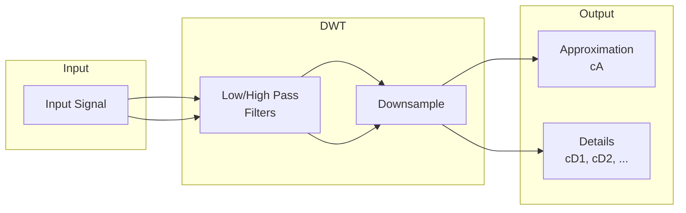

# Wavelet

Wavelet transform utilities for time-frequency analysis.

## Theoretical Background

Wavelet transforms provide multi-resolution analysis, unlike Fourier which gives only frequency content.

### Continuous Wavelet Transform

$$W(a, b) = \int_{-\infty}^{\infty} x(t) \psi_{a,b}^*(t) \, dt$$

Where:
- $\psi_{a,b}(t) = \frac{1}{\sqrt{a}} \psi\left(\frac{t-b}{a}\right)$
- $a$ is the scale (inverse of frequency)
- $b$ is the translation (time position)

### Discrete Wavelet Transform

For practical computation, wavelets are discretized:

$$x(t) = \sum_{k} c_{j,k} \phi_{j,k}(t) + \sum_{i=1}^{j} \sum_{k} d_{i,k} \psi_{i,k}(t)$$

Where:
- $c_{j,k}$ are approximation coefficients (low-frequency)
- $d_{i,k}$ are detail coefficients (high-frequency at scale $i$)

### Wavelet Families

- **Haar**: Simplest, discontinuous, good for edges
- **Daubechies** ($N=4,6,8,\dots$): More vanishing moments, smoother
- **Symlets**: Nearly symmetric Daubechies

## How It Is Implemented Here

### Wavelet Types

```cpp
// File: include/nn/wavelet/Types.h
enum class WaveletType 
{ 
    Haar,      // db1
    Daub4,     // db2
    Daub6,     // db3
    Daub8,     // db4
    // ... up to Daub58
};
```

### Forward Transform

```cpp
// Forward wavelet transform
// Returns approximation and detail coefficients
auto wavelet_transform(const Tensor& signal, WaveletType type) 
    -> std::pair<Tensor, Tensor>;
```

### Inverse Transform

```cpp
// Inverse wavelet transform from coefficients
auto inverse_wavelet_transform(const Tensor& approx, 
                               const Tensor& detail,
                               WaveletType type) -> Tensor;
```

## Data Flow



## Usage Example

```cpp
// File: src/core/wavelet/tests/wavelet_gtest.cpp
#include "nn/wavelet/Types.h"

// Apply Haar wavelet transform
nn::Tensor signal = /* load signal */;
auto [approx, detail] = nn::wavelet::wavelet_transform(signal, WaveletType::Haar);

// Reconstruct
nn::Tensor reconstructed = nn::wavelet::inverse_wavelet_transform(
    approx, detail, WaveletType::Haar);
```

## Common Pitfalls

1. **Signal Length**: Must be power of 2 for dyadic wavelet transform

2. **Wavelet Choice**: Haar for edges, Daubechies for smooth signals

3. **Boundary Effects**: DWT has artifacts at edges; consider padding

4. **Level Selection**: More levels = more detail, but more computation

## See Also

- [Wave](./Wave.md) - Related signal processing
- [Statistics](./Statistics.md) - Time-frequency analysis

## References

[1] S. Mallat, A Wavelet Tour of Signal Processing, 3rd ed. Academic Press, 2009.

[2] I. Daubechies, Ten Lectures on Wavelets. Society for Industrial and Applied Mathematics, 1992.