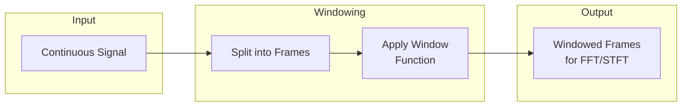

# Windowing

Windowing utilities for signal processing - applying window functions to frames for spectral analysis.

## Theoretical Background

### Why Windowing?

When computing FFT on long signals, we need to process finite segments. Window functions reduce spectral leakage from discontinuities at frame boundaries.

### Window Functions

#### Hamming Window
$$w[n] = 0.54 - 0.46 \cos\left(\frac{2\pi n}{N-1}\right)$$

#### Hann Window
$$w[n] = 0.5 - 0.5 \cos\left(\frac{2\pi n}{N-1}\right)$$

#### Blackman Window
$$w[n] = 0.42 - 0.5 \cos\left(\frac{2\pi n}{N-1}\right) + 0.08 \cos\left(\frac{4\pi n}{N-1}\right)$$

### Window Properties

| Window | Main Lobe | Side Lobe | scalloping |
|--------|-----------|-----------|------------|
| Rectangular | Narrow | High | Yes |
| Hamming | Medium | Low | Reduced |
| Hann | Medium | Low | Reduced |
| Blackman | Wide | Very Low | Minimal |

## How It Is Implemented Here

### Window Specification

```cpp
// File: include/windowing/WindowSpec.hpp
enum class WindowType
{
    Rectangular,
    Hamming,
    Hann,
    Blackman
};

struct WindowSpec
{
    int window_length;   // samples per window
    int window_step;    // samples between windows
    WindowType type;    // window function
    
    int sample_rate = 16000;
};
```

### Windowing Engine

```cpp
// File: include/windowing/WindowingEngine.hpp
class WindowingEngine
{
public:
    // Create overlapping windows from signal
    auto create_windows(const Tensor& signal, const WindowSpec& spec) 
        -> std::vector<Tensor>;

    // Apply window function to frame
    auto apply_window(Tensor& frame, WindowType type) -> void;

    // Overlap-add for reconstruction
    auto overlap_add(const std::vector<Tensor>& windows,
                     const WindowSpec& spec) -> Tensor;
};
```

## Data Flow



## Usage Example

```cpp
// File: src/core/windowing/tests/windowing_gtest.cpp
#include "windowing/WindowingEngine.hpp"

// Configure windowing
nn::windowing::WindowSpec spec{
    .window_length = 400,   // 25ms at 16kHz
    .window_step = 160,    // 10ms hop
    .type = nn::windowing::WindowType::Hamming,
    .sample_rate = 16000
};

// Create windows
nn::windowing::WindowingEngine engine;
nn::Tensor signal = /* load audio */;
auto windows = engine.create_windows(signal, spec);

// Each window is now ready for FFT
for (const auto& frame : windows)
{
    auto spectrum = fft(frame);
    // ... process
}
```

## Common Pitfalls

1. **Window Size**: Too short = poor frequency resolution; too long = poor temporal resolution

2. **Hop Size**: Too small = redundant computation; too large = temporal aliasing

3. **Window Type**: Use Hann/Hamming for speech; rectangular for impulses

4. **Signal Length**: Pad to avoid issues with short final frame

## See Also

- [Wave](./Wave.md) - Audio processing
- [DataLoaders](./DataLoaders.md) - Windowed datasets

## References

[1] J. O. Smith III, Spectral Audio Signal Processing. Stanford University, 2011.

[2] A. V. Oppenheim and R. W. Schafer, Discrete-Time Signal Processing. Prentice Hall, 2009.