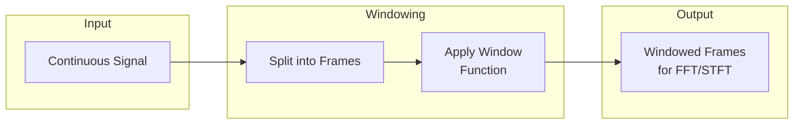

# Windowing

Windowing utilities for signal processing - applying window functions to frames for spectral analysis.

## Theoretical Background

### Why Windowing?

When computing FFT on long signals, we need to process finite segments. Window functions reduce spectral leakage from discontinuities at frame boundaries.

### Window Functions

#### Hamming Window
$$w[n] = 0.54 - 0.46 \cos\left(\frac{2\pi n}{N-1}\right)$$

#### Hann Window
$$w[n] = 0.5 - 0.5 \cos\left(\frac{2\pi n}{N-1}\right)$$

#### Blackman Window
$$w[n] = 0.42 - 0.5 \cos\left(\frac{2\pi n}{N-1}\right) + 0.08 \cos\left(\frac{4\pi n}{N-1}\right)$$

### Window Properties

| Window | Main Lobe | Side Lobe | scalloping |
|--------|-----------|-----------|------------|
| Rectangular | Narrow | High | Yes |
| Hamming | Medium | Low | Reduced |
| Hann | Medium | Low | Reduced |
| Blackman | Wide | Very Low | Minimal |

## How It Is Implemented Here

### Window Specification

This module does **not** implement a window *function* (Hamming/Hann/
Blackman taper) at all — `WindowSpec`/`compute_windows` only compute
**segment boundaries** (sliding-window start/end indices and overlap), a
different, earlier step than applying a taper before an FFT. There is no
`WindowType` enum and no `apply_window()`/`overlap_add()` anywhere in the
codebase — the theoretical background above (Hamming/Hann/Blackman weighting)
is not what this specific module does:

```cpp
// File: include/windowing/WindowSpec.hpp
struct WindowSpec
{
    int window_size{};   // samples per window (> 0)
    float overlap{0.5f}; // fractional overlap in [0, 1); default 50%
    int sample_rate{1};  // Hz; used only for WindowInfo::center_time_s

    // Derived: hop_size = window_size * (1 - overlap), minimum 1
    [[nodiscard]] constexpr int hop_size() const noexcept;
    // Number of complete windows fitting a signal of signal_length samples
    [[nodiscard]] constexpr int num_windows(int signal_length) const noexcept;
    void validate() const;  // throws std::invalid_argument if malformed
};
```

### Sliding-Window Enumeration

```cpp
// File: include/windowing/WindowingEngine.hpp
// Free function, not a class. Only produces WindowInfo{start, end, center_time_s}
// descriptors — the caller slices the actual signal/Tensor data itself.
// Stateless, thread-safe. Only *complete* windows are produced (no padding).
[[nodiscard]] auto compute_windows(int signal_length, const WindowSpec& spec)
    -> std::vector<WindowInfo>;
```

## Data Flow



## Usage Example

```cpp
// File: src/core/windowing/tests/windowing_gtest.cpp
#include "windowing/WindowingEngine.hpp"

// Configure windowing: 25ms window at 16kHz = 400 samples, 50% overlap
nn::windowing::WindowSpec spec{
    .window_size = 400,
    .overlap = 0.5f,
    .sample_rate = 16000
};
spec.validate();

// Enumerate window boundaries (no signal data touched yet)
auto windows = nn::windowing::compute_windows(/*signal_length=*/16000, spec);

// Caller slices the actual signal/Tensor per descriptor
for (const auto& w : windows)
{
    // signal[w.start .. w.end), centered at w.center_time_s seconds
    auto spectrum = fft(signal.block(w.start, w.end - w.start));
    // ... process
}
```

## Common Pitfalls

1. **Window Size**: Too short = poor frequency resolution; too long = poor temporal resolution

2. **Hop Size**: Too small = redundant computation; too large = temporal aliasing

3. **Window Type**: Use Hann/Hamming for speech; rectangular for impulses

4. **Signal Length**: Pad to avoid issues with short final frame

## See Also

- [Wave](./Wave.md) - Audio processing
- [DataLoaders](./DataLoaders.md) - Windowed datasets

## References

[1] J. O. Smith III, Spectral Audio Signal Processing. Stanford University, 2011.

[2] A. V. Oppenheim and R. W. Schafer, Discrete-Time Signal Processing. Prentice Hall, 2009.